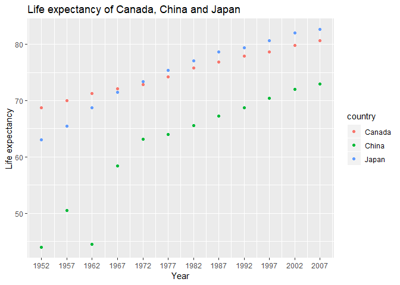
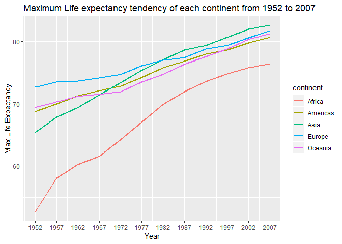
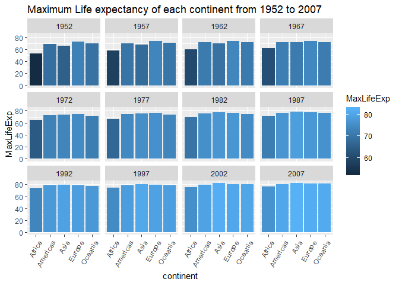

hw-04
================
Guochenchen
October 7th, 2018

Homework 04: Tidy data and joins
================================

Data Reshaping Prompts(And relationship to aggregation)
-------------------------------------------------------

``` r
# Firstly load all libraries
suppressPackageStartupMessages(library(gapminder))
suppressPackageStartupMessages(library(tidyverse))
suppressPackageStartupMessages(library(ggplot2))
suppressPackageStartupMessages(library(knitr))
suppressPackageStartupMessages(library(kableExtra))
suppressPackageStartupMessages(library(reshape2))
suppressPackageStartupMessages(library(wbstats))
```

### 1. Make a tibble with one row per year and columns for life expectancy for two or more countries

``` r
data1 <- gapminder %>% 
  filter(country %in% c('China', 'Japan', 'Canada')) %>% 
  select(year, country, lifeExp)

knitr::kable(head(data1, 20)) %>% 
  kable_styling(bootstrap_options = "bordered", latex_options = "basic", full_width = F)
```

<table class="table table-bordered" style="width: auto !important; margin-left: auto; margin-right: auto;">
<thead>
<tr>
<th style="text-align:right;">
year
</th>
<th style="text-align:left;">
country
</th>
<th style="text-align:right;">
lifeExp
</th>
</tr>
</thead>
<tbody>
<tr>
<td style="text-align:right;">
1952
</td>
<td style="text-align:left;">
Canada
</td>
<td style="text-align:right;">
68.75000
</td>
</tr>
<tr>
<td style="text-align:right;">
1957
</td>
<td style="text-align:left;">
Canada
</td>
<td style="text-align:right;">
69.96000
</td>
</tr>
<tr>
<td style="text-align:right;">
1962
</td>
<td style="text-align:left;">
Canada
</td>
<td style="text-align:right;">
71.30000
</td>
</tr>
<tr>
<td style="text-align:right;">
1967
</td>
<td style="text-align:left;">
Canada
</td>
<td style="text-align:right;">
72.13000
</td>
</tr>
<tr>
<td style="text-align:right;">
1972
</td>
<td style="text-align:left;">
Canada
</td>
<td style="text-align:right;">
72.88000
</td>
</tr>
<tr>
<td style="text-align:right;">
1977
</td>
<td style="text-align:left;">
Canada
</td>
<td style="text-align:right;">
74.21000
</td>
</tr>
<tr>
<td style="text-align:right;">
1982
</td>
<td style="text-align:left;">
Canada
</td>
<td style="text-align:right;">
75.76000
</td>
</tr>
<tr>
<td style="text-align:right;">
1987
</td>
<td style="text-align:left;">
Canada
</td>
<td style="text-align:right;">
76.86000
</td>
</tr>
<tr>
<td style="text-align:right;">
1992
</td>
<td style="text-align:left;">
Canada
</td>
<td style="text-align:right;">
77.95000
</td>
</tr>
<tr>
<td style="text-align:right;">
1997
</td>
<td style="text-align:left;">
Canada
</td>
<td style="text-align:right;">
78.61000
</td>
</tr>
<tr>
<td style="text-align:right;">
2002
</td>
<td style="text-align:left;">
Canada
</td>
<td style="text-align:right;">
79.77000
</td>
</tr>
<tr>
<td style="text-align:right;">
2007
</td>
<td style="text-align:left;">
Canada
</td>
<td style="text-align:right;">
80.65300
</td>
</tr>
<tr>
<td style="text-align:right;">
1952
</td>
<td style="text-align:left;">
China
</td>
<td style="text-align:right;">
44.00000
</td>
</tr>
<tr>
<td style="text-align:right;">
1957
</td>
<td style="text-align:left;">
China
</td>
<td style="text-align:right;">
50.54896
</td>
</tr>
<tr>
<td style="text-align:right;">
1962
</td>
<td style="text-align:left;">
China
</td>
<td style="text-align:right;">
44.50136
</td>
</tr>
<tr>
<td style="text-align:right;">
1967
</td>
<td style="text-align:left;">
China
</td>
<td style="text-align:right;">
58.38112
</td>
</tr>
<tr>
<td style="text-align:right;">
1972
</td>
<td style="text-align:left;">
China
</td>
<td style="text-align:right;">
63.11888
</td>
</tr>
<tr>
<td style="text-align:right;">
1977
</td>
<td style="text-align:left;">
China
</td>
<td style="text-align:right;">
63.96736
</td>
</tr>
<tr>
<td style="text-align:right;">
1982
</td>
<td style="text-align:left;">
China
</td>
<td style="text-align:right;">
65.52500
</td>
</tr>
<tr>
<td style="text-align:right;">
1987
</td>
<td style="text-align:left;">
China
</td>
<td style="text-align:right;">
67.27400
</td>
</tr>
</tbody>
</table>
``` r
# To further explore this table
data2 <- spread(data1, key = "country", value = "lifeExp") %>% 
  rename(lifeexp_Canada = Canada, lifeexp_China = China, lifeexp_Japan = Japan)

knitr::kable(data2) %>% 
  kable_styling(bootstrap_options = "bordered", latex_options = "basic", full_width = F)
```

<table class="table table-bordered" style="width: auto !important; margin-left: auto; margin-right: auto;">
<thead>
<tr>
<th style="text-align:right;">
year
</th>
<th style="text-align:right;">
lifeexp\_Canada
</th>
<th style="text-align:right;">
lifeexp\_China
</th>
<th style="text-align:right;">
lifeexp\_Japan
</th>
</tr>
</thead>
<tbody>
<tr>
<td style="text-align:right;">
1952
</td>
<td style="text-align:right;">
68.750
</td>
<td style="text-align:right;">
44.00000
</td>
<td style="text-align:right;">
63.030
</td>
</tr>
<tr>
<td style="text-align:right;">
1957
</td>
<td style="text-align:right;">
69.960
</td>
<td style="text-align:right;">
50.54896
</td>
<td style="text-align:right;">
65.500
</td>
</tr>
<tr>
<td style="text-align:right;">
1962
</td>
<td style="text-align:right;">
71.300
</td>
<td style="text-align:right;">
44.50136
</td>
<td style="text-align:right;">
68.730
</td>
</tr>
<tr>
<td style="text-align:right;">
1967
</td>
<td style="text-align:right;">
72.130
</td>
<td style="text-align:right;">
58.38112
</td>
<td style="text-align:right;">
71.430
</td>
</tr>
<tr>
<td style="text-align:right;">
1972
</td>
<td style="text-align:right;">
72.880
</td>
<td style="text-align:right;">
63.11888
</td>
<td style="text-align:right;">
73.420
</td>
</tr>
<tr>
<td style="text-align:right;">
1977
</td>
<td style="text-align:right;">
74.210
</td>
<td style="text-align:right;">
63.96736
</td>
<td style="text-align:right;">
75.380
</td>
</tr>
<tr>
<td style="text-align:right;">
1982
</td>
<td style="text-align:right;">
75.760
</td>
<td style="text-align:right;">
65.52500
</td>
<td style="text-align:right;">
77.110
</td>
</tr>
<tr>
<td style="text-align:right;">
1987
</td>
<td style="text-align:right;">
76.860
</td>
<td style="text-align:right;">
67.27400
</td>
<td style="text-align:right;">
78.670
</td>
</tr>
<tr>
<td style="text-align:right;">
1992
</td>
<td style="text-align:right;">
77.950
</td>
<td style="text-align:right;">
68.69000
</td>
<td style="text-align:right;">
79.360
</td>
</tr>
<tr>
<td style="text-align:right;">
1997
</td>
<td style="text-align:right;">
78.610
</td>
<td style="text-align:right;">
70.42600
</td>
<td style="text-align:right;">
80.690
</td>
</tr>
<tr>
<td style="text-align:right;">
2002
</td>
<td style="text-align:right;">
79.770
</td>
<td style="text-align:right;">
72.02800
</td>
<td style="text-align:right;">
82.000
</td>
</tr>
<tr>
<td style="text-align:right;">
2007
</td>
<td style="text-align:right;">
80.653
</td>
<td style="text-align:right;">
72.96100
</td>
<td style="text-align:right;">
82.603
</td>
</tr>
</tbody>
</table>
``` r
#To scatter plot this data further indicate the comparison between lifeexp of these three countries
ggplot(data1, aes(year, lifeExp)) +
  geom_point(aes(color = country))+
  scale_x_continuous(limits = c(1952, 2007), breaks = seq(1952, 2007, 5))+
  xlab("Year")+ ylab("Life expectancy") + ggtitle("Life expectancy of Canada, China and Japan")
```



### 2. Compute life expectancy for all possible combinations of content and year. Reshape that to have one row per year and one variable for each continent.

``` r
# Here to compute the maximum lifeExpectancy for all continents each year
data3 <- gapminder %>% 
  group_by(continent, year) %>% 
  summarise(MaxLifeExp = max(lifeExp))

data4 <- spread(data3, key = "continent", value = "MaxLifeExp")

knitr::kable(head(data4, 20)) %>% 
  kable_styling(bootstrap_options = "bordered", latex_options = "basic", full_width = F)
```

<table class="table table-bordered" style="width: auto !important; margin-left: auto; margin-right: auto;">
<thead>
<tr>
<th style="text-align:right;">
year
</th>
<th style="text-align:right;">
Africa
</th>
<th style="text-align:right;">
Americas
</th>
<th style="text-align:right;">
Asia
</th>
<th style="text-align:right;">
Europe
</th>
<th style="text-align:right;">
Oceania
</th>
</tr>
</thead>
<tbody>
<tr>
<td style="text-align:right;">
1952
</td>
<td style="text-align:right;">
52.724
</td>
<td style="text-align:right;">
68.750
</td>
<td style="text-align:right;">
65.390
</td>
<td style="text-align:right;">
72.670
</td>
<td style="text-align:right;">
69.390
</td>
</tr>
<tr>
<td style="text-align:right;">
1957
</td>
<td style="text-align:right;">
58.089
</td>
<td style="text-align:right;">
69.960
</td>
<td style="text-align:right;">
67.840
</td>
<td style="text-align:right;">
73.470
</td>
<td style="text-align:right;">
70.330
</td>
</tr>
<tr>
<td style="text-align:right;">
1962
</td>
<td style="text-align:right;">
60.246
</td>
<td style="text-align:right;">
71.300
</td>
<td style="text-align:right;">
69.390
</td>
<td style="text-align:right;">
73.680
</td>
<td style="text-align:right;">
71.240
</td>
</tr>
<tr>
<td style="text-align:right;">
1967
</td>
<td style="text-align:right;">
61.557
</td>
<td style="text-align:right;">
72.130
</td>
<td style="text-align:right;">
71.430
</td>
<td style="text-align:right;">
74.160
</td>
<td style="text-align:right;">
71.520
</td>
</tr>
<tr>
<td style="text-align:right;">
1972
</td>
<td style="text-align:right;">
64.274
</td>
<td style="text-align:right;">
72.880
</td>
<td style="text-align:right;">
73.420
</td>
<td style="text-align:right;">
74.720
</td>
<td style="text-align:right;">
71.930
</td>
</tr>
<tr>
<td style="text-align:right;">
1977
</td>
<td style="text-align:right;">
67.064
</td>
<td style="text-align:right;">
74.210
</td>
<td style="text-align:right;">
75.380
</td>
<td style="text-align:right;">
76.110
</td>
<td style="text-align:right;">
73.490
</td>
</tr>
<tr>
<td style="text-align:right;">
1982
</td>
<td style="text-align:right;">
69.885
</td>
<td style="text-align:right;">
75.760
</td>
<td style="text-align:right;">
77.110
</td>
<td style="text-align:right;">
76.990
</td>
<td style="text-align:right;">
74.740
</td>
</tr>
<tr>
<td style="text-align:right;">
1987
</td>
<td style="text-align:right;">
71.913
</td>
<td style="text-align:right;">
76.860
</td>
<td style="text-align:right;">
78.670
</td>
<td style="text-align:right;">
77.410
</td>
<td style="text-align:right;">
76.320
</td>
</tr>
<tr>
<td style="text-align:right;">
1992
</td>
<td style="text-align:right;">
73.615
</td>
<td style="text-align:right;">
77.950
</td>
<td style="text-align:right;">
79.360
</td>
<td style="text-align:right;">
78.770
</td>
<td style="text-align:right;">
77.560
</td>
</tr>
<tr>
<td style="text-align:right;">
1997
</td>
<td style="text-align:right;">
74.772
</td>
<td style="text-align:right;">
78.610
</td>
<td style="text-align:right;">
80.690
</td>
<td style="text-align:right;">
79.390
</td>
<td style="text-align:right;">
78.830
</td>
</tr>
<tr>
<td style="text-align:right;">
2002
</td>
<td style="text-align:right;">
75.744
</td>
<td style="text-align:right;">
79.770
</td>
<td style="text-align:right;">
82.000
</td>
<td style="text-align:right;">
80.620
</td>
<td style="text-align:right;">
80.370
</td>
</tr>
<tr>
<td style="text-align:right;">
2007
</td>
<td style="text-align:right;">
76.442
</td>
<td style="text-align:right;">
80.653
</td>
<td style="text-align:right;">
82.603
</td>
<td style="text-align:right;">
81.757
</td>
<td style="text-align:right;">
81.235
</td>
</tr>
</tbody>
</table>
``` r
# alter the x, y of table 
data5 <- spread(data3, key = "year", value = "MaxLifeExp")

knitr::kable(head(data5, 20)) %>% 
  kable_styling(bootstrap_options = "bordered", latex_options = "basic", full_width = F)
```

<table class="table table-bordered" style="width: auto !important; margin-left: auto; margin-right: auto;">
<thead>
<tr>
<th style="text-align:left;">
continent
</th>
<th style="text-align:right;">
1952
</th>
<th style="text-align:right;">
1957
</th>
<th style="text-align:right;">
1962
</th>
<th style="text-align:right;">
1967
</th>
<th style="text-align:right;">
1972
</th>
<th style="text-align:right;">
1977
</th>
<th style="text-align:right;">
1982
</th>
<th style="text-align:right;">
1987
</th>
<th style="text-align:right;">
1992
</th>
<th style="text-align:right;">
1997
</th>
<th style="text-align:right;">
2002
</th>
<th style="text-align:right;">
2007
</th>
</tr>
</thead>
<tbody>
<tr>
<td style="text-align:left;">
Africa
</td>
<td style="text-align:right;">
52.724
</td>
<td style="text-align:right;">
58.089
</td>
<td style="text-align:right;">
60.246
</td>
<td style="text-align:right;">
61.557
</td>
<td style="text-align:right;">
64.274
</td>
<td style="text-align:right;">
67.064
</td>
<td style="text-align:right;">
69.885
</td>
<td style="text-align:right;">
71.913
</td>
<td style="text-align:right;">
73.615
</td>
<td style="text-align:right;">
74.772
</td>
<td style="text-align:right;">
75.744
</td>
<td style="text-align:right;">
76.442
</td>
</tr>
<tr>
<td style="text-align:left;">
Americas
</td>
<td style="text-align:right;">
68.750
</td>
<td style="text-align:right;">
69.960
</td>
<td style="text-align:right;">
71.300
</td>
<td style="text-align:right;">
72.130
</td>
<td style="text-align:right;">
72.880
</td>
<td style="text-align:right;">
74.210
</td>
<td style="text-align:right;">
75.760
</td>
<td style="text-align:right;">
76.860
</td>
<td style="text-align:right;">
77.950
</td>
<td style="text-align:right;">
78.610
</td>
<td style="text-align:right;">
79.770
</td>
<td style="text-align:right;">
80.653
</td>
</tr>
<tr>
<td style="text-align:left;">
Asia
</td>
<td style="text-align:right;">
65.390
</td>
<td style="text-align:right;">
67.840
</td>
<td style="text-align:right;">
69.390
</td>
<td style="text-align:right;">
71.430
</td>
<td style="text-align:right;">
73.420
</td>
<td style="text-align:right;">
75.380
</td>
<td style="text-align:right;">
77.110
</td>
<td style="text-align:right;">
78.670
</td>
<td style="text-align:right;">
79.360
</td>
<td style="text-align:right;">
80.690
</td>
<td style="text-align:right;">
82.000
</td>
<td style="text-align:right;">
82.603
</td>
</tr>
<tr>
<td style="text-align:left;">
Europe
</td>
<td style="text-align:right;">
72.670
</td>
<td style="text-align:right;">
73.470
</td>
<td style="text-align:right;">
73.680
</td>
<td style="text-align:right;">
74.160
</td>
<td style="text-align:right;">
74.720
</td>
<td style="text-align:right;">
76.110
</td>
<td style="text-align:right;">
76.990
</td>
<td style="text-align:right;">
77.410
</td>
<td style="text-align:right;">
78.770
</td>
<td style="text-align:right;">
79.390
</td>
<td style="text-align:right;">
80.620
</td>
<td style="text-align:right;">
81.757
</td>
</tr>
<tr>
<td style="text-align:left;">
Oceania
</td>
<td style="text-align:right;">
69.390
</td>
<td style="text-align:right;">
70.330
</td>
<td style="text-align:right;">
71.240
</td>
<td style="text-align:right;">
71.520
</td>
<td style="text-align:right;">
71.930
</td>
<td style="text-align:right;">
73.490
</td>
<td style="text-align:right;">
74.740
</td>
<td style="text-align:right;">
76.320
</td>
<td style="text-align:right;">
77.560
</td>
<td style="text-align:right;">
78.830
</td>
<td style="text-align:right;">
80.370
</td>
<td style="text-align:right;">
81.235
</td>
</tr>
</tbody>
</table>
``` r
# And the plot of data 4
ggplot(data = data3, aes(x=year, y=MaxLifeExp, group = continent, colour = continent))+
  geom_line(size = 1)+
  scale_x_continuous(limits = c(1952, 2007), breaks = seq(1952, 2007, 5))+
  xlab("Year")+ ylab("Max Life Expectancy") + ggtitle("Maximum Life expectancy tendency of each continent from 1952 to 2007")
```



``` r
# another way to show this, use bar chart to separately indicate the maximum lifeexpectancy of each continent
ggplot(data = data3, aes(x=continent, y=MaxLifeExp, group=continent))+
  facet_wrap( ~year)+
  geom_col(aes(fill=MaxLifeExp), size = 5)+
  theme(axis.text.x = element_text(angle = 60, hjust = 1))+
  ggtitle("Maximum Life expectancy of each continent from 1952 to 2007")
```

 \#\#\# 3. Reshape the table to have one row per year or per year \* continent combination

``` r
data6 <- gapminder %>% 
  group_by(year, continent) %>% 
  filter(min_rank(lifeExp)<2 | min_rank(desc(lifeExp))<2) %>% 
  select(year, continent, country, lifeExp)
knitr::kable(head(data6, 20)) %>% 
  kable_styling(bootstrap_options = "bordered", latex_options = "basic", full_width = F)
```

<table class="table table-bordered" style="width: auto !important; margin-left: auto; margin-right: auto;">
<thead>
<tr>
<th style="text-align:right;">
year
</th>
<th style="text-align:left;">
continent
</th>
<th style="text-align:left;">
country
</th>
<th style="text-align:right;">
lifeExp
</th>
</tr>
</thead>
<tbody>
<tr>
<td style="text-align:right;">
1952
</td>
<td style="text-align:left;">
Asia
</td>
<td style="text-align:left;">
Afghanistan
</td>
<td style="text-align:right;">
28.801
</td>
</tr>
<tr>
<td style="text-align:right;">
1957
</td>
<td style="text-align:left;">
Asia
</td>
<td style="text-align:left;">
Afghanistan
</td>
<td style="text-align:right;">
30.332
</td>
</tr>
<tr>
<td style="text-align:right;">
1962
</td>
<td style="text-align:left;">
Asia
</td>
<td style="text-align:left;">
Afghanistan
</td>
<td style="text-align:right;">
31.997
</td>
</tr>
<tr>
<td style="text-align:right;">
1967
</td>
<td style="text-align:left;">
Asia
</td>
<td style="text-align:left;">
Afghanistan
</td>
<td style="text-align:right;">
34.020
</td>
</tr>
<tr>
<td style="text-align:right;">
1972
</td>
<td style="text-align:left;">
Asia
</td>
<td style="text-align:left;">
Afghanistan
</td>
<td style="text-align:right;">
36.088
</td>
</tr>
<tr>
<td style="text-align:right;">
1982
</td>
<td style="text-align:left;">
Asia
</td>
<td style="text-align:left;">
Afghanistan
</td>
<td style="text-align:right;">
39.854
</td>
</tr>
<tr>
<td style="text-align:right;">
1987
</td>
<td style="text-align:left;">
Asia
</td>
<td style="text-align:left;">
Afghanistan
</td>
<td style="text-align:right;">
40.822
</td>
</tr>
<tr>
<td style="text-align:right;">
1992
</td>
<td style="text-align:left;">
Asia
</td>
<td style="text-align:left;">
Afghanistan
</td>
<td style="text-align:right;">
41.674
</td>
</tr>
<tr>
<td style="text-align:right;">
1997
</td>
<td style="text-align:left;">
Asia
</td>
<td style="text-align:left;">
Afghanistan
</td>
<td style="text-align:right;">
41.763
</td>
</tr>
<tr>
<td style="text-align:right;">
2002
</td>
<td style="text-align:left;">
Asia
</td>
<td style="text-align:left;">
Afghanistan
</td>
<td style="text-align:right;">
42.129
</td>
</tr>
<tr>
<td style="text-align:right;">
2007
</td>
<td style="text-align:left;">
Asia
</td>
<td style="text-align:left;">
Afghanistan
</td>
<td style="text-align:right;">
43.828
</td>
</tr>
<tr>
<td style="text-align:right;">
1987
</td>
<td style="text-align:left;">
Africa
</td>
<td style="text-align:left;">
Angola
</td>
<td style="text-align:right;">
39.906
</td>
</tr>
<tr>
<td style="text-align:right;">
1952
</td>
<td style="text-align:left;">
Oceania
</td>
<td style="text-align:left;">
Australia
</td>
<td style="text-align:right;">
69.120
</td>
</tr>
<tr>
<td style="text-align:right;">
1957
</td>
<td style="text-align:left;">
Oceania
</td>
<td style="text-align:left;">
Australia
</td>
<td style="text-align:right;">
70.330
</td>
</tr>
<tr>
<td style="text-align:right;">
1962
</td>
<td style="text-align:left;">
Oceania
</td>
<td style="text-align:left;">
Australia
</td>
<td style="text-align:right;">
70.930
</td>
</tr>
<tr>
<td style="text-align:right;">
1967
</td>
<td style="text-align:left;">
Oceania
</td>
<td style="text-align:left;">
Australia
</td>
<td style="text-align:right;">
71.100
</td>
</tr>
<tr>
<td style="text-align:right;">
1972
</td>
<td style="text-align:left;">
Oceania
</td>
<td style="text-align:left;">
Australia
</td>
<td style="text-align:right;">
71.930
</td>
</tr>
<tr>
<td style="text-align:right;">
1977
</td>
<td style="text-align:left;">
Oceania
</td>
<td style="text-align:left;">
Australia
</td>
<td style="text-align:right;">
73.490
</td>
</tr>
<tr>
<td style="text-align:right;">
1982
</td>
<td style="text-align:left;">
Oceania
</td>
<td style="text-align:left;">
Australia
</td>
<td style="text-align:right;">
74.740
</td>
</tr>
<tr>
<td style="text-align:right;">
1987
</td>
<td style="text-align:left;">
Oceania
</td>
<td style="text-align:left;">
Australia
</td>
<td style="text-align:right;">
76.320
</td>
</tr>
</tbody>
</table>
``` r
# for per year*continent combination
data7 <- data6 %>% 
  group_by(year, continent) %>% 
  arrange(lifeExp) %>% 
  mutate(MinlifeExp_country = first(country), 
         MinlifeExp_value = min(lifeExp),
         MaxlifeExp_country = last(country),
         MaxlifeExp_value = max(lifeExp)) %>% 
  arrange(year) %>% 
  unite("Year_Cont", year, continent) %>% 
  select(Year_Cont, MinlifeExp_country, MinlifeExp_value, MaxlifeExp_country, MaxlifeExp_value)
# Form to table
knitr::kable(data7) %>% 
  kable_styling(bootstrap_options = "bordered", latex_options = "basic", full_width = F)
```

<table class="table table-bordered" style="width: auto !important; margin-left: auto; margin-right: auto;">
<thead>
<tr>
<th style="text-align:left;">
Year\_Cont
</th>
<th style="text-align:left;">
MinlifeExp\_country
</th>
<th style="text-align:right;">
MinlifeExp\_value
</th>
<th style="text-align:left;">
MaxlifeExp\_country
</th>
<th style="text-align:right;">
MaxlifeExp\_value
</th>
</tr>
</thead>
<tbody>
<tr>
<td style="text-align:left;">
1952\_Asia
</td>
<td style="text-align:left;">
Afghanistan
</td>
<td style="text-align:right;">
28.801
</td>
<td style="text-align:left;">
Israel
</td>
<td style="text-align:right;">
65.390
</td>
</tr>
<tr>
<td style="text-align:left;">
1952\_Africa
</td>
<td style="text-align:left;">
Gambia
</td>
<td style="text-align:right;">
30.000
</td>
<td style="text-align:left;">
Reunion
</td>
<td style="text-align:right;">
52.724
</td>
</tr>
<tr>
<td style="text-align:left;">
1952\_Americas
</td>
<td style="text-align:left;">
Haiti
</td>
<td style="text-align:right;">
37.579
</td>
<td style="text-align:left;">
Canada
</td>
<td style="text-align:right;">
68.750
</td>
</tr>
<tr>
<td style="text-align:left;">
1952\_Europe
</td>
<td style="text-align:left;">
Turkey
</td>
<td style="text-align:right;">
43.585
</td>
<td style="text-align:left;">
Norway
</td>
<td style="text-align:right;">
72.670
</td>
</tr>
<tr>
<td style="text-align:left;">
1952\_Africa
</td>
<td style="text-align:left;">
Gambia
</td>
<td style="text-align:right;">
30.000
</td>
<td style="text-align:left;">
Reunion
</td>
<td style="text-align:right;">
52.724
</td>
</tr>
<tr>
<td style="text-align:left;">
1952\_Asia
</td>
<td style="text-align:left;">
Afghanistan
</td>
<td style="text-align:right;">
28.801
</td>
<td style="text-align:left;">
Israel
</td>
<td style="text-align:right;">
65.390
</td>
</tr>
<tr>
<td style="text-align:left;">
1952\_Americas
</td>
<td style="text-align:left;">
Haiti
</td>
<td style="text-align:right;">
37.579
</td>
<td style="text-align:left;">
Canada
</td>
<td style="text-align:right;">
68.750
</td>
</tr>
<tr>
<td style="text-align:left;">
1952\_Oceania
</td>
<td style="text-align:left;">
Australia
</td>
<td style="text-align:right;">
69.120
</td>
<td style="text-align:left;">
New Zealand
</td>
<td style="text-align:right;">
69.390
</td>
</tr>
<tr>
<td style="text-align:left;">
1952\_Oceania
</td>
<td style="text-align:left;">
Australia
</td>
<td style="text-align:right;">
69.120
</td>
<td style="text-align:left;">
New Zealand
</td>
<td style="text-align:right;">
69.390
</td>
</tr>
<tr>
<td style="text-align:left;">
1952\_Europe
</td>
<td style="text-align:left;">
Turkey
</td>
<td style="text-align:right;">
43.585
</td>
<td style="text-align:left;">
Norway
</td>
<td style="text-align:right;">
72.670
</td>
</tr>
<tr>
<td style="text-align:left;">
1957\_Asia
</td>
<td style="text-align:left;">
Afghanistan
</td>
<td style="text-align:right;">
30.332
</td>
<td style="text-align:left;">
Israel
</td>
<td style="text-align:right;">
67.840
</td>
</tr>
<tr>
<td style="text-align:left;">
1957\_Africa
</td>
<td style="text-align:left;">
Sierra Leone
</td>
<td style="text-align:right;">
31.570
</td>
<td style="text-align:left;">
Mauritius
</td>
<td style="text-align:right;">
58.089
</td>
</tr>
<tr>
<td style="text-align:left;">
1957\_Americas
</td>
<td style="text-align:left;">
Haiti
</td>
<td style="text-align:right;">
40.696
</td>
<td style="text-align:left;">
Canada
</td>
<td style="text-align:right;">
69.960
</td>
</tr>
<tr>
<td style="text-align:left;">
1957\_Europe
</td>
<td style="text-align:left;">
Turkey
</td>
<td style="text-align:right;">
48.079
</td>
<td style="text-align:left;">
Iceland
</td>
<td style="text-align:right;">
73.470
</td>
</tr>
<tr>
<td style="text-align:left;">
1957\_Africa
</td>
<td style="text-align:left;">
Sierra Leone
</td>
<td style="text-align:right;">
31.570
</td>
<td style="text-align:left;">
Mauritius
</td>
<td style="text-align:right;">
58.089
</td>
</tr>
<tr>
<td style="text-align:left;">
1957\_Asia
</td>
<td style="text-align:left;">
Afghanistan
</td>
<td style="text-align:right;">
30.332
</td>
<td style="text-align:left;">
Israel
</td>
<td style="text-align:right;">
67.840
</td>
</tr>
<tr>
<td style="text-align:left;">
1957\_Americas
</td>
<td style="text-align:left;">
Haiti
</td>
<td style="text-align:right;">
40.696
</td>
<td style="text-align:left;">
Canada
</td>
<td style="text-align:right;">
69.960
</td>
</tr>
<tr>
<td style="text-align:left;">
1957\_Oceania
</td>
<td style="text-align:left;">
New Zealand
</td>
<td style="text-align:right;">
70.260
</td>
<td style="text-align:left;">
Australia
</td>
<td style="text-align:right;">
70.330
</td>
</tr>
<tr>
<td style="text-align:left;">
1957\_Oceania
</td>
<td style="text-align:left;">
New Zealand
</td>
<td style="text-align:right;">
70.260
</td>
<td style="text-align:left;">
Australia
</td>
<td style="text-align:right;">
70.330
</td>
</tr>
<tr>
<td style="text-align:left;">
1957\_Europe
</td>
<td style="text-align:left;">
Turkey
</td>
<td style="text-align:right;">
48.079
</td>
<td style="text-align:left;">
Iceland
</td>
<td style="text-align:right;">
73.470
</td>
</tr>
<tr>
<td style="text-align:left;">
1962\_Asia
</td>
<td style="text-align:left;">
Afghanistan
</td>
<td style="text-align:right;">
31.997
</td>
<td style="text-align:left;">
Israel
</td>
<td style="text-align:right;">
69.390
</td>
</tr>
<tr>
<td style="text-align:left;">
1962\_Africa
</td>
<td style="text-align:left;">
Sierra Leone
</td>
<td style="text-align:right;">
32.767
</td>
<td style="text-align:left;">
Mauritius
</td>
<td style="text-align:right;">
60.246
</td>
</tr>
<tr>
<td style="text-align:left;">
1962\_Americas
</td>
<td style="text-align:left;">
Bolivia
</td>
<td style="text-align:right;">
43.428
</td>
<td style="text-align:left;">
Canada
</td>
<td style="text-align:right;">
71.300
</td>
</tr>
<tr>
<td style="text-align:left;">
1962\_Europe
</td>
<td style="text-align:left;">
Turkey
</td>
<td style="text-align:right;">
52.098
</td>
<td style="text-align:left;">
Iceland
</td>
<td style="text-align:right;">
73.680
</td>
</tr>
<tr>
<td style="text-align:left;">
1962\_Africa
</td>
<td style="text-align:left;">
Sierra Leone
</td>
<td style="text-align:right;">
32.767
</td>
<td style="text-align:left;">
Mauritius
</td>
<td style="text-align:right;">
60.246
</td>
</tr>
<tr>
<td style="text-align:left;">
1962\_Asia
</td>
<td style="text-align:left;">
Afghanistan
</td>
<td style="text-align:right;">
31.997
</td>
<td style="text-align:left;">
Israel
</td>
<td style="text-align:right;">
69.390
</td>
</tr>
<tr>
<td style="text-align:left;">
1962\_Oceania
</td>
<td style="text-align:left;">
Australia
</td>
<td style="text-align:right;">
70.930
</td>
<td style="text-align:left;">
New Zealand
</td>
<td style="text-align:right;">
71.240
</td>
</tr>
<tr>
<td style="text-align:left;">
1962\_Oceania
</td>
<td style="text-align:left;">
Australia
</td>
<td style="text-align:right;">
70.930
</td>
<td style="text-align:left;">
New Zealand
</td>
<td style="text-align:right;">
71.240
</td>
</tr>
<tr>
<td style="text-align:left;">
1962\_Americas
</td>
<td style="text-align:left;">
Bolivia
</td>
<td style="text-align:right;">
43.428
</td>
<td style="text-align:left;">
Canada
</td>
<td style="text-align:right;">
71.300
</td>
</tr>
<tr>
<td style="text-align:left;">
1962\_Europe
</td>
<td style="text-align:left;">
Turkey
</td>
<td style="text-align:right;">
52.098
</td>
<td style="text-align:left;">
Iceland
</td>
<td style="text-align:right;">
73.680
</td>
</tr>
<tr>
<td style="text-align:left;">
1967\_Asia
</td>
<td style="text-align:left;">
Afghanistan
</td>
<td style="text-align:right;">
34.020
</td>
<td style="text-align:left;">
Japan
</td>
<td style="text-align:right;">
71.430
</td>
</tr>
<tr>
<td style="text-align:left;">
1967\_Africa
</td>
<td style="text-align:left;">
Sierra Leone
</td>
<td style="text-align:right;">
34.113
</td>
<td style="text-align:left;">
Mauritius
</td>
<td style="text-align:right;">
61.557
</td>
</tr>
<tr>
<td style="text-align:left;">
1967\_Americas
</td>
<td style="text-align:left;">
Bolivia
</td>
<td style="text-align:right;">
45.032
</td>
<td style="text-align:left;">
Canada
</td>
<td style="text-align:right;">
72.130
</td>
</tr>
<tr>
<td style="text-align:left;">
1967\_Europe
</td>
<td style="text-align:left;">
Turkey
</td>
<td style="text-align:right;">
54.336
</td>
<td style="text-align:left;">
Sweden
</td>
<td style="text-align:right;">
74.160
</td>
</tr>
<tr>
<td style="text-align:left;">
1967\_Africa
</td>
<td style="text-align:left;">
Sierra Leone
</td>
<td style="text-align:right;">
34.113
</td>
<td style="text-align:left;">
Mauritius
</td>
<td style="text-align:right;">
61.557
</td>
</tr>
<tr>
<td style="text-align:left;">
1967\_Oceania
</td>
<td style="text-align:left;">
Australia
</td>
<td style="text-align:right;">
71.100
</td>
<td style="text-align:left;">
New Zealand
</td>
<td style="text-align:right;">
71.520
</td>
</tr>
<tr>
<td style="text-align:left;">
1967\_Asia
</td>
<td style="text-align:left;">
Afghanistan
</td>
<td style="text-align:right;">
34.020
</td>
<td style="text-align:left;">
Japan
</td>
<td style="text-align:right;">
71.430
</td>
</tr>
<tr>
<td style="text-align:left;">
1967\_Oceania
</td>
<td style="text-align:left;">
Australia
</td>
<td style="text-align:right;">
71.100
</td>
<td style="text-align:left;">
New Zealand
</td>
<td style="text-align:right;">
71.520
</td>
</tr>
<tr>
<td style="text-align:left;">
1967\_Americas
</td>
<td style="text-align:left;">
Bolivia
</td>
<td style="text-align:right;">
45.032
</td>
<td style="text-align:left;">
Canada
</td>
<td style="text-align:right;">
72.130
</td>
</tr>
<tr>
<td style="text-align:left;">
1967\_Europe
</td>
<td style="text-align:left;">
Turkey
</td>
<td style="text-align:right;">
54.336
</td>
<td style="text-align:left;">
Sweden
</td>
<td style="text-align:right;">
74.160
</td>
</tr>
<tr>
<td style="text-align:left;">
1972\_Africa
</td>
<td style="text-align:left;">
Sierra Leone
</td>
<td style="text-align:right;">
35.400
</td>
<td style="text-align:left;">
Reunion
</td>
<td style="text-align:right;">
64.274
</td>
</tr>
<tr>
<td style="text-align:left;">
1972\_Asia
</td>
<td style="text-align:left;">
Afghanistan
</td>
<td style="text-align:right;">
36.088
</td>
<td style="text-align:left;">
Japan
</td>
<td style="text-align:right;">
73.420
</td>
</tr>
<tr>
<td style="text-align:left;">
1972\_Americas
</td>
<td style="text-align:left;">
Bolivia
</td>
<td style="text-align:right;">
46.714
</td>
<td style="text-align:left;">
Canada
</td>
<td style="text-align:right;">
72.880
</td>
</tr>
<tr>
<td style="text-align:left;">
1972\_Europe
</td>
<td style="text-align:left;">
Turkey
</td>
<td style="text-align:right;">
57.005
</td>
<td style="text-align:left;">
Sweden
</td>
<td style="text-align:right;">
74.720
</td>
</tr>
<tr>
<td style="text-align:left;">
1972\_Africa
</td>
<td style="text-align:left;">
Sierra Leone
</td>
<td style="text-align:right;">
35.400
</td>
<td style="text-align:left;">
Reunion
</td>
<td style="text-align:right;">
64.274
</td>
</tr>
<tr>
<td style="text-align:left;">
1972\_Oceania
</td>
<td style="text-align:left;">
New Zealand
</td>
<td style="text-align:right;">
71.890
</td>
<td style="text-align:left;">
Australia
</td>
<td style="text-align:right;">
71.930
</td>
</tr>
<tr>
<td style="text-align:left;">
1972\_Oceania
</td>
<td style="text-align:left;">
New Zealand
</td>
<td style="text-align:right;">
71.890
</td>
<td style="text-align:left;">
Australia
</td>
<td style="text-align:right;">
71.930
</td>
</tr>
<tr>
<td style="text-align:left;">
1972\_Americas
</td>
<td style="text-align:left;">
Bolivia
</td>
<td style="text-align:right;">
46.714
</td>
<td style="text-align:left;">
Canada
</td>
<td style="text-align:right;">
72.880
</td>
</tr>
<tr>
<td style="text-align:left;">
1972\_Asia
</td>
<td style="text-align:left;">
Afghanistan
</td>
<td style="text-align:right;">
36.088
</td>
<td style="text-align:left;">
Japan
</td>
<td style="text-align:right;">
73.420
</td>
</tr>
<tr>
<td style="text-align:left;">
1972\_Europe
</td>
<td style="text-align:left;">
Turkey
</td>
<td style="text-align:right;">
57.005
</td>
<td style="text-align:left;">
Sweden
</td>
<td style="text-align:right;">
74.720
</td>
</tr>
<tr>
<td style="text-align:left;">
1977\_Asia
</td>
<td style="text-align:left;">
Cambodia
</td>
<td style="text-align:right;">
31.220
</td>
<td style="text-align:left;">
Japan
</td>
<td style="text-align:right;">
75.380
</td>
</tr>
<tr>
<td style="text-align:left;">
1977\_Africa
</td>
<td style="text-align:left;">
Sierra Leone
</td>
<td style="text-align:right;">
36.788
</td>
<td style="text-align:left;">
Reunion
</td>
<td style="text-align:right;">
67.064
</td>
</tr>
<tr>
<td style="text-align:left;">
1977\_Americas
</td>
<td style="text-align:left;">
Haiti
</td>
<td style="text-align:right;">
49.923
</td>
<td style="text-align:left;">
Canada
</td>
<td style="text-align:right;">
74.210
</td>
</tr>
<tr>
<td style="text-align:left;">
1977\_Europe
</td>
<td style="text-align:left;">
Turkey
</td>
<td style="text-align:right;">
59.507
</td>
<td style="text-align:left;">
Iceland
</td>
<td style="text-align:right;">
76.110
</td>
</tr>
<tr>
<td style="text-align:left;">
1977\_Africa
</td>
<td style="text-align:left;">
Sierra Leone
</td>
<td style="text-align:right;">
36.788
</td>
<td style="text-align:left;">
Reunion
</td>
<td style="text-align:right;">
67.064
</td>
</tr>
<tr>
<td style="text-align:left;">
1977\_Oceania
</td>
<td style="text-align:left;">
New Zealand
</td>
<td style="text-align:right;">
72.220
</td>
<td style="text-align:left;">
Australia
</td>
<td style="text-align:right;">
73.490
</td>
</tr>
<tr>
<td style="text-align:left;">
1977\_Oceania
</td>
<td style="text-align:left;">
New Zealand
</td>
<td style="text-align:right;">
72.220
</td>
<td style="text-align:left;">
Australia
</td>
<td style="text-align:right;">
73.490
</td>
</tr>
<tr>
<td style="text-align:left;">
1977\_Americas
</td>
<td style="text-align:left;">
Haiti
</td>
<td style="text-align:right;">
49.923
</td>
<td style="text-align:left;">
Canada
</td>
<td style="text-align:right;">
74.210
</td>
</tr>
<tr>
<td style="text-align:left;">
1977\_Asia
</td>
<td style="text-align:left;">
Cambodia
</td>
<td style="text-align:right;">
31.220
</td>
<td style="text-align:left;">
Japan
</td>
<td style="text-align:right;">
75.380
</td>
</tr>
<tr>
<td style="text-align:left;">
1977\_Europe
</td>
<td style="text-align:left;">
Turkey
</td>
<td style="text-align:right;">
59.507
</td>
<td style="text-align:left;">
Iceland
</td>
<td style="text-align:right;">
76.110
</td>
</tr>
<tr>
<td style="text-align:left;">
1982\_Africa
</td>
<td style="text-align:left;">
Sierra Leone
</td>
<td style="text-align:right;">
38.445
</td>
<td style="text-align:left;">
Reunion
</td>
<td style="text-align:right;">
69.885
</td>
</tr>
<tr>
<td style="text-align:left;">
1982\_Asia
</td>
<td style="text-align:left;">
Afghanistan
</td>
<td style="text-align:right;">
39.854
</td>
<td style="text-align:left;">
Japan
</td>
<td style="text-align:right;">
77.110
</td>
</tr>
<tr>
<td style="text-align:left;">
1982\_Americas
</td>
<td style="text-align:left;">
Haiti
</td>
<td style="text-align:right;">
51.461
</td>
<td style="text-align:left;">
Canada
</td>
<td style="text-align:right;">
75.760
</td>
</tr>
<tr>
<td style="text-align:left;">
1982\_Europe
</td>
<td style="text-align:left;">
Turkey
</td>
<td style="text-align:right;">
61.036
</td>
<td style="text-align:left;">
Iceland
</td>
<td style="text-align:right;">
76.990
</td>
</tr>
<tr>
<td style="text-align:left;">
1982\_Africa
</td>
<td style="text-align:left;">
Sierra Leone
</td>
<td style="text-align:right;">
38.445
</td>
<td style="text-align:left;">
Reunion
</td>
<td style="text-align:right;">
69.885
</td>
</tr>
<tr>
<td style="text-align:left;">
1982\_Oceania
</td>
<td style="text-align:left;">
New Zealand
</td>
<td style="text-align:right;">
73.840
</td>
<td style="text-align:left;">
Australia
</td>
<td style="text-align:right;">
74.740
</td>
</tr>
<tr>
<td style="text-align:left;">
1982\_Oceania
</td>
<td style="text-align:left;">
New Zealand
</td>
<td style="text-align:right;">
73.840
</td>
<td style="text-align:left;">
Australia
</td>
<td style="text-align:right;">
74.740
</td>
</tr>
<tr>
<td style="text-align:left;">
1982\_Americas
</td>
<td style="text-align:left;">
Haiti
</td>
<td style="text-align:right;">
51.461
</td>
<td style="text-align:left;">
Canada
</td>
<td style="text-align:right;">
75.760
</td>
</tr>
<tr>
<td style="text-align:left;">
1982\_Europe
</td>
<td style="text-align:left;">
Turkey
</td>
<td style="text-align:right;">
61.036
</td>
<td style="text-align:left;">
Iceland
</td>
<td style="text-align:right;">
76.990
</td>
</tr>
<tr>
<td style="text-align:left;">
1982\_Asia
</td>
<td style="text-align:left;">
Afghanistan
</td>
<td style="text-align:right;">
39.854
</td>
<td style="text-align:left;">
Japan
</td>
<td style="text-align:right;">
77.110
</td>
</tr>
<tr>
<td style="text-align:left;">
1987\_Africa
</td>
<td style="text-align:left;">
Angola
</td>
<td style="text-align:right;">
39.906
</td>
<td style="text-align:left;">
Reunion
</td>
<td style="text-align:right;">
71.913
</td>
</tr>
<tr>
<td style="text-align:left;">
1987\_Asia
</td>
<td style="text-align:left;">
Afghanistan
</td>
<td style="text-align:right;">
40.822
</td>
<td style="text-align:left;">
Japan
</td>
<td style="text-align:right;">
78.670
</td>
</tr>
<tr>
<td style="text-align:left;">
1987\_Americas
</td>
<td style="text-align:left;">
Haiti
</td>
<td style="text-align:right;">
53.636
</td>
<td style="text-align:left;">
Canada
</td>
<td style="text-align:right;">
76.860
</td>
</tr>
<tr>
<td style="text-align:left;">
1987\_Europe
</td>
<td style="text-align:left;">
Turkey
</td>
<td style="text-align:right;">
63.108
</td>
<td style="text-align:left;">
Switzerland
</td>
<td style="text-align:right;">
77.410
</td>
</tr>
<tr>
<td style="text-align:left;">
1987\_Africa
</td>
<td style="text-align:left;">
Angola
</td>
<td style="text-align:right;">
39.906
</td>
<td style="text-align:left;">
Reunion
</td>
<td style="text-align:right;">
71.913
</td>
</tr>
<tr>
<td style="text-align:left;">
1987\_Oceania
</td>
<td style="text-align:left;">
New Zealand
</td>
<td style="text-align:right;">
74.320
</td>
<td style="text-align:left;">
Australia
</td>
<td style="text-align:right;">
76.320
</td>
</tr>
<tr>
<td style="text-align:left;">
1987\_Oceania
</td>
<td style="text-align:left;">
New Zealand
</td>
<td style="text-align:right;">
74.320
</td>
<td style="text-align:left;">
Australia
</td>
<td style="text-align:right;">
76.320
</td>
</tr>
<tr>
<td style="text-align:left;">
1987\_Americas
</td>
<td style="text-align:left;">
Haiti
</td>
<td style="text-align:right;">
53.636
</td>
<td style="text-align:left;">
Canada
</td>
<td style="text-align:right;">
76.860
</td>
</tr>
<tr>
<td style="text-align:left;">
1987\_Europe
</td>
<td style="text-align:left;">
Turkey
</td>
<td style="text-align:right;">
63.108
</td>
<td style="text-align:left;">
Switzerland
</td>
<td style="text-align:right;">
77.410
</td>
</tr>
<tr>
<td style="text-align:left;">
1987\_Asia
</td>
<td style="text-align:left;">
Afghanistan
</td>
<td style="text-align:right;">
40.822
</td>
<td style="text-align:left;">
Japan
</td>
<td style="text-align:right;">
78.670
</td>
</tr>
<tr>
<td style="text-align:left;">
1992\_Africa
</td>
<td style="text-align:left;">
Rwanda
</td>
<td style="text-align:right;">
23.599
</td>
<td style="text-align:left;">
Reunion
</td>
<td style="text-align:right;">
73.615
</td>
</tr>
<tr>
<td style="text-align:left;">
1992\_Asia
</td>
<td style="text-align:left;">
Afghanistan
</td>
<td style="text-align:right;">
41.674
</td>
<td style="text-align:left;">
Japan
</td>
<td style="text-align:right;">
79.360
</td>
</tr>
<tr>
<td style="text-align:left;">
1992\_Americas
</td>
<td style="text-align:left;">
Haiti
</td>
<td style="text-align:right;">
55.089
</td>
<td style="text-align:left;">
Canada
</td>
<td style="text-align:right;">
77.950
</td>
</tr>
<tr>
<td style="text-align:left;">
1992\_Europe
</td>
<td style="text-align:left;">
Turkey
</td>
<td style="text-align:right;">
66.146
</td>
<td style="text-align:left;">
Iceland
</td>
<td style="text-align:right;">
78.770
</td>
</tr>
<tr>
<td style="text-align:left;">
1992\_Africa
</td>
<td style="text-align:left;">
Rwanda
</td>
<td style="text-align:right;">
23.599
</td>
<td style="text-align:left;">
Reunion
</td>
<td style="text-align:right;">
73.615
</td>
</tr>
<tr>
<td style="text-align:left;">
1992\_Oceania
</td>
<td style="text-align:left;">
New Zealand
</td>
<td style="text-align:right;">
76.330
</td>
<td style="text-align:left;">
Australia
</td>
<td style="text-align:right;">
77.560
</td>
</tr>
<tr>
<td style="text-align:left;">
1992\_Oceania
</td>
<td style="text-align:left;">
New Zealand
</td>
<td style="text-align:right;">
76.330
</td>
<td style="text-align:left;">
Australia
</td>
<td style="text-align:right;">
77.560
</td>
</tr>
<tr>
<td style="text-align:left;">
1992\_Americas
</td>
<td style="text-align:left;">
Haiti
</td>
<td style="text-align:right;">
55.089
</td>
<td style="text-align:left;">
Canada
</td>
<td style="text-align:right;">
77.950
</td>
</tr>
<tr>
<td style="text-align:left;">
1992\_Europe
</td>
<td style="text-align:left;">
Turkey
</td>
<td style="text-align:right;">
66.146
</td>
<td style="text-align:left;">
Iceland
</td>
<td style="text-align:right;">
78.770
</td>
</tr>
<tr>
<td style="text-align:left;">
1992\_Asia
</td>
<td style="text-align:left;">
Afghanistan
</td>
<td style="text-align:right;">
41.674
</td>
<td style="text-align:left;">
Japan
</td>
<td style="text-align:right;">
79.360
</td>
</tr>
<tr>
<td style="text-align:left;">
1997\_Africa
</td>
<td style="text-align:left;">
Rwanda
</td>
<td style="text-align:right;">
36.087
</td>
<td style="text-align:left;">
Reunion
</td>
<td style="text-align:right;">
74.772
</td>
</tr>
<tr>
<td style="text-align:left;">
1997\_Asia
</td>
<td style="text-align:left;">
Afghanistan
</td>
<td style="text-align:right;">
41.763
</td>
<td style="text-align:left;">
Japan
</td>
<td style="text-align:right;">
80.690
</td>
</tr>
<tr>
<td style="text-align:left;">
1997\_Americas
</td>
<td style="text-align:left;">
Haiti
</td>
<td style="text-align:right;">
56.671
</td>
<td style="text-align:left;">
Canada
</td>
<td style="text-align:right;">
78.610
</td>
</tr>
<tr>
<td style="text-align:left;">
1997\_Europe
</td>
<td style="text-align:left;">
Turkey
</td>
<td style="text-align:right;">
68.835
</td>
<td style="text-align:left;">
Sweden
</td>
<td style="text-align:right;">
79.390
</td>
</tr>
<tr>
<td style="text-align:left;">
1997\_Africa
</td>
<td style="text-align:left;">
Rwanda
</td>
<td style="text-align:right;">
36.087
</td>
<td style="text-align:left;">
Reunion
</td>
<td style="text-align:right;">
74.772
</td>
</tr>
<tr>
<td style="text-align:left;">
1997\_Oceania
</td>
<td style="text-align:left;">
New Zealand
</td>
<td style="text-align:right;">
77.550
</td>
<td style="text-align:left;">
Australia
</td>
<td style="text-align:right;">
78.830
</td>
</tr>
<tr>
<td style="text-align:left;">
1997\_Americas
</td>
<td style="text-align:left;">
Haiti
</td>
<td style="text-align:right;">
56.671
</td>
<td style="text-align:left;">
Canada
</td>
<td style="text-align:right;">
78.610
</td>
</tr>
<tr>
<td style="text-align:left;">
1997\_Oceania
</td>
<td style="text-align:left;">
New Zealand
</td>
<td style="text-align:right;">
77.550
</td>
<td style="text-align:left;">
Australia
</td>
<td style="text-align:right;">
78.830
</td>
</tr>
<tr>
<td style="text-align:left;">
1997\_Europe
</td>
<td style="text-align:left;">
Turkey
</td>
<td style="text-align:right;">
68.835
</td>
<td style="text-align:left;">
Sweden
</td>
<td style="text-align:right;">
79.390
</td>
</tr>
<tr>
<td style="text-align:left;">
1997\_Asia
</td>
<td style="text-align:left;">
Afghanistan
</td>
<td style="text-align:right;">
41.763
</td>
<td style="text-align:left;">
Japan
</td>
<td style="text-align:right;">
80.690
</td>
</tr>
<tr>
<td style="text-align:left;">
2002\_Africa
</td>
<td style="text-align:left;">
Zambia
</td>
<td style="text-align:right;">
39.193
</td>
<td style="text-align:left;">
Reunion
</td>
<td style="text-align:right;">
75.744
</td>
</tr>
<tr>
<td style="text-align:left;">
2002\_Asia
</td>
<td style="text-align:left;">
Afghanistan
</td>
<td style="text-align:right;">
42.129
</td>
<td style="text-align:left;">
Japan
</td>
<td style="text-align:right;">
82.000
</td>
</tr>
<tr>
<td style="text-align:left;">
2002\_Americas
</td>
<td style="text-align:left;">
Haiti
</td>
<td style="text-align:right;">
58.137
</td>
<td style="text-align:left;">
Canada
</td>
<td style="text-align:right;">
79.770
</td>
</tr>
<tr>
<td style="text-align:left;">
2002\_Europe
</td>
<td style="text-align:left;">
Turkey
</td>
<td style="text-align:right;">
70.845
</td>
<td style="text-align:left;">
Switzerland
</td>
<td style="text-align:right;">
80.620
</td>
</tr>
<tr>
<td style="text-align:left;">
2002\_Africa
</td>
<td style="text-align:left;">
Zambia
</td>
<td style="text-align:right;">
39.193
</td>
<td style="text-align:left;">
Reunion
</td>
<td style="text-align:right;">
75.744
</td>
</tr>
<tr>
<td style="text-align:left;">
2002\_Oceania
</td>
<td style="text-align:left;">
New Zealand
</td>
<td style="text-align:right;">
79.110
</td>
<td style="text-align:left;">
Australia
</td>
<td style="text-align:right;">
80.370
</td>
</tr>
<tr>
<td style="text-align:left;">
2002\_Americas
</td>
<td style="text-align:left;">
Haiti
</td>
<td style="text-align:right;">
58.137
</td>
<td style="text-align:left;">
Canada
</td>
<td style="text-align:right;">
79.770
</td>
</tr>
<tr>
<td style="text-align:left;">
2002\_Oceania
</td>
<td style="text-align:left;">
New Zealand
</td>
<td style="text-align:right;">
79.110
</td>
<td style="text-align:left;">
Australia
</td>
<td style="text-align:right;">
80.370
</td>
</tr>
<tr>
<td style="text-align:left;">
2002\_Europe
</td>
<td style="text-align:left;">
Turkey
</td>
<td style="text-align:right;">
70.845
</td>
<td style="text-align:left;">
Switzerland
</td>
<td style="text-align:right;">
80.620
</td>
</tr>
<tr>
<td style="text-align:left;">
2002\_Asia
</td>
<td style="text-align:left;">
Afghanistan
</td>
<td style="text-align:right;">
42.129
</td>
<td style="text-align:left;">
Japan
</td>
<td style="text-align:right;">
82.000
</td>
</tr>
<tr>
<td style="text-align:left;">
2007\_Africa
</td>
<td style="text-align:left;">
Swaziland
</td>
<td style="text-align:right;">
39.613
</td>
<td style="text-align:left;">
Reunion
</td>
<td style="text-align:right;">
76.442
</td>
</tr>
<tr>
<td style="text-align:left;">
2007\_Asia
</td>
<td style="text-align:left;">
Afghanistan
</td>
<td style="text-align:right;">
43.828
</td>
<td style="text-align:left;">
Japan
</td>
<td style="text-align:right;">
82.603
</td>
</tr>
<tr>
<td style="text-align:left;">
2007\_Americas
</td>
<td style="text-align:left;">
Haiti
</td>
<td style="text-align:right;">
60.916
</td>
<td style="text-align:left;">
Canada
</td>
<td style="text-align:right;">
80.653
</td>
</tr>
<tr>
<td style="text-align:left;">
2007\_Europe
</td>
<td style="text-align:left;">
Turkey
</td>
<td style="text-align:right;">
71.777
</td>
<td style="text-align:left;">
Iceland
</td>
<td style="text-align:right;">
81.757
</td>
</tr>
<tr>
<td style="text-align:left;">
2007\_Africa
</td>
<td style="text-align:left;">
Swaziland
</td>
<td style="text-align:right;">
39.613
</td>
<td style="text-align:left;">
Reunion
</td>
<td style="text-align:right;">
76.442
</td>
</tr>
<tr>
<td style="text-align:left;">
2007\_Oceania
</td>
<td style="text-align:left;">
New Zealand
</td>
<td style="text-align:right;">
80.204
</td>
<td style="text-align:left;">
Australia
</td>
<td style="text-align:right;">
81.235
</td>
</tr>
<tr>
<td style="text-align:left;">
2007\_Americas
</td>
<td style="text-align:left;">
Haiti
</td>
<td style="text-align:right;">
60.916
</td>
<td style="text-align:left;">
Canada
</td>
<td style="text-align:right;">
80.653
</td>
</tr>
<tr>
<td style="text-align:left;">
2007\_Oceania
</td>
<td style="text-align:left;">
New Zealand
</td>
<td style="text-align:right;">
80.204
</td>
<td style="text-align:left;">
Australia
</td>
<td style="text-align:right;">
81.235
</td>
</tr>
<tr>
<td style="text-align:left;">
2007\_Europe
</td>
<td style="text-align:left;">
Turkey
</td>
<td style="text-align:right;">
71.777
</td>
<td style="text-align:left;">
Iceland
</td>
<td style="text-align:right;">
81.757
</td>
</tr>
<tr>
<td style="text-align:left;">
2007\_Asia
</td>
<td style="text-align:left;">
Afghanistan
</td>
<td style="text-align:right;">
43.828
</td>
<td style="text-align:left;">
Japan
</td>
<td style="text-align:right;">
82.603
</td>
</tr>
</tbody>
</table>
### 4. Data manipulation sampler

``` r
# filter out gdp for china, japan and canada for each year
data8 <- gapminder %>% 
  filter(country %in% c("China", "Japan", "Canada")) %>% 
  select(year, country, gdpPercap)
# only show 15 of whole data to keep markdown file compact
knitr::kable(head(data8, 15)) %>% 
  kable_styling(bootstrap_options = "bordered", latex_options = "basic", full_width = F)
```

<table class="table table-bordered" style="width: auto !important; margin-left: auto; margin-right: auto;">
<thead>
<tr>
<th style="text-align:right;">
year
</th>
<th style="text-align:left;">
country
</th>
<th style="text-align:right;">
gdpPercap
</th>
</tr>
</thead>
<tbody>
<tr>
<td style="text-align:right;">
1952
</td>
<td style="text-align:left;">
Canada
</td>
<td style="text-align:right;">
11367.1611
</td>
</tr>
<tr>
<td style="text-align:right;">
1957
</td>
<td style="text-align:left;">
Canada
</td>
<td style="text-align:right;">
12489.9501
</td>
</tr>
<tr>
<td style="text-align:right;">
1962
</td>
<td style="text-align:left;">
Canada
</td>
<td style="text-align:right;">
13462.4855
</td>
</tr>
<tr>
<td style="text-align:right;">
1967
</td>
<td style="text-align:left;">
Canada
</td>
<td style="text-align:right;">
16076.5880
</td>
</tr>
<tr>
<td style="text-align:right;">
1972
</td>
<td style="text-align:left;">
Canada
</td>
<td style="text-align:right;">
18970.5709
</td>
</tr>
<tr>
<td style="text-align:right;">
1977
</td>
<td style="text-align:left;">
Canada
</td>
<td style="text-align:right;">
22090.8831
</td>
</tr>
<tr>
<td style="text-align:right;">
1982
</td>
<td style="text-align:left;">
Canada
</td>
<td style="text-align:right;">
22898.7921
</td>
</tr>
<tr>
<td style="text-align:right;">
1987
</td>
<td style="text-align:left;">
Canada
</td>
<td style="text-align:right;">
26626.5150
</td>
</tr>
<tr>
<td style="text-align:right;">
1992
</td>
<td style="text-align:left;">
Canada
</td>
<td style="text-align:right;">
26342.8843
</td>
</tr>
<tr>
<td style="text-align:right;">
1997
</td>
<td style="text-align:left;">
Canada
</td>
<td style="text-align:right;">
28954.9259
</td>
</tr>
<tr>
<td style="text-align:right;">
2002
</td>
<td style="text-align:left;">
Canada
</td>
<td style="text-align:right;">
33328.9651
</td>
</tr>
<tr>
<td style="text-align:right;">
2007
</td>
<td style="text-align:left;">
Canada
</td>
<td style="text-align:right;">
36319.2350
</td>
</tr>
<tr>
<td style="text-align:right;">
1952
</td>
<td style="text-align:left;">
China
</td>
<td style="text-align:right;">
400.4486
</td>
</tr>
<tr>
<td style="text-align:right;">
1957
</td>
<td style="text-align:left;">
China
</td>
<td style="text-align:right;">
575.9870
</td>
</tr>
<tr>
<td style="text-align:right;">
1962
</td>
<td style="text-align:left;">
China
</td>
<td style="text-align:right;">
487.6740
</td>
</tr>
</tbody>
</table>
``` r
# calculate the total gdp of three countries for each year
data9 <- data8 %>% 
  group_by(year) %>% 
  summarize(Total_country=n(),
            Total_gdp=sum(gdpPercap))
knitr::kable(data9) %>% 
  kable_styling(bootstrap_options = "bordered", latex_options = "basic", full_width = F)
```

<table class="table table-bordered" style="width: auto !important; margin-left: auto; margin-right: auto;">
<thead>
<tr>
<th style="text-align:right;">
year
</th>
<th style="text-align:right;">
Total\_country
</th>
<th style="text-align:right;">
Total\_gdp
</th>
</tr>
</thead>
<tbody>
<tr>
<td style="text-align:right;">
1952
</td>
<td style="text-align:right;">
3
</td>
<td style="text-align:right;">
14984.57
</td>
</tr>
<tr>
<td style="text-align:right;">
1957
</td>
<td style="text-align:right;">
3
</td>
<td style="text-align:right;">
17383.63
</td>
</tr>
<tr>
<td style="text-align:right;">
1962
</td>
<td style="text-align:right;">
3
</td>
<td style="text-align:right;">
20526.81
</td>
</tr>
<tr>
<td style="text-align:right;">
1967
</td>
<td style="text-align:right;">
3
</td>
<td style="text-align:right;">
26537.08
</td>
</tr>
<tr>
<td style="text-align:right;">
1972
</td>
<td style="text-align:right;">
3
</td>
<td style="text-align:right;">
34426.26
</td>
</tr>
<tr>
<td style="text-align:right;">
1977
</td>
<td style="text-align:right;">
3
</td>
<td style="text-align:right;">
39442.50
</td>
</tr>
<tr>
<td style="text-align:right;">
1982
</td>
<td style="text-align:right;">
3
</td>
<td style="text-align:right;">
43245.32
</td>
</tr>
<tr>
<td style="text-align:right;">
1987
</td>
<td style="text-align:right;">
3
</td>
<td style="text-align:right;">
50381.36
</td>
</tr>
<tr>
<td style="text-align:right;">
1992
</td>
<td style="text-align:right;">
3
</td>
<td style="text-align:right;">
54823.56
</td>
</tr>
<tr>
<td style="text-align:right;">
1997
</td>
<td style="text-align:right;">
3
</td>
<td style="text-align:right;">
60060.75
</td>
</tr>
<tr>
<td style="text-align:right;">
2002
</td>
<td style="text-align:right;">
3
</td>
<td style="text-align:right;">
65052.84
</td>
</tr>
<tr>
<td style="text-align:right;">
2007
</td>
<td style="text-align:right;">
3
</td>
<td style="text-align:right;">
72934.42
</td>
</tr>
</tbody>
</table>
``` r
# the gapminder dataset is not a perfect example to show dcast and with function here.
C <- with(data9, table(year, Total_country))
kable(C)
```

<table>
<thead>
<tr>
<th style="text-align:left;">
</th>
<th style="text-align:right;">
3
</th>
</tr>
</thead>
<tbody>
<tr>
<td style="text-align:left;">
1952
</td>
<td style="text-align:right;">
1
</td>
</tr>
<tr>
<td style="text-align:left;">
1957
</td>
<td style="text-align:right;">
1
</td>
</tr>
<tr>
<td style="text-align:left;">
1962
</td>
<td style="text-align:right;">
1
</td>
</tr>
<tr>
<td style="text-align:left;">
1967
</td>
<td style="text-align:right;">
1
</td>
</tr>
<tr>
<td style="text-align:left;">
1972
</td>
<td style="text-align:right;">
1
</td>
</tr>
<tr>
<td style="text-align:left;">
1977
</td>
<td style="text-align:right;">
1
</td>
</tr>
<tr>
<td style="text-align:left;">
1982
</td>
<td style="text-align:right;">
1
</td>
</tr>
<tr>
<td style="text-align:left;">
1987
</td>
<td style="text-align:right;">
1
</td>
</tr>
<tr>
<td style="text-align:left;">
1992
</td>
<td style="text-align:right;">
1
</td>
</tr>
<tr>
<td style="text-align:left;">
1997
</td>
<td style="text-align:right;">
1
</td>
</tr>
<tr>
<td style="text-align:left;">
2002
</td>
<td style="text-align:right;">
1
</td>
</tr>
<tr>
<td style="text-align:left;">
2007
</td>
<td style="text-align:right;">
1
</td>
</tr>
</tbody>
</table>
Join Prompts(join, merge, look up)
----------------------------------

### Load another data package: country\_Capitals

``` r
# The second data frame used complementary to gapminder is country_capitals.

coun_cap <- read.csv("https://github.com/icyrockcom/country-capitals/raw/master/data/country-list.csv")
ls(coun_cap)
```

    ## [1] "capital" "country" "type"

``` r
nrow(coun_cap)
```

    ## [1] 248

``` r
nrow(gapminder)
```

    ## [1] 1704

``` r
# Show the country contained in country_capitals but not in gapminder
setdiff(coun_cap$country, gapminder$country)
```

    ##   [1] "Abkhazia"                                    
    ##   [2] "Akrotiri and Dhekelia"                       
    ##   [3] "American Samoa"                              
    ##   [4] "Andorra"                                     
    ##   [5] "Anguilla"                                    
    ##   [6] "Antigua and Barbuda"                         
    ##   [7] "Armenia"                                     
    ##   [8] "Aruba"                                       
    ##   [9] "Ascension Island"                            
    ##  [10] "Azerbaijan"                                  
    ##  [11] "Bahamas"                                     
    ##  [12] "Barbados"                                    
    ##  [13] "Belarus"                                     
    ##  [14] "Belize"                                      
    ##  [15] "Bermuda"                                     
    ##  [16] "Bhutan"                                      
    ##  [17] "British Virgin Islands"                      
    ##  [18] "Brunei"                                      
    ##  [19] "Cape Verde"                                  
    ##  [20] "Cayman Islands"                              
    ##  [21] "Christmas Island"                            
    ##  [22] "Cocos (Keeling) Islands"                     
    ##  [23] "Cook Islands"                                
    ##  [24] "Curaçao"                                    
    ##  [25] "Cyprus"                                      
    ##  [26] "Côte d'Ivoire"                              
    ##  [27] "Democratic Republic of the Congo"            
    ##  [28] "Dominica"                                    
    ##  [29] "East Timor (Timor-Leste)"                    
    ##  [30] "Easter Island"                               
    ##  [31] "Estonia"                                     
    ##  [32] "Falkland Islands"                            
    ##  [33] "Faroe Islands"                               
    ##  [34] "Federated States of Micronesia"              
    ##  [35] "Fiji"                                        
    ##  [36] "French Guiana"                               
    ##  [37] "French Polynesia"                            
    ##  [38] "Georgia"                                     
    ##  [39] "Gibraltar"                                   
    ##  [40] "Greenland"                                   
    ##  [41] "Grenada"                                     
    ##  [42] "Guam"                                        
    ##  [43] "Guernsey"                                    
    ##  [44] "Guyana"                                      
    ##  [45] "Isle of Man"                                 
    ##  [46] "Jersey"                                      
    ##  [47] "Kazakhstan"                                  
    ##  [48] "Kiribati"                                    
    ##  [49] "Kosovo"                                      
    ##  [50] "Kyrgyzstan"                                  
    ##  [51] "Laos"                                        
    ##  [52] "Latvia"                                      
    ##  [53] "Liechtenstein"                               
    ##  [54] "Lithuania"                                   
    ##  [55] "Luxembourg"                                  
    ##  [56] "Macedonia"                                   
    ##  [57] "Maldives"                                    
    ##  [58] "Malta"                                       
    ##  [59] "Marshall Islands"                            
    ##  [60] "Moldova"                                     
    ##  [61] "Monaco"                                      
    ##  [62] "Montserrat"                                  
    ##  [63] "Nagorno-Karabakh Republic"                   
    ##  [64] "Nauru"                                       
    ##  [65] "New Caledonia"                               
    ##  [66] "Niue"                                        
    ##  [67] "Norfolk Island"                              
    ##  [68] "North Korea"                                 
    ##  [69] "Northern Cyprus"                             
    ##  [70] "United Kingdom Northern Ireland"             
    ##  [71] "Northern Mariana Islands"                    
    ##  [72] "Palau"                                       
    ##  [73] "Palestine"                                   
    ##  [74] "Papua New Guinea"                            
    ##  [75] "Pitcairn Islands"                            
    ##  [76] "Qatar"                                       
    ##  [77] "Republic of China (Taiwan)"                  
    ##  [78] "Republic of the Congo"                       
    ##  [79] "Russia"                                      
    ##  [80] "Saint Barthélemy"                           
    ##  [81] "Saint Helena"                                
    ##  [82] "Saint Kitts and Nevis"                       
    ##  [83] "Saint Lucia"                                 
    ##  [84] "Saint Martin"                                
    ##  [85] "Saint Pierre and Miquelon"                   
    ##  [86] "Saint Vincent and the Grenadines"            
    ##  [87] "Samoa"                                       
    ##  [88] "San Marino"                                  
    ##  [89] "Scotland"                                    
    ##  [90] "Seychelles"                                  
    ##  [91] "Sint Maarten"                                
    ##  [92] "Slovakia"                                    
    ##  [93] "Solomon Islands"                             
    ##  [94] "Somaliland"                                  
    ##  [95] "South Georgia and the South Sandwich Islands"
    ##  [96] "South Korea"                                 
    ##  [97] "South Ossetia"                               
    ##  [98] "South Sudan South Sudan"                     
    ##  [99] "Suriname"                                    
    ## [100] "São Tomé and Príncipe"                    
    ## [101] "Tajikistan"                                  
    ## [102] "Tonga"                                       
    ## [103] "Transnistria"                                
    ## [104] "Tristan da Cunha"                            
    ## [105] "Turkmenistan"                                
    ## [106] "Turks and Caicos Islands"                    
    ## [107] "Tuvalu"                                      
    ## [108] "Ukraine"                                     
    ## [109] "United Arab Emirates"                        
    ## [110] "United Kingdom; England"                     
    ## [111] "United States Virgin Islands"                
    ## [112] "Uzbekistan"                                  
    ## [113] "Vanuatu"                                     
    ## [114] "Vatican City"                                
    ## [115] "Wales"                                       
    ## [116] "Wallis and Futuna"                           
    ## [117] "Western Sahara"                              
    ## [118] "Yemen"

``` r
# show countries contained in gapminder but not in country_capitals
setdiff(gapminder$country, coun_cap$country)
```

    ##  [1] "Congo, Dem. Rep."      "Congo, Rep."          
    ##  [3] "Cote d'Ivoire"         "Hong Kong, China"     
    ##  [5] "Korea, Dem. Rep."      "Korea, Rep."          
    ##  [7] "Reunion"               "Sao Tome and Principe"
    ##  [9] "Slovak Republic"       "Taiwan"               
    ## [11] "United Kingdom"        "West Bank and Gaza"   
    ## [13] "Yemen, Rep."

### Activity 1

``` r
head(coun_cap)
```

    ##                 country             capital           type
    ## 1              Abkhazia             Sukhumi countryCapital
    ## 2           Afghanistan               Kabul countryCapital
    ## 3 Akrotiri and Dhekelia Episkopi Cantonment countryCapital
    ## 4               Albania              Tirana countryCapital
    ## 5               Algeria             Algiers countryCapital
    ## 6        American Samoa           Pago Pago countryCapital

``` r
# use left join to join these two data
coun_cap$type <- NULL
# To delete the type column of package country capital which will not be used in this join function.
# And firstly left join gapminder and capitals by country column
join1 <- gapminder %>% 
  filter(year == "2007") %>% 
  left_join(coun_cap, by = "country")
```

    ## Warning: Column `country` joining factors with different levels, coercing
    ## to character vector

``` r
knitr::kable(join1) %>% 
   kable_styling(bootstrap_options = "bordered", latex_options = "basic", full_width = F)
```

<table class="table table-bordered" style="width: auto !important; margin-left: auto; margin-right: auto;">
<thead>
<tr>
<th style="text-align:left;">
country
</th>
<th style="text-align:left;">
continent
</th>
<th style="text-align:right;">
year
</th>
<th style="text-align:right;">
lifeExp
</th>
<th style="text-align:right;">
pop
</th>
<th style="text-align:right;">
gdpPercap
</th>
<th style="text-align:left;">
capital
</th>
</tr>
</thead>
<tbody>
<tr>
<td style="text-align:left;">
Afghanistan
</td>
<td style="text-align:left;">
Asia
</td>
<td style="text-align:right;">
2007
</td>
<td style="text-align:right;">
43.828
</td>
<td style="text-align:right;">
31889923
</td>
<td style="text-align:right;">
974.5803
</td>
<td style="text-align:left;">
Kabul
</td>
</tr>
<tr>
<td style="text-align:left;">
Albania
</td>
<td style="text-align:left;">
Europe
</td>
<td style="text-align:right;">
2007
</td>
<td style="text-align:right;">
76.423
</td>
<td style="text-align:right;">
3600523
</td>
<td style="text-align:right;">
5937.0295
</td>
<td style="text-align:left;">
Tirana
</td>
</tr>
<tr>
<td style="text-align:left;">
Algeria
</td>
<td style="text-align:left;">
Africa
</td>
<td style="text-align:right;">
2007
</td>
<td style="text-align:right;">
72.301
</td>
<td style="text-align:right;">
33333216
</td>
<td style="text-align:right;">
6223.3675
</td>
<td style="text-align:left;">
Algiers
</td>
</tr>
<tr>
<td style="text-align:left;">
Angola
</td>
<td style="text-align:left;">
Africa
</td>
<td style="text-align:right;">
2007
</td>
<td style="text-align:right;">
42.731
</td>
<td style="text-align:right;">
12420476
</td>
<td style="text-align:right;">
4797.2313
</td>
<td style="text-align:left;">
Luanda
</td>
</tr>
<tr>
<td style="text-align:left;">
Argentina
</td>
<td style="text-align:left;">
Americas
</td>
<td style="text-align:right;">
2007
</td>
<td style="text-align:right;">
75.320
</td>
<td style="text-align:right;">
40301927
</td>
<td style="text-align:right;">
12779.3796
</td>
<td style="text-align:left;">
Buenos Aires
</td>
</tr>
<tr>
<td style="text-align:left;">
Australia
</td>
<td style="text-align:left;">
Oceania
</td>
<td style="text-align:right;">
2007
</td>
<td style="text-align:right;">
81.235
</td>
<td style="text-align:right;">
20434176
</td>
<td style="text-align:right;">
34435.3674
</td>
<td style="text-align:left;">
Canberra
</td>
</tr>
<tr>
<td style="text-align:left;">
Austria
</td>
<td style="text-align:left;">
Europe
</td>
<td style="text-align:right;">
2007
</td>
<td style="text-align:right;">
79.829
</td>
<td style="text-align:right;">
8199783
</td>
<td style="text-align:right;">
36126.4927
</td>
<td style="text-align:left;">
Vienna
</td>
</tr>
<tr>
<td style="text-align:left;">
Bahrain
</td>
<td style="text-align:left;">
Asia
</td>
<td style="text-align:right;">
2007
</td>
<td style="text-align:right;">
75.635
</td>
<td style="text-align:right;">
708573
</td>
<td style="text-align:right;">
29796.0483
</td>
<td style="text-align:left;">
Manama
</td>
</tr>
<tr>
<td style="text-align:left;">
Bangladesh
</td>
<td style="text-align:left;">
Asia
</td>
<td style="text-align:right;">
2007
</td>
<td style="text-align:right;">
64.062
</td>
<td style="text-align:right;">
150448339
</td>
<td style="text-align:right;">
1391.2538
</td>
<td style="text-align:left;">
Dhaka
</td>
</tr>
<tr>
<td style="text-align:left;">
Belgium
</td>
<td style="text-align:left;">
Europe
</td>
<td style="text-align:right;">
2007
</td>
<td style="text-align:right;">
79.441
</td>
<td style="text-align:right;">
10392226
</td>
<td style="text-align:right;">
33692.6051
</td>
<td style="text-align:left;">
Brussels
</td>
</tr>
<tr>
<td style="text-align:left;">
Benin
</td>
<td style="text-align:left;">
Africa
</td>
<td style="text-align:right;">
2007
</td>
<td style="text-align:right;">
56.728
</td>
<td style="text-align:right;">
8078314
</td>
<td style="text-align:right;">
1441.2849
</td>
<td style="text-align:left;">
Porto-Novo
</td>
</tr>
<tr>
<td style="text-align:left;">
Bolivia
</td>
<td style="text-align:left;">
Americas
</td>
<td style="text-align:right;">
2007
</td>
<td style="text-align:right;">
65.554
</td>
<td style="text-align:right;">
9119152
</td>
<td style="text-align:right;">
3822.1371
</td>
<td style="text-align:left;">
Sucre
</td>
</tr>
<tr>
<td style="text-align:left;">
Bolivia
</td>
<td style="text-align:left;">
Americas
</td>
<td style="text-align:right;">
2007
</td>
<td style="text-align:right;">
65.554
</td>
<td style="text-align:right;">
9119152
</td>
<td style="text-align:right;">
3822.1371
</td>
<td style="text-align:left;">
La Paz
</td>
</tr>
<tr>
<td style="text-align:left;">
Bosnia and Herzegovina
</td>
<td style="text-align:left;">
Europe
</td>
<td style="text-align:right;">
2007
</td>
<td style="text-align:right;">
74.852
</td>
<td style="text-align:right;">
4552198
</td>
<td style="text-align:right;">
7446.2988
</td>
<td style="text-align:left;">
Sarajevo
</td>
</tr>
<tr>
<td style="text-align:left;">
Botswana
</td>
<td style="text-align:left;">
Africa
</td>
<td style="text-align:right;">
2007
</td>
<td style="text-align:right;">
50.728
</td>
<td style="text-align:right;">
1639131
</td>
<td style="text-align:right;">
12569.8518
</td>
<td style="text-align:left;">
Gaborone
</td>
</tr>
<tr>
<td style="text-align:left;">
Brazil
</td>
<td style="text-align:left;">
Americas
</td>
<td style="text-align:right;">
2007
</td>
<td style="text-align:right;">
72.390
</td>
<td style="text-align:right;">
190010647
</td>
<td style="text-align:right;">
9065.8008
</td>
<td style="text-align:left;">
Brasília
</td>
</tr>
<tr>
<td style="text-align:left;">
Bulgaria
</td>
<td style="text-align:left;">
Europe
</td>
<td style="text-align:right;">
2007
</td>
<td style="text-align:right;">
73.005
</td>
<td style="text-align:right;">
7322858
</td>
<td style="text-align:right;">
10680.7928
</td>
<td style="text-align:left;">
Sofia
</td>
</tr>
<tr>
<td style="text-align:left;">
Burkina Faso
</td>
<td style="text-align:left;">
Africa
</td>
<td style="text-align:right;">
2007
</td>
<td style="text-align:right;">
52.295
</td>
<td style="text-align:right;">
14326203
</td>
<td style="text-align:right;">
1217.0330
</td>
<td style="text-align:left;">
Ouagadougou
</td>
</tr>
<tr>
<td style="text-align:left;">
Burundi
</td>
<td style="text-align:left;">
Africa
</td>
<td style="text-align:right;">
2007
</td>
<td style="text-align:right;">
49.580
</td>
<td style="text-align:right;">
8390505
</td>
<td style="text-align:right;">
430.0707
</td>
<td style="text-align:left;">
Bujumbura
</td>
</tr>
<tr>
<td style="text-align:left;">
Cambodia
</td>
<td style="text-align:left;">
Asia
</td>
<td style="text-align:right;">
2007
</td>
<td style="text-align:right;">
59.723
</td>
<td style="text-align:right;">
14131858
</td>
<td style="text-align:right;">
1713.7787
</td>
<td style="text-align:left;">
Phnom Penh
</td>
</tr>
<tr>
<td style="text-align:left;">
Cameroon
</td>
<td style="text-align:left;">
Africa
</td>
<td style="text-align:right;">
2007
</td>
<td style="text-align:right;">
50.430
</td>
<td style="text-align:right;">
17696293
</td>
<td style="text-align:right;">
2042.0952
</td>
<td style="text-align:left;">
Yaoundé
</td>
</tr>
<tr>
<td style="text-align:left;">
Canada
</td>
<td style="text-align:left;">
Americas
</td>
<td style="text-align:right;">
2007
</td>
<td style="text-align:right;">
80.653
</td>
<td style="text-align:right;">
33390141
</td>
<td style="text-align:right;">
36319.2350
</td>
<td style="text-align:left;">
Ottawa
</td>
</tr>
<tr>
<td style="text-align:left;">
Central African Republic
</td>
<td style="text-align:left;">
Africa
</td>
<td style="text-align:right;">
2007
</td>
<td style="text-align:right;">
44.741
</td>
<td style="text-align:right;">
4369038
</td>
<td style="text-align:right;">
706.0165
</td>
<td style="text-align:left;">
Bangui
</td>
</tr>
<tr>
<td style="text-align:left;">
Chad
</td>
<td style="text-align:left;">
Africa
</td>
<td style="text-align:right;">
2007
</td>
<td style="text-align:right;">
50.651
</td>
<td style="text-align:right;">
10238807
</td>
<td style="text-align:right;">
1704.0637
</td>
<td style="text-align:left;">
N'Djamena
</td>
</tr>
<tr>
<td style="text-align:left;">
Chile
</td>
<td style="text-align:left;">
Americas
</td>
<td style="text-align:right;">
2007
</td>
<td style="text-align:right;">
78.553
</td>
<td style="text-align:right;">
16284741
</td>
<td style="text-align:right;">
13171.6388
</td>
<td style="text-align:left;">
Santiago
</td>
</tr>
<tr>
<td style="text-align:left;">
China
</td>
<td style="text-align:left;">
Asia
</td>
<td style="text-align:right;">
2007
</td>
<td style="text-align:right;">
72.961
</td>
<td style="text-align:right;">
1318683096
</td>
<td style="text-align:right;">
4959.1149
</td>
<td style="text-align:left;">
Beijing
</td>
</tr>
<tr>
<td style="text-align:left;">
Colombia
</td>
<td style="text-align:left;">
Americas
</td>
<td style="text-align:right;">
2007
</td>
<td style="text-align:right;">
72.889
</td>
<td style="text-align:right;">
44227550
</td>
<td style="text-align:right;">
7006.5804
</td>
<td style="text-align:left;">
Bogotá
</td>
</tr>
<tr>
<td style="text-align:left;">
Comoros
</td>
<td style="text-align:left;">
Africa
</td>
<td style="text-align:right;">
2007
</td>
<td style="text-align:right;">
65.152
</td>
<td style="text-align:right;">
710960
</td>
<td style="text-align:right;">
986.1479
</td>
<td style="text-align:left;">
Moroni
</td>
</tr>
<tr>
<td style="text-align:left;">
Congo, Dem. Rep.
</td>
<td style="text-align:left;">
Africa
</td>
<td style="text-align:right;">
2007
</td>
<td style="text-align:right;">
46.462
</td>
<td style="text-align:right;">
64606759
</td>
<td style="text-align:right;">
277.5519
</td>
<td style="text-align:left;">
NA
</td>
</tr>
<tr>
<td style="text-align:left;">
Congo, Rep.
</td>
<td style="text-align:left;">
Africa
</td>
<td style="text-align:right;">
2007
</td>
<td style="text-align:right;">
55.322
</td>
<td style="text-align:right;">
3800610
</td>
<td style="text-align:right;">
3632.5578
</td>
<td style="text-align:left;">
NA
</td>
</tr>
<tr>
<td style="text-align:left;">
Costa Rica
</td>
<td style="text-align:left;">
Americas
</td>
<td style="text-align:right;">
2007
</td>
<td style="text-align:right;">
78.782
</td>
<td style="text-align:right;">
4133884
</td>
<td style="text-align:right;">
9645.0614
</td>
<td style="text-align:left;">
San José
</td>
</tr>
<tr>
<td style="text-align:left;">
Cote d'Ivoire
</td>
<td style="text-align:left;">
Africa
</td>
<td style="text-align:right;">
2007
</td>
<td style="text-align:right;">
48.328
</td>
<td style="text-align:right;">
18013409
</td>
<td style="text-align:right;">
1544.7501
</td>
<td style="text-align:left;">
NA
</td>
</tr>
<tr>
<td style="text-align:left;">
Croatia
</td>
<td style="text-align:left;">
Europe
</td>
<td style="text-align:right;">
2007
</td>
<td style="text-align:right;">
75.748
</td>
<td style="text-align:right;">
4493312
</td>
<td style="text-align:right;">
14619.2227
</td>
<td style="text-align:left;">
Zagreb
</td>
</tr>
<tr>
<td style="text-align:left;">
Cuba
</td>
<td style="text-align:left;">
Americas
</td>
<td style="text-align:right;">
2007
</td>
<td style="text-align:right;">
78.273
</td>
<td style="text-align:right;">
11416987
</td>
<td style="text-align:right;">
8948.1029
</td>
<td style="text-align:left;">
Havana
</td>
</tr>
<tr>
<td style="text-align:left;">
Czech Republic
</td>
<td style="text-align:left;">
Europe
</td>
<td style="text-align:right;">
2007
</td>
<td style="text-align:right;">
76.486
</td>
<td style="text-align:right;">
10228744
</td>
<td style="text-align:right;">
22833.3085
</td>
<td style="text-align:left;">
Prague
</td>
</tr>
<tr>
<td style="text-align:left;">
Denmark
</td>
<td style="text-align:left;">
Europe
</td>
<td style="text-align:right;">
2007
</td>
<td style="text-align:right;">
78.332
</td>
<td style="text-align:right;">
5468120
</td>
<td style="text-align:right;">
35278.4187
</td>
<td style="text-align:left;">
Copenhagen
</td>
</tr>
<tr>
<td style="text-align:left;">
Djibouti
</td>
<td style="text-align:left;">
Africa
</td>
<td style="text-align:right;">
2007
</td>
<td style="text-align:right;">
54.791
</td>
<td style="text-align:right;">
496374
</td>
<td style="text-align:right;">
2082.4816
</td>
<td style="text-align:left;">
Djibouti
</td>
</tr>
<tr>
<td style="text-align:left;">
Dominican Republic
</td>
<td style="text-align:left;">
Americas
</td>
<td style="text-align:right;">
2007
</td>
<td style="text-align:right;">
72.235
</td>
<td style="text-align:right;">
9319622
</td>
<td style="text-align:right;">
6025.3748
</td>
<td style="text-align:left;">
Santo Domingo
</td>
</tr>
<tr>
<td style="text-align:left;">
Ecuador
</td>
<td style="text-align:left;">
Americas
</td>
<td style="text-align:right;">
2007
</td>
<td style="text-align:right;">
74.994
</td>
<td style="text-align:right;">
13755680
</td>
<td style="text-align:right;">
6873.2623
</td>
<td style="text-align:left;">
Quito
</td>
</tr>
<tr>
<td style="text-align:left;">
Egypt
</td>
<td style="text-align:left;">
Africa
</td>
<td style="text-align:right;">
2007
</td>
<td style="text-align:right;">
71.338
</td>
<td style="text-align:right;">
80264543
</td>
<td style="text-align:right;">
5581.1810
</td>
<td style="text-align:left;">
Cairo
</td>
</tr>
<tr>
<td style="text-align:left;">
El Salvador
</td>
<td style="text-align:left;">
Americas
</td>
<td style="text-align:right;">
2007
</td>
<td style="text-align:right;">
71.878
</td>
<td style="text-align:right;">
6939688
</td>
<td style="text-align:right;">
5728.3535
</td>
<td style="text-align:left;">
San Salvador
</td>
</tr>
<tr>
<td style="text-align:left;">
Equatorial Guinea
</td>
<td style="text-align:left;">
Africa
</td>
<td style="text-align:right;">
2007
</td>
<td style="text-align:right;">
51.579
</td>
<td style="text-align:right;">
551201
</td>
<td style="text-align:right;">
12154.0897
</td>
<td style="text-align:left;">
Malabo
</td>
</tr>
<tr>
<td style="text-align:left;">
Eritrea
</td>
<td style="text-align:left;">
Africa
</td>
<td style="text-align:right;">
2007
</td>
<td style="text-align:right;">
58.040
</td>
<td style="text-align:right;">
4906585
</td>
<td style="text-align:right;">
641.3695
</td>
<td style="text-align:left;">
Asmara
</td>
</tr>
<tr>
<td style="text-align:left;">
Ethiopia
</td>
<td style="text-align:left;">
Africa
</td>
<td style="text-align:right;">
2007
</td>
<td style="text-align:right;">
52.947
</td>
<td style="text-align:right;">
76511887
</td>
<td style="text-align:right;">
690.8056
</td>
<td style="text-align:left;">
Addis Ababa
</td>
</tr>
<tr>
<td style="text-align:left;">
Finland
</td>
<td style="text-align:left;">
Europe
</td>
<td style="text-align:right;">
2007
</td>
<td style="text-align:right;">
79.313
</td>
<td style="text-align:right;">
5238460
</td>
<td style="text-align:right;">
33207.0844
</td>
<td style="text-align:left;">
Helsinki
</td>
</tr>
<tr>
<td style="text-align:left;">
France
</td>
<td style="text-align:left;">
Europe
</td>
<td style="text-align:right;">
2007
</td>
<td style="text-align:right;">
80.657
</td>
<td style="text-align:right;">
61083916
</td>
<td style="text-align:right;">
30470.0167
</td>
<td style="text-align:left;">
Paris
</td>
</tr>
<tr>
<td style="text-align:left;">
Gabon
</td>
<td style="text-align:left;">
Africa
</td>
<td style="text-align:right;">
2007
</td>
<td style="text-align:right;">
56.735
</td>
<td style="text-align:right;">
1454867
</td>
<td style="text-align:right;">
13206.4845
</td>
<td style="text-align:left;">
Libreville
</td>
</tr>
<tr>
<td style="text-align:left;">
Gambia
</td>
<td style="text-align:left;">
Africa
</td>
<td style="text-align:right;">
2007
</td>
<td style="text-align:right;">
59.448
</td>
<td style="text-align:right;">
1688359
</td>
<td style="text-align:right;">
752.7497
</td>
<td style="text-align:left;">
Banjul
</td>
</tr>
<tr>
<td style="text-align:left;">
Germany
</td>
<td style="text-align:left;">
Europe
</td>
<td style="text-align:right;">
2007
</td>
<td style="text-align:right;">
79.406
</td>
<td style="text-align:right;">
82400996
</td>
<td style="text-align:right;">
32170.3744
</td>
<td style="text-align:left;">
Berlin
</td>
</tr>
<tr>
<td style="text-align:left;">
Ghana
</td>
<td style="text-align:left;">
Africa
</td>
<td style="text-align:right;">
2007
</td>
<td style="text-align:right;">
60.022
</td>
<td style="text-align:right;">
22873338
</td>
<td style="text-align:right;">
1327.6089
</td>
<td style="text-align:left;">
Accra
</td>
</tr>
<tr>
<td style="text-align:left;">
Greece
</td>
<td style="text-align:left;">
Europe
</td>
<td style="text-align:right;">
2007
</td>
<td style="text-align:right;">
79.483
</td>
<td style="text-align:right;">
10706290
</td>
<td style="text-align:right;">
27538.4119
</td>
<td style="text-align:left;">
Athens
</td>
</tr>
<tr>
<td style="text-align:left;">
Guatemala
</td>
<td style="text-align:left;">
Americas
</td>
<td style="text-align:right;">
2007
</td>
<td style="text-align:right;">
70.259
</td>
<td style="text-align:right;">
12572928
</td>
<td style="text-align:right;">
5186.0500
</td>
<td style="text-align:left;">
Guatemala City
</td>
</tr>
<tr>
<td style="text-align:left;">
Guinea
</td>
<td style="text-align:left;">
Africa
</td>
<td style="text-align:right;">
2007
</td>
<td style="text-align:right;">
56.007
</td>
<td style="text-align:right;">
9947814
</td>
<td style="text-align:right;">
942.6542
</td>
<td style="text-align:left;">
Conakry
</td>
</tr>
<tr>
<td style="text-align:left;">
Guinea-Bissau
</td>
<td style="text-align:left;">
Africa
</td>
<td style="text-align:right;">
2007
</td>
<td style="text-align:right;">
46.388
</td>
<td style="text-align:right;">
1472041
</td>
<td style="text-align:right;">
579.2317
</td>
<td style="text-align:left;">
Bissau
</td>
</tr>
<tr>
<td style="text-align:left;">
Haiti
</td>
<td style="text-align:left;">
Americas
</td>
<td style="text-align:right;">
2007
</td>
<td style="text-align:right;">
60.916
</td>
<td style="text-align:right;">
8502814
</td>
<td style="text-align:right;">
1201.6372
</td>
<td style="text-align:left;">
Port-au-Prince
</td>
</tr>
<tr>
<td style="text-align:left;">
Honduras
</td>
<td style="text-align:left;">
Americas
</td>
<td style="text-align:right;">
2007
</td>
<td style="text-align:right;">
70.198
</td>
<td style="text-align:right;">
7483763
</td>
<td style="text-align:right;">
3548.3308
</td>
<td style="text-align:left;">
Tegucigalpa
</td>
</tr>
<tr>
<td style="text-align:left;">
Hong Kong, China
</td>
<td style="text-align:left;">
Asia
</td>
<td style="text-align:right;">
2007
</td>
<td style="text-align:right;">
82.208
</td>
<td style="text-align:right;">
6980412
</td>
<td style="text-align:right;">
39724.9787
</td>
<td style="text-align:left;">
NA
</td>
</tr>
<tr>
<td style="text-align:left;">
Hungary
</td>
<td style="text-align:left;">
Europe
</td>
<td style="text-align:right;">
2007
</td>
<td style="text-align:right;">
73.338
</td>
<td style="text-align:right;">
9956108
</td>
<td style="text-align:right;">
18008.9444
</td>
<td style="text-align:left;">
Budapest
</td>
</tr>
<tr>
<td style="text-align:left;">
Iceland
</td>
<td style="text-align:left;">
Europe
</td>
<td style="text-align:right;">
2007
</td>
<td style="text-align:right;">
81.757
</td>
<td style="text-align:right;">
301931
</td>
<td style="text-align:right;">
36180.7892
</td>
<td style="text-align:left;">
Reykjavík
</td>
</tr>
<tr>
<td style="text-align:left;">
India
</td>
<td style="text-align:left;">
Asia
</td>
<td style="text-align:right;">
2007
</td>
<td style="text-align:right;">
64.698
</td>
<td style="text-align:right;">
1110396331
</td>
<td style="text-align:right;">
2452.2104
</td>
<td style="text-align:left;">
New Delhi
</td>
</tr>
<tr>
<td style="text-align:left;">
Indonesia
</td>
<td style="text-align:left;">
Asia
</td>
<td style="text-align:right;">
2007
</td>
<td style="text-align:right;">
70.650
</td>
<td style="text-align:right;">
223547000
</td>
<td style="text-align:right;">
3540.6516
</td>
<td style="text-align:left;">
Jakarta
</td>
</tr>
<tr>
<td style="text-align:left;">
Iran
</td>
<td style="text-align:left;">
Asia
</td>
<td style="text-align:right;">
2007
</td>
<td style="text-align:right;">
70.964
</td>
<td style="text-align:right;">
69453570
</td>
<td style="text-align:right;">
11605.7145
</td>
<td style="text-align:left;">
Tehran
</td>
</tr>
<tr>
<td style="text-align:left;">
Iraq
</td>
<td style="text-align:left;">
Asia
</td>
<td style="text-align:right;">
2007
</td>
<td style="text-align:right;">
59.545
</td>
<td style="text-align:right;">
27499638
</td>
<td style="text-align:right;">
4471.0619
</td>
<td style="text-align:left;">
Baghdad
</td>
</tr>
<tr>
<td style="text-align:left;">
Ireland
</td>
<td style="text-align:left;">
Europe
</td>
<td style="text-align:right;">
2007
</td>
<td style="text-align:right;">
78.885
</td>
<td style="text-align:right;">
4109086
</td>
<td style="text-align:right;">
40675.9964
</td>
<td style="text-align:left;">
Dublin
</td>
</tr>
<tr>
<td style="text-align:left;">
Israel
</td>
<td style="text-align:left;">
Asia
</td>
<td style="text-align:right;">
2007
</td>
<td style="text-align:right;">
80.745
</td>
<td style="text-align:right;">
6426679
</td>
<td style="text-align:right;">
25523.2771
</td>
<td style="text-align:left;">
Jerusalem
</td>
</tr>
<tr>
<td style="text-align:left;">
Italy
</td>
<td style="text-align:left;">
Europe
</td>
<td style="text-align:right;">
2007
</td>
<td style="text-align:right;">
80.546
</td>
<td style="text-align:right;">
58147733
</td>
<td style="text-align:right;">
28569.7197
</td>
<td style="text-align:left;">
Rome
</td>
</tr>
<tr>
<td style="text-align:left;">
Jamaica
</td>
<td style="text-align:left;">
Americas
</td>
<td style="text-align:right;">
2007
</td>
<td style="text-align:right;">
72.567
</td>
<td style="text-align:right;">
2780132
</td>
<td style="text-align:right;">
7320.8803
</td>
<td style="text-align:left;">
Kingston
</td>
</tr>
<tr>
<td style="text-align:left;">
Japan
</td>
<td style="text-align:left;">
Asia
</td>
<td style="text-align:right;">
2007
</td>
<td style="text-align:right;">
82.603
</td>
<td style="text-align:right;">
127467972
</td>
<td style="text-align:right;">
31656.0681
</td>
<td style="text-align:left;">
Tokyo
</td>
</tr>
<tr>
<td style="text-align:left;">
Jordan
</td>
<td style="text-align:left;">
Asia
</td>
<td style="text-align:right;">
2007
</td>
<td style="text-align:right;">
72.535
</td>
<td style="text-align:right;">
6053193
</td>
<td style="text-align:right;">
4519.4612
</td>
<td style="text-align:left;">
Amman
</td>
</tr>
<tr>
<td style="text-align:left;">
Kenya
</td>
<td style="text-align:left;">
Africa
</td>
<td style="text-align:right;">
2007
</td>
<td style="text-align:right;">
54.110
</td>
<td style="text-align:right;">
35610177
</td>
<td style="text-align:right;">
1463.2493
</td>
<td style="text-align:left;">
Nairobi
</td>
</tr>
<tr>
<td style="text-align:left;">
Korea, Dem. Rep.
</td>
<td style="text-align:left;">
Asia
</td>
<td style="text-align:right;">
2007
</td>
<td style="text-align:right;">
67.297
</td>
<td style="text-align:right;">
23301725
</td>
<td style="text-align:right;">
1593.0655
</td>
<td style="text-align:left;">
NA
</td>
</tr>
<tr>
<td style="text-align:left;">
Korea, Rep.
</td>
<td style="text-align:left;">
Asia
</td>
<td style="text-align:right;">
2007
</td>
<td style="text-align:right;">
78.623
</td>
<td style="text-align:right;">
49044790
</td>
<td style="text-align:right;">
23348.1397
</td>
<td style="text-align:left;">
NA
</td>
</tr>
<tr>
<td style="text-align:left;">
Kuwait
</td>
<td style="text-align:left;">
Asia
</td>
<td style="text-align:right;">
2007
</td>
<td style="text-align:right;">
77.588
</td>
<td style="text-align:right;">
2505559
</td>
<td style="text-align:right;">
47306.9898
</td>
<td style="text-align:left;">
Kuwait City
</td>
</tr>
<tr>
<td style="text-align:left;">
Lebanon
</td>
<td style="text-align:left;">
Asia
</td>
<td style="text-align:right;">
2007
</td>
<td style="text-align:right;">
71.993
</td>
<td style="text-align:right;">
3921278
</td>
<td style="text-align:right;">
10461.0587
</td>
<td style="text-align:left;">
Beirut
</td>
</tr>
<tr>
<td style="text-align:left;">
Lesotho
</td>
<td style="text-align:left;">
Africa
</td>
<td style="text-align:right;">
2007
</td>
<td style="text-align:right;">
42.592
</td>
<td style="text-align:right;">
2012649
</td>
<td style="text-align:right;">
1569.3314
</td>
<td style="text-align:left;">
Maseru
</td>
</tr>
<tr>
<td style="text-align:left;">
Liberia
</td>
<td style="text-align:left;">
Africa
</td>
<td style="text-align:right;">
2007
</td>
<td style="text-align:right;">
45.678
</td>
<td style="text-align:right;">
3193942
</td>
<td style="text-align:right;">
414.5073
</td>
<td style="text-align:left;">
Monrovia
</td>
</tr>
<tr>
<td style="text-align:left;">
Libya
</td>
<td style="text-align:left;">
Africa
</td>
<td style="text-align:right;">
2007
</td>
<td style="text-align:right;">
73.952
</td>
<td style="text-align:right;">
6036914
</td>
<td style="text-align:right;">
12057.4993
</td>
<td style="text-align:left;">
Tripoli
</td>
</tr>
<tr>
<td style="text-align:left;">
Madagascar
</td>
<td style="text-align:left;">
Africa
</td>
<td style="text-align:right;">
2007
</td>
<td style="text-align:right;">
59.443
</td>
<td style="text-align:right;">
19167654
</td>
<td style="text-align:right;">
1044.7701
</td>
<td style="text-align:left;">
Antananarivo
</td>
</tr>
<tr>
<td style="text-align:left;">
Malawi
</td>
<td style="text-align:left;">
Africa
</td>
<td style="text-align:right;">
2007
</td>
<td style="text-align:right;">
48.303
</td>
<td style="text-align:right;">
13327079
</td>
<td style="text-align:right;">
759.3499
</td>
<td style="text-align:left;">
Lilongwe
</td>
</tr>
<tr>
<td style="text-align:left;">
Malaysia
</td>
<td style="text-align:left;">
Asia
</td>
<td style="text-align:right;">
2007
</td>
<td style="text-align:right;">
74.241
</td>
<td style="text-align:right;">
24821286
</td>
<td style="text-align:right;">
12451.6558
</td>
<td style="text-align:left;">
Kuala Lumpur
</td>
</tr>
<tr>
<td style="text-align:left;">
Mali
</td>
<td style="text-align:left;">
Africa
</td>
<td style="text-align:right;">
2007
</td>
<td style="text-align:right;">
54.467
</td>
<td style="text-align:right;">
12031795
</td>
<td style="text-align:right;">
1042.5816
</td>
<td style="text-align:left;">
Bamako
</td>
</tr>
<tr>
<td style="text-align:left;">
Mauritania
</td>
<td style="text-align:left;">
Africa
</td>
<td style="text-align:right;">
2007
</td>
<td style="text-align:right;">
64.164
</td>
<td style="text-align:right;">
3270065
</td>
<td style="text-align:right;">
1803.1515
</td>
<td style="text-align:left;">
Nouakchott
</td>
</tr>
<tr>
<td style="text-align:left;">
Mauritius
</td>
<td style="text-align:left;">
Africa
</td>
<td style="text-align:right;">
2007
</td>
<td style="text-align:right;">
72.801
</td>
<td style="text-align:right;">
1250882
</td>
<td style="text-align:right;">
10956.9911
</td>
<td style="text-align:left;">
Port Louis
</td>
</tr>
<tr>
<td style="text-align:left;">
Mexico
</td>
<td style="text-align:left;">
Americas
</td>
<td style="text-align:right;">
2007
</td>
<td style="text-align:right;">
76.195
</td>
<td style="text-align:right;">
108700891
</td>
<td style="text-align:right;">
11977.5750
</td>
<td style="text-align:left;">
Mexico City
</td>
</tr>
<tr>
<td style="text-align:left;">
Mongolia
</td>
<td style="text-align:left;">
Asia
</td>
<td style="text-align:right;">
2007
</td>
<td style="text-align:right;">
66.803
</td>
<td style="text-align:right;">
2874127
</td>
<td style="text-align:right;">
3095.7723
</td>
<td style="text-align:left;">
Ulaanbaatar
</td>
</tr>
<tr>
<td style="text-align:left;">
Montenegro
</td>
<td style="text-align:left;">
Europe
</td>
<td style="text-align:right;">
2007
</td>
<td style="text-align:right;">
74.543
</td>
<td style="text-align:right;">
684736
</td>
<td style="text-align:right;">
9253.8961
</td>
<td style="text-align:left;">
Podgorica
</td>
</tr>
<tr>
<td style="text-align:left;">
Morocco
</td>
<td style="text-align:left;">
Africa
</td>
<td style="text-align:right;">
2007
</td>
<td style="text-align:right;">
71.164
</td>
<td style="text-align:right;">
33757175
</td>
<td style="text-align:right;">
3820.1752
</td>
<td style="text-align:left;">
Rabat
</td>
</tr>
<tr>
<td style="text-align:left;">
Mozambique
</td>
<td style="text-align:left;">
Africa
</td>
<td style="text-align:right;">
2007
</td>
<td style="text-align:right;">
42.082
</td>
<td style="text-align:right;">
19951656
</td>
<td style="text-align:right;">
823.6856
</td>
<td style="text-align:left;">
Maputo
</td>
</tr>
<tr>
<td style="text-align:left;">
Myanmar
</td>
<td style="text-align:left;">
Asia
</td>
<td style="text-align:right;">
2007
</td>
<td style="text-align:right;">
62.069
</td>
<td style="text-align:right;">
47761980
</td>
<td style="text-align:right;">
944.0000
</td>
<td style="text-align:left;">
Naypyidaw
</td>
</tr>
<tr>
<td style="text-align:left;">
Namibia
</td>
<td style="text-align:left;">
Africa
</td>
<td style="text-align:right;">
2007
</td>
<td style="text-align:right;">
52.906
</td>
<td style="text-align:right;">
2055080
</td>
<td style="text-align:right;">
4811.0604
</td>
<td style="text-align:left;">
Windhoek
</td>
</tr>
<tr>
<td style="text-align:left;">
Nepal
</td>
<td style="text-align:left;">
Asia
</td>
<td style="text-align:right;">
2007
</td>
<td style="text-align:right;">
63.785
</td>
<td style="text-align:right;">
28901790
</td>
<td style="text-align:right;">
1091.3598
</td>
<td style="text-align:left;">
Kathmandu
</td>
</tr>
<tr>
<td style="text-align:left;">
Netherlands
</td>
<td style="text-align:left;">
Europe
</td>
<td style="text-align:right;">
2007
</td>
<td style="text-align:right;">
79.762
</td>
<td style="text-align:right;">
16570613
</td>
<td style="text-align:right;">
36797.9333
</td>
<td style="text-align:left;">
Amsterdam
</td>
</tr>
<tr>
<td style="text-align:left;">
New Zealand
</td>
<td style="text-align:left;">
Oceania
</td>
<td style="text-align:right;">
2007
</td>
<td style="text-align:right;">
80.204
</td>
<td style="text-align:right;">
4115771
</td>
<td style="text-align:right;">
25185.0091
</td>
<td style="text-align:left;">
Wellington
</td>
</tr>
<tr>
<td style="text-align:left;">
Nicaragua
</td>
<td style="text-align:left;">
Americas
</td>
<td style="text-align:right;">
2007
</td>
<td style="text-align:right;">
72.899
</td>
<td style="text-align:right;">
5675356
</td>
<td style="text-align:right;">
2749.3210
</td>
<td style="text-align:left;">
Managua
</td>
</tr>
<tr>
<td style="text-align:left;">
Niger
</td>
<td style="text-align:left;">
Africa
</td>
<td style="text-align:right;">
2007
</td>
<td style="text-align:right;">
56.867
</td>
<td style="text-align:right;">
12894865
</td>
<td style="text-align:right;">
619.6769
</td>
<td style="text-align:left;">
Niamey
</td>
</tr>
<tr>
<td style="text-align:left;">
Nigeria
</td>
<td style="text-align:left;">
Africa
</td>
<td style="text-align:right;">
2007
</td>
<td style="text-align:right;">
46.859
</td>
<td style="text-align:right;">
135031164
</td>
<td style="text-align:right;">
2013.9773
</td>
<td style="text-align:left;">
Abuja
</td>
</tr>
<tr>
<td style="text-align:left;">
Norway
</td>
<td style="text-align:left;">
Europe
</td>
<td style="text-align:right;">
2007
</td>
<td style="text-align:right;">
80.196
</td>
<td style="text-align:right;">
4627926
</td>
<td style="text-align:right;">
49357.1902
</td>
<td style="text-align:left;">
Oslo
</td>
</tr>
<tr>
<td style="text-align:left;">
Oman
</td>
<td style="text-align:left;">
Asia
</td>
<td style="text-align:right;">
2007
</td>
<td style="text-align:right;">
75.640
</td>
<td style="text-align:right;">
3204897
</td>
<td style="text-align:right;">
22316.1929
</td>
<td style="text-align:left;">
Muscat
</td>
</tr>
<tr>
<td style="text-align:left;">
Pakistan
</td>
<td style="text-align:left;">
Asia
</td>
<td style="text-align:right;">
2007
</td>
<td style="text-align:right;">
65.483
</td>
<td style="text-align:right;">
169270617
</td>
<td style="text-align:right;">
2605.9476
</td>
<td style="text-align:left;">
Islamabad
</td>
</tr>
<tr>
<td style="text-align:left;">
Panama
</td>
<td style="text-align:left;">
Americas
</td>
<td style="text-align:right;">
2007
</td>
<td style="text-align:right;">
75.537
</td>
<td style="text-align:right;">
3242173
</td>
<td style="text-align:right;">
9809.1856
</td>
<td style="text-align:left;">
Panama City
</td>
</tr>
<tr>
<td style="text-align:left;">
Paraguay
</td>
<td style="text-align:left;">
Americas
</td>
<td style="text-align:right;">
2007
</td>
<td style="text-align:right;">
71.752
</td>
<td style="text-align:right;">
6667147
</td>
<td style="text-align:right;">
4172.8385
</td>
<td style="text-align:left;">
Asunción
</td>
</tr>
<tr>
<td style="text-align:left;">
Peru
</td>
<td style="text-align:left;">
Americas
</td>
<td style="text-align:right;">
2007
</td>
<td style="text-align:right;">
71.421
</td>
<td style="text-align:right;">
28674757
</td>
<td style="text-align:right;">
7408.9056
</td>
<td style="text-align:left;">
Lima
</td>
</tr>
<tr>
<td style="text-align:left;">
Philippines
</td>
<td style="text-align:left;">
Asia
</td>
<td style="text-align:right;">
2007
</td>
<td style="text-align:right;">
71.688
</td>
<td style="text-align:right;">
91077287
</td>
<td style="text-align:right;">
3190.4810
</td>
<td style="text-align:left;">
Manila
</td>
</tr>
<tr>
<td style="text-align:left;">
Poland
</td>
<td style="text-align:left;">
Europe
</td>
<td style="text-align:right;">
2007
</td>
<td style="text-align:right;">
75.563
</td>
<td style="text-align:right;">
38518241
</td>
<td style="text-align:right;">
15389.9247
</td>
<td style="text-align:left;">
Warsaw
</td>
</tr>
<tr>
<td style="text-align:left;">
Portugal
</td>
<td style="text-align:left;">
Europe
</td>
<td style="text-align:right;">
2007
</td>
<td style="text-align:right;">
78.098
</td>
<td style="text-align:right;">
10642836
</td>
<td style="text-align:right;">
20509.6478
</td>
<td style="text-align:left;">
Lisbon
</td>
</tr>
<tr>
<td style="text-align:left;">
Puerto Rico
</td>
<td style="text-align:left;">
Americas
</td>
<td style="text-align:right;">
2007
</td>
<td style="text-align:right;">
78.746
</td>
<td style="text-align:right;">
3942491
</td>
<td style="text-align:right;">
19328.7090
</td>
<td style="text-align:left;">
San Juan
</td>
</tr>
<tr>
<td style="text-align:left;">
Reunion
</td>
<td style="text-align:left;">
Africa
</td>
<td style="text-align:right;">
2007
</td>
<td style="text-align:right;">
76.442
</td>
<td style="text-align:right;">
798094
</td>
<td style="text-align:right;">
7670.1226
</td>
<td style="text-align:left;">
NA
</td>
</tr>
<tr>
<td style="text-align:left;">
Romania
</td>
<td style="text-align:left;">
Europe
</td>
<td style="text-align:right;">
2007
</td>
<td style="text-align:right;">
72.476
</td>
<td style="text-align:right;">
22276056
</td>
<td style="text-align:right;">
10808.4756
</td>
<td style="text-align:left;">
Bucharest
</td>
</tr>
<tr>
<td style="text-align:left;">
Rwanda
</td>
<td style="text-align:left;">
Africa
</td>
<td style="text-align:right;">
2007
</td>
<td style="text-align:right;">
46.242
</td>
<td style="text-align:right;">
8860588
</td>
<td style="text-align:right;">
863.0885
</td>
<td style="text-align:left;">
Kigali
</td>
</tr>
<tr>
<td style="text-align:left;">
Sao Tome and Principe
</td>
<td style="text-align:left;">
Africa
</td>
<td style="text-align:right;">
2007
</td>
<td style="text-align:right;">
65.528
</td>
<td style="text-align:right;">
199579
</td>
<td style="text-align:right;">
1598.4351
</td>
<td style="text-align:left;">
NA
</td>
</tr>
<tr>
<td style="text-align:left;">
Saudi Arabia
</td>
<td style="text-align:left;">
Asia
</td>
<td style="text-align:right;">
2007
</td>
<td style="text-align:right;">
72.777
</td>
<td style="text-align:right;">
27601038
</td>
<td style="text-align:right;">
21654.8319
</td>
<td style="text-align:left;">
Riyadh
</td>
</tr>
<tr>
<td style="text-align:left;">
Senegal
</td>
<td style="text-align:left;">
Africa
</td>
<td style="text-align:right;">
2007
</td>
<td style="text-align:right;">
63.062
</td>
<td style="text-align:right;">
12267493
</td>
<td style="text-align:right;">
1712.4721
</td>
<td style="text-align:left;">
Dakar
</td>
</tr>
<tr>
<td style="text-align:left;">
Serbia
</td>
<td style="text-align:left;">
Europe
</td>
<td style="text-align:right;">
2007
</td>
<td style="text-align:right;">
74.002
</td>
<td style="text-align:right;">
10150265
</td>
<td style="text-align:right;">
9786.5347
</td>
<td style="text-align:left;">
Belgrade
</td>
</tr>
<tr>
<td style="text-align:left;">
Sierra Leone
</td>
<td style="text-align:left;">
Africa
</td>
<td style="text-align:right;">
2007
</td>
<td style="text-align:right;">
42.568
</td>
<td style="text-align:right;">
6144562
</td>
<td style="text-align:right;">
862.5408
</td>
<td style="text-align:left;">
Freetown
</td>
</tr>
<tr>
<td style="text-align:left;">
Singapore
</td>
<td style="text-align:left;">
Asia
</td>
<td style="text-align:right;">
2007
</td>
<td style="text-align:right;">
79.972
</td>
<td style="text-align:right;">
4553009
</td>
<td style="text-align:right;">
47143.1796
</td>
<td style="text-align:left;">
Singapore
</td>
</tr>
<tr>
<td style="text-align:left;">
Slovak Republic
</td>
<td style="text-align:left;">
Europe
</td>
<td style="text-align:right;">
2007
</td>
<td style="text-align:right;">
74.663
</td>
<td style="text-align:right;">
5447502
</td>
<td style="text-align:right;">
18678.3144
</td>
<td style="text-align:left;">
NA
</td>
</tr>
<tr>
<td style="text-align:left;">
Slovenia
</td>
<td style="text-align:left;">
Europe
</td>
<td style="text-align:right;">
2007
</td>
<td style="text-align:right;">
77.926
</td>
<td style="text-align:right;">
2009245
</td>
<td style="text-align:right;">
25768.2576
</td>
<td style="text-align:left;">
Ljubljana
</td>
</tr>
<tr>
<td style="text-align:left;">
Somalia
</td>
<td style="text-align:left;">
Africa
</td>
<td style="text-align:right;">
2007
</td>
<td style="text-align:right;">
48.159
</td>
<td style="text-align:right;">
9118773
</td>
<td style="text-align:right;">
926.1411
</td>
<td style="text-align:left;">
Mogadishu
</td>
</tr>
<tr>
<td style="text-align:left;">
South Africa
</td>
<td style="text-align:left;">
Africa
</td>
<td style="text-align:right;">
2007
</td>
<td style="text-align:right;">
49.339
</td>
<td style="text-align:right;">
43997828
</td>
<td style="text-align:right;">
9269.6578
</td>
<td style="text-align:left;">
Pretoria
</td>
</tr>
<tr>
<td style="text-align:left;">
Spain
</td>
<td style="text-align:left;">
Europe
</td>
<td style="text-align:right;">
2007
</td>
<td style="text-align:right;">
80.941
</td>
<td style="text-align:right;">
40448191
</td>
<td style="text-align:right;">
28821.0637
</td>
<td style="text-align:left;">
Madrid
</td>
</tr>
<tr>
<td style="text-align:left;">
Sri Lanka
</td>
<td style="text-align:left;">
Asia
</td>
<td style="text-align:right;">
2007
</td>
<td style="text-align:right;">
72.396
</td>
<td style="text-align:right;">
20378239
</td>
<td style="text-align:right;">
3970.0954
</td>
<td style="text-align:left;">
Sri Jayawardenapura Kotte
</td>
</tr>
<tr>
<td style="text-align:left;">
Sudan
</td>
<td style="text-align:left;">
Africa
</td>
<td style="text-align:right;">
2007
</td>
<td style="text-align:right;">
58.556
</td>
<td style="text-align:right;">
42292929
</td>
<td style="text-align:right;">
2602.3950
</td>
<td style="text-align:left;">
Khartoum
</td>
</tr>
<tr>
<td style="text-align:left;">
Swaziland
</td>
<td style="text-align:left;">
Africa
</td>
<td style="text-align:right;">
2007
</td>
<td style="text-align:right;">
39.613
</td>
<td style="text-align:right;">
1133066
</td>
<td style="text-align:right;">
4513.4806
</td>
<td style="text-align:left;">
Mbabane
</td>
</tr>
<tr>
<td style="text-align:left;">
Sweden
</td>
<td style="text-align:left;">
Europe
</td>
<td style="text-align:right;">
2007
</td>
<td style="text-align:right;">
80.884
</td>
<td style="text-align:right;">
9031088
</td>
<td style="text-align:right;">
33859.7484
</td>
<td style="text-align:left;">
Stockholm
</td>
</tr>
<tr>
<td style="text-align:left;">
Switzerland
</td>
<td style="text-align:left;">
Europe
</td>
<td style="text-align:right;">
2007
</td>
<td style="text-align:right;">
81.701
</td>
<td style="text-align:right;">
7554661
</td>
<td style="text-align:right;">
37506.4191
</td>
<td style="text-align:left;">
Bern
</td>
</tr>
<tr>
<td style="text-align:left;">
Syria
</td>
<td style="text-align:left;">
Asia
</td>
<td style="text-align:right;">
2007
</td>
<td style="text-align:right;">
74.143
</td>
<td style="text-align:right;">
19314747
</td>
<td style="text-align:right;">
4184.5481
</td>
<td style="text-align:left;">
Damascus
</td>
</tr>
<tr>
<td style="text-align:left;">
Taiwan
</td>
<td style="text-align:left;">
Asia
</td>
<td style="text-align:right;">
2007
</td>
<td style="text-align:right;">
78.400
</td>
<td style="text-align:right;">
23174294
</td>
<td style="text-align:right;">
28718.2768
</td>
<td style="text-align:left;">
NA
</td>
</tr>
<tr>
<td style="text-align:left;">
Tanzania
</td>
<td style="text-align:left;">
Africa
</td>
<td style="text-align:right;">
2007
</td>
<td style="text-align:right;">
52.517
</td>
<td style="text-align:right;">
38139640
</td>
<td style="text-align:right;">
1107.4822
</td>
<td style="text-align:left;">
Dodoma
</td>
</tr>
<tr>
<td style="text-align:left;">
Thailand
</td>
<td style="text-align:left;">
Asia
</td>
<td style="text-align:right;">
2007
</td>
<td style="text-align:right;">
70.616
</td>
<td style="text-align:right;">
65068149
</td>
<td style="text-align:right;">
7458.3963
</td>
<td style="text-align:left;">
Bangkok
</td>
</tr>
<tr>
<td style="text-align:left;">
Togo
</td>
<td style="text-align:left;">
Africa
</td>
<td style="text-align:right;">
2007
</td>
<td style="text-align:right;">
58.420
</td>
<td style="text-align:right;">
5701579
</td>
<td style="text-align:right;">
882.9699
</td>
<td style="text-align:left;">
Lomé
</td>
</tr>
<tr>
<td style="text-align:left;">
Trinidad and Tobago
</td>
<td style="text-align:left;">
Americas
</td>
<td style="text-align:right;">
2007
</td>
<td style="text-align:right;">
69.819
</td>
<td style="text-align:right;">
1056608
</td>
<td style="text-align:right;">
18008.5092
</td>
<td style="text-align:left;">
Port of Spain
</td>
</tr>
<tr>
<td style="text-align:left;">
Tunisia
</td>
<td style="text-align:left;">
Africa
</td>
<td style="text-align:right;">
2007
</td>
<td style="text-align:right;">
73.923
</td>
<td style="text-align:right;">
10276158
</td>
<td style="text-align:right;">
7092.9230
</td>
<td style="text-align:left;">
Tunis
</td>
</tr>
<tr>
<td style="text-align:left;">
Turkey
</td>
<td style="text-align:left;">
Europe
</td>
<td style="text-align:right;">
2007
</td>
<td style="text-align:right;">
71.777
</td>
<td style="text-align:right;">
71158647
</td>
<td style="text-align:right;">
8458.2764
</td>
<td style="text-align:left;">
Ankara
</td>
</tr>
<tr>
<td style="text-align:left;">
Uganda
</td>
<td style="text-align:left;">
Africa
</td>
<td style="text-align:right;">
2007
</td>
<td style="text-align:right;">
51.542
</td>
<td style="text-align:right;">
29170398
</td>
<td style="text-align:right;">
1056.3801
</td>
<td style="text-align:left;">
Kampala
</td>
</tr>
<tr>
<td style="text-align:left;">
United Kingdom
</td>
<td style="text-align:left;">
Europe
</td>
<td style="text-align:right;">
2007
</td>
<td style="text-align:right;">
79.425
</td>
<td style="text-align:right;">
60776238
</td>
<td style="text-align:right;">
33203.2613
</td>
<td style="text-align:left;">
NA
</td>
</tr>
<tr>
<td style="text-align:left;">
United States
</td>
<td style="text-align:left;">
Americas
</td>
<td style="text-align:right;">
2007
</td>
<td style="text-align:right;">
78.242
</td>
<td style="text-align:right;">
301139947
</td>
<td style="text-align:right;">
42951.6531
</td>
<td style="text-align:left;">
Washington, D.C.
</td>
</tr>
<tr>
<td style="text-align:left;">
Uruguay
</td>
<td style="text-align:left;">
Americas
</td>
<td style="text-align:right;">
2007
</td>
<td style="text-align:right;">
76.384
</td>
<td style="text-align:right;">
3447496
</td>
<td style="text-align:right;">
10611.4630
</td>
<td style="text-align:left;">
Montevideo
</td>
</tr>
<tr>
<td style="text-align:left;">
Venezuela
</td>
<td style="text-align:left;">
Americas
</td>
<td style="text-align:right;">
2007
</td>
<td style="text-align:right;">
73.747
</td>
<td style="text-align:right;">
26084662
</td>
<td style="text-align:right;">
11415.8057
</td>
<td style="text-align:left;">
Caracas
</td>
</tr>
<tr>
<td style="text-align:left;">
Vietnam
</td>
<td style="text-align:left;">
Asia
</td>
<td style="text-align:right;">
2007
</td>
<td style="text-align:right;">
74.249
</td>
<td style="text-align:right;">
85262356
</td>
<td style="text-align:right;">
2441.5764
</td>
<td style="text-align:left;">
Hanoi
</td>
</tr>
<tr>
<td style="text-align:left;">
West Bank and Gaza
</td>
<td style="text-align:left;">
Asia
</td>
<td style="text-align:right;">
2007
</td>
<td style="text-align:right;">
73.422
</td>
<td style="text-align:right;">
4018332
</td>
<td style="text-align:right;">
3025.3498
</td>
<td style="text-align:left;">
NA
</td>
</tr>
<tr>
<td style="text-align:left;">
Yemen, Rep.
</td>
<td style="text-align:left;">
Asia
</td>
<td style="text-align:right;">
2007
</td>
<td style="text-align:right;">
62.698
</td>
<td style="text-align:right;">
22211743
</td>
<td style="text-align:right;">
2280.7699
</td>
<td style="text-align:left;">
NA
</td>
</tr>
<tr>
<td style="text-align:left;">
Zambia
</td>
<td style="text-align:left;">
Africa
</td>
<td style="text-align:right;">
2007
</td>
<td style="text-align:right;">
42.384
</td>
<td style="text-align:right;">
11746035
</td>
<td style="text-align:right;">
1271.2116
</td>
<td style="text-align:left;">
Lusaka
</td>
</tr>
<tr>
<td style="text-align:left;">
Zimbabwe
</td>
<td style="text-align:left;">
Africa
</td>
<td style="text-align:right;">
2007
</td>
<td style="text-align:right;">
43.487
</td>
<td style="text-align:right;">
12311143
</td>
<td style="text-align:right;">
469.7093
</td>
<td style="text-align:left;">
Harare
</td>
</tr>
</tbody>
</table>
``` r
#Then right join, the difference are right join will contain all countries in countrycapitals, hence lots ofcountries has no values of continent, year, lifeExp and etc.
join2 <- gapminder %>% 
  filter(year == "2007") %>% 
  right_join(coun_cap, by = "country")
```

    ## Warning: Column `country` joining factors with different levels, coercing
    ## to character vector

``` r
knitr::kable(join2) %>% 
   kable_styling(bootstrap_options = "bordered", latex_options = "basic", full_width = F)
```

<table class="table table-bordered" style="width: auto !important; margin-left: auto; margin-right: auto;">
<thead>
<tr>
<th style="text-align:left;">
country
</th>
<th style="text-align:left;">
continent
</th>
<th style="text-align:right;">
year
</th>
<th style="text-align:right;">
lifeExp
</th>
<th style="text-align:right;">
pop
</th>
<th style="text-align:right;">
gdpPercap
</th>
<th style="text-align:left;">
capital
</th>
</tr>
</thead>
<tbody>
<tr>
<td style="text-align:left;">
Abkhazia
</td>
<td style="text-align:left;">
NA
</td>
<td style="text-align:right;">
NA
</td>
<td style="text-align:right;">
NA
</td>
<td style="text-align:right;">
NA
</td>
<td style="text-align:right;">
NA
</td>
<td style="text-align:left;">
Sukhumi
</td>
</tr>
<tr>
<td style="text-align:left;">
Afghanistan
</td>
<td style="text-align:left;">
Asia
</td>
<td style="text-align:right;">
2007
</td>
<td style="text-align:right;">
43.828
</td>
<td style="text-align:right;">
31889923
</td>
<td style="text-align:right;">
974.5803
</td>
<td style="text-align:left;">
Kabul
</td>
</tr>
<tr>
<td style="text-align:left;">
Akrotiri and Dhekelia
</td>
<td style="text-align:left;">
NA
</td>
<td style="text-align:right;">
NA
</td>
<td style="text-align:right;">
NA
</td>
<td style="text-align:right;">
NA
</td>
<td style="text-align:right;">
NA
</td>
<td style="text-align:left;">
Episkopi Cantonment
</td>
</tr>
<tr>
<td style="text-align:left;">
Albania
</td>
<td style="text-align:left;">
Europe
</td>
<td style="text-align:right;">
2007
</td>
<td style="text-align:right;">
76.423
</td>
<td style="text-align:right;">
3600523
</td>
<td style="text-align:right;">
5937.0295
</td>
<td style="text-align:left;">
Tirana
</td>
</tr>
<tr>
<td style="text-align:left;">
Algeria
</td>
<td style="text-align:left;">
Africa
</td>
<td style="text-align:right;">
2007
</td>
<td style="text-align:right;">
72.301
</td>
<td style="text-align:right;">
33333216
</td>
<td style="text-align:right;">
6223.3675
</td>
<td style="text-align:left;">
Algiers
</td>
</tr>
<tr>
<td style="text-align:left;">
American Samoa
</td>
<td style="text-align:left;">
NA
</td>
<td style="text-align:right;">
NA
</td>
<td style="text-align:right;">
NA
</td>
<td style="text-align:right;">
NA
</td>
<td style="text-align:right;">
NA
</td>
<td style="text-align:left;">
Pago Pago
</td>
</tr>
<tr>
<td style="text-align:left;">
Andorra
</td>
<td style="text-align:left;">
NA
</td>
<td style="text-align:right;">
NA
</td>
<td style="text-align:right;">
NA
</td>
<td style="text-align:right;">
NA
</td>
<td style="text-align:right;">
NA
</td>
<td style="text-align:left;">
Andorra la Vella
</td>
</tr>
<tr>
<td style="text-align:left;">
Angola
</td>
<td style="text-align:left;">
Africa
</td>
<td style="text-align:right;">
2007
</td>
<td style="text-align:right;">
42.731
</td>
<td style="text-align:right;">
12420476
</td>
<td style="text-align:right;">
4797.2313
</td>
<td style="text-align:left;">
Luanda
</td>
</tr>
<tr>
<td style="text-align:left;">
Anguilla
</td>
<td style="text-align:left;">
NA
</td>
<td style="text-align:right;">
NA
</td>
<td style="text-align:right;">
NA
</td>
<td style="text-align:right;">
NA
</td>
<td style="text-align:right;">
NA
</td>
<td style="text-align:left;">
The Valley
</td>
</tr>
<tr>
<td style="text-align:left;">
Antigua and Barbuda
</td>
<td style="text-align:left;">
NA
</td>
<td style="text-align:right;">
NA
</td>
<td style="text-align:right;">
NA
</td>
<td style="text-align:right;">
NA
</td>
<td style="text-align:right;">
NA
</td>
<td style="text-align:left;">
St. John's
</td>
</tr>
<tr>
<td style="text-align:left;">
Argentina
</td>
<td style="text-align:left;">
Americas
</td>
<td style="text-align:right;">
2007
</td>
<td style="text-align:right;">
75.320
</td>
<td style="text-align:right;">
40301927
</td>
<td style="text-align:right;">
12779.3796
</td>
<td style="text-align:left;">
Buenos Aires
</td>
</tr>
<tr>
<td style="text-align:left;">
Armenia
</td>
<td style="text-align:left;">
NA
</td>
<td style="text-align:right;">
NA
</td>
<td style="text-align:right;">
NA
</td>
<td style="text-align:right;">
NA
</td>
<td style="text-align:right;">
NA
</td>
<td style="text-align:left;">
Yerevan
</td>
</tr>
<tr>
<td style="text-align:left;">
Aruba
</td>
<td style="text-align:left;">
NA
</td>
<td style="text-align:right;">
NA
</td>
<td style="text-align:right;">
NA
</td>
<td style="text-align:right;">
NA
</td>
<td style="text-align:right;">
NA
</td>
<td style="text-align:left;">
Oranjestad
</td>
</tr>
<tr>
<td style="text-align:left;">
Ascension Island
</td>
<td style="text-align:left;">
NA
</td>
<td style="text-align:right;">
NA
</td>
<td style="text-align:right;">
NA
</td>
<td style="text-align:right;">
NA
</td>
<td style="text-align:right;">
NA
</td>
<td style="text-align:left;">
Georgetown
</td>
</tr>
<tr>
<td style="text-align:left;">
Australia
</td>
<td style="text-align:left;">
Oceania
</td>
<td style="text-align:right;">
2007
</td>
<td style="text-align:right;">
81.235
</td>
<td style="text-align:right;">
20434176
</td>
<td style="text-align:right;">
34435.3674
</td>
<td style="text-align:left;">
Canberra
</td>
</tr>
<tr>
<td style="text-align:left;">
Austria
</td>
<td style="text-align:left;">
Europe
</td>
<td style="text-align:right;">
2007
</td>
<td style="text-align:right;">
79.829
</td>
<td style="text-align:right;">
8199783
</td>
<td style="text-align:right;">
36126.4927
</td>
<td style="text-align:left;">
Vienna
</td>
</tr>
<tr>
<td style="text-align:left;">
Azerbaijan
</td>
<td style="text-align:left;">
NA
</td>
<td style="text-align:right;">
NA
</td>
<td style="text-align:right;">
NA
</td>
<td style="text-align:right;">
NA
</td>
<td style="text-align:right;">
NA
</td>
<td style="text-align:left;">
Baku
</td>
</tr>
<tr>
<td style="text-align:left;">
Bahamas
</td>
<td style="text-align:left;">
NA
</td>
<td style="text-align:right;">
NA
</td>
<td style="text-align:right;">
NA
</td>
<td style="text-align:right;">
NA
</td>
<td style="text-align:right;">
NA
</td>
<td style="text-align:left;">
Nassau
</td>
</tr>
<tr>
<td style="text-align:left;">
Bahrain
</td>
<td style="text-align:left;">
Asia
</td>
<td style="text-align:right;">
2007
</td>
<td style="text-align:right;">
75.635
</td>
<td style="text-align:right;">
708573
</td>
<td style="text-align:right;">
29796.0483
</td>
<td style="text-align:left;">
Manama
</td>
</tr>
<tr>
<td style="text-align:left;">
Bangladesh
</td>
<td style="text-align:left;">
Asia
</td>
<td style="text-align:right;">
2007
</td>
<td style="text-align:right;">
64.062
</td>
<td style="text-align:right;">
150448339
</td>
<td style="text-align:right;">
1391.2538
</td>
<td style="text-align:left;">
Dhaka
</td>
</tr>
<tr>
<td style="text-align:left;">
Barbados
</td>
<td style="text-align:left;">
NA
</td>
<td style="text-align:right;">
NA
</td>
<td style="text-align:right;">
NA
</td>
<td style="text-align:right;">
NA
</td>
<td style="text-align:right;">
NA
</td>
<td style="text-align:left;">
Bridgetown
</td>
</tr>
<tr>
<td style="text-align:left;">
Belarus
</td>
<td style="text-align:left;">
NA
</td>
<td style="text-align:right;">
NA
</td>
<td style="text-align:right;">
NA
</td>
<td style="text-align:right;">
NA
</td>
<td style="text-align:right;">
NA
</td>
<td style="text-align:left;">
Minsk
</td>
</tr>
<tr>
<td style="text-align:left;">
Belgium
</td>
<td style="text-align:left;">
Europe
</td>
<td style="text-align:right;">
2007
</td>
<td style="text-align:right;">
79.441
</td>
<td style="text-align:right;">
10392226
</td>
<td style="text-align:right;">
33692.6051
</td>
<td style="text-align:left;">
Brussels
</td>
</tr>
<tr>
<td style="text-align:left;">
Belize
</td>
<td style="text-align:left;">
NA
</td>
<td style="text-align:right;">
NA
</td>
<td style="text-align:right;">
NA
</td>
<td style="text-align:right;">
NA
</td>
<td style="text-align:right;">
NA
</td>
<td style="text-align:left;">
Belmopan
</td>
</tr>
<tr>
<td style="text-align:left;">
Benin
</td>
<td style="text-align:left;">
Africa
</td>
<td style="text-align:right;">
2007
</td>
<td style="text-align:right;">
56.728
</td>
<td style="text-align:right;">
8078314
</td>
<td style="text-align:right;">
1441.2849
</td>
<td style="text-align:left;">
Porto-Novo
</td>
</tr>
<tr>
<td style="text-align:left;">
Bermuda
</td>
<td style="text-align:left;">
NA
</td>
<td style="text-align:right;">
NA
</td>
<td style="text-align:right;">
NA
</td>
<td style="text-align:right;">
NA
</td>
<td style="text-align:right;">
NA
</td>
<td style="text-align:left;">
Hamilton
</td>
</tr>
<tr>
<td style="text-align:left;">
Bhutan
</td>
<td style="text-align:left;">
NA
</td>
<td style="text-align:right;">
NA
</td>
<td style="text-align:right;">
NA
</td>
<td style="text-align:right;">
NA
</td>
<td style="text-align:right;">
NA
</td>
<td style="text-align:left;">
Thimphu
</td>
</tr>
<tr>
<td style="text-align:left;">
Bolivia
</td>
<td style="text-align:left;">
Americas
</td>
<td style="text-align:right;">
2007
</td>
<td style="text-align:right;">
65.554
</td>
<td style="text-align:right;">
9119152
</td>
<td style="text-align:right;">
3822.1371
</td>
<td style="text-align:left;">
Sucre
</td>
</tr>
<tr>
<td style="text-align:left;">
Bolivia
</td>
<td style="text-align:left;">
Americas
</td>
<td style="text-align:right;">
2007
</td>
<td style="text-align:right;">
65.554
</td>
<td style="text-align:right;">
9119152
</td>
<td style="text-align:right;">
3822.1371
</td>
<td style="text-align:left;">
La Paz
</td>
</tr>
<tr>
<td style="text-align:left;">
Bosnia and Herzegovina
</td>
<td style="text-align:left;">
Europe
</td>
<td style="text-align:right;">
2007
</td>
<td style="text-align:right;">
74.852
</td>
<td style="text-align:right;">
4552198
</td>
<td style="text-align:right;">
7446.2988
</td>
<td style="text-align:left;">
Sarajevo
</td>
</tr>
<tr>
<td style="text-align:left;">
Botswana
</td>
<td style="text-align:left;">
Africa
</td>
<td style="text-align:right;">
2007
</td>
<td style="text-align:right;">
50.728
</td>
<td style="text-align:right;">
1639131
</td>
<td style="text-align:right;">
12569.8518
</td>
<td style="text-align:left;">
Gaborone
</td>
</tr>
<tr>
<td style="text-align:left;">
Brazil
</td>
<td style="text-align:left;">
Americas
</td>
<td style="text-align:right;">
2007
</td>
<td style="text-align:right;">
72.390
</td>
<td style="text-align:right;">
190010647
</td>
<td style="text-align:right;">
9065.8008
</td>
<td style="text-align:left;">
Brasília
</td>
</tr>
<tr>
<td style="text-align:left;">
British Virgin Islands
</td>
<td style="text-align:left;">
NA
</td>
<td style="text-align:right;">
NA
</td>
<td style="text-align:right;">
NA
</td>
<td style="text-align:right;">
NA
</td>
<td style="text-align:right;">
NA
</td>
<td style="text-align:left;">
Road Town
</td>
</tr>
<tr>
<td style="text-align:left;">
Brunei
</td>
<td style="text-align:left;">
NA
</td>
<td style="text-align:right;">
NA
</td>
<td style="text-align:right;">
NA
</td>
<td style="text-align:right;">
NA
</td>
<td style="text-align:right;">
NA
</td>
<td style="text-align:left;">
Bandar Seri Begawan
</td>
</tr>
<tr>
<td style="text-align:left;">
Bulgaria
</td>
<td style="text-align:left;">
Europe
</td>
<td style="text-align:right;">
2007
</td>
<td style="text-align:right;">
73.005
</td>
<td style="text-align:right;">
7322858
</td>
<td style="text-align:right;">
10680.7928
</td>
<td style="text-align:left;">
Sofia
</td>
</tr>
<tr>
<td style="text-align:left;">
Burkina Faso
</td>
<td style="text-align:left;">
Africa
</td>
<td style="text-align:right;">
2007
</td>
<td style="text-align:right;">
52.295
</td>
<td style="text-align:right;">
14326203
</td>
<td style="text-align:right;">
1217.0330
</td>
<td style="text-align:left;">
Ouagadougou
</td>
</tr>
<tr>
<td style="text-align:left;">
Burundi
</td>
<td style="text-align:left;">
Africa
</td>
<td style="text-align:right;">
2007
</td>
<td style="text-align:right;">
49.580
</td>
<td style="text-align:right;">
8390505
</td>
<td style="text-align:right;">
430.0707
</td>
<td style="text-align:left;">
Bujumbura
</td>
</tr>
<tr>
<td style="text-align:left;">
Cambodia
</td>
<td style="text-align:left;">
Asia
</td>
<td style="text-align:right;">
2007
</td>
<td style="text-align:right;">
59.723
</td>
<td style="text-align:right;">
14131858
</td>
<td style="text-align:right;">
1713.7787
</td>
<td style="text-align:left;">
Phnom Penh
</td>
</tr>
<tr>
<td style="text-align:left;">
Cameroon
</td>
<td style="text-align:left;">
Africa
</td>
<td style="text-align:right;">
2007
</td>
<td style="text-align:right;">
50.430
</td>
<td style="text-align:right;">
17696293
</td>
<td style="text-align:right;">
2042.0952
</td>
<td style="text-align:left;">
Yaoundé
</td>
</tr>
<tr>
<td style="text-align:left;">
Canada
</td>
<td style="text-align:left;">
Americas
</td>
<td style="text-align:right;">
2007
</td>
<td style="text-align:right;">
80.653
</td>
<td style="text-align:right;">
33390141
</td>
<td style="text-align:right;">
36319.2350
</td>
<td style="text-align:left;">
Ottawa
</td>
</tr>
<tr>
<td style="text-align:left;">
Cape Verde
</td>
<td style="text-align:left;">
NA
</td>
<td style="text-align:right;">
NA
</td>
<td style="text-align:right;">
NA
</td>
<td style="text-align:right;">
NA
</td>
<td style="text-align:right;">
NA
</td>
<td style="text-align:left;">
Praia
</td>
</tr>
<tr>
<td style="text-align:left;">
Cayman Islands
</td>
<td style="text-align:left;">
NA
</td>
<td style="text-align:right;">
NA
</td>
<td style="text-align:right;">
NA
</td>
<td style="text-align:right;">
NA
</td>
<td style="text-align:right;">
NA
</td>
<td style="text-align:left;">
George Town
</td>
</tr>
<tr>
<td style="text-align:left;">
Central African Republic
</td>
<td style="text-align:left;">
Africa
</td>
<td style="text-align:right;">
2007
</td>
<td style="text-align:right;">
44.741
</td>
<td style="text-align:right;">
4369038
</td>
<td style="text-align:right;">
706.0165
</td>
<td style="text-align:left;">
Bangui
</td>
</tr>
<tr>
<td style="text-align:left;">
Chad
</td>
<td style="text-align:left;">
Africa
</td>
<td style="text-align:right;">
2007
</td>
<td style="text-align:right;">
50.651
</td>
<td style="text-align:right;">
10238807
</td>
<td style="text-align:right;">
1704.0637
</td>
<td style="text-align:left;">
N'Djamena
</td>
</tr>
<tr>
<td style="text-align:left;">
Chile
</td>
<td style="text-align:left;">
Americas
</td>
<td style="text-align:right;">
2007
</td>
<td style="text-align:right;">
78.553
</td>
<td style="text-align:right;">
16284741
</td>
<td style="text-align:right;">
13171.6388
</td>
<td style="text-align:left;">
Santiago
</td>
</tr>
<tr>
<td style="text-align:left;">
China
</td>
<td style="text-align:left;">
Asia
</td>
<td style="text-align:right;">
2007
</td>
<td style="text-align:right;">
72.961
</td>
<td style="text-align:right;">
1318683096
</td>
<td style="text-align:right;">
4959.1149
</td>
<td style="text-align:left;">
Beijing
</td>
</tr>
<tr>
<td style="text-align:left;">
Christmas Island
</td>
<td style="text-align:left;">
NA
</td>
<td style="text-align:right;">
NA
</td>
<td style="text-align:right;">
NA
</td>
<td style="text-align:right;">
NA
</td>
<td style="text-align:right;">
NA
</td>
<td style="text-align:left;">
Flying Fish Cove
</td>
</tr>
<tr>
<td style="text-align:left;">
Cocos (Keeling) Islands
</td>
<td style="text-align:left;">
NA
</td>
<td style="text-align:right;">
NA
</td>
<td style="text-align:right;">
NA
</td>
<td style="text-align:right;">
NA
</td>
<td style="text-align:right;">
NA
</td>
<td style="text-align:left;">
West Island
</td>
</tr>
<tr>
<td style="text-align:left;">
Colombia
</td>
<td style="text-align:left;">
Americas
</td>
<td style="text-align:right;">
2007
</td>
<td style="text-align:right;">
72.889
</td>
<td style="text-align:right;">
44227550
</td>
<td style="text-align:right;">
7006.5804
</td>
<td style="text-align:left;">
Bogotá
</td>
</tr>
<tr>
<td style="text-align:left;">
Comoros
</td>
<td style="text-align:left;">
Africa
</td>
<td style="text-align:right;">
2007
</td>
<td style="text-align:right;">
65.152
</td>
<td style="text-align:right;">
710960
</td>
<td style="text-align:right;">
986.1479
</td>
<td style="text-align:left;">
Moroni
</td>
</tr>
<tr>
<td style="text-align:left;">
Cook Islands
</td>
<td style="text-align:left;">
NA
</td>
<td style="text-align:right;">
NA
</td>
<td style="text-align:right;">
NA
</td>
<td style="text-align:right;">
NA
</td>
<td style="text-align:right;">
NA
</td>
<td style="text-align:left;">
Avarua
</td>
</tr>
<tr>
<td style="text-align:left;">
Costa Rica
</td>
<td style="text-align:left;">
Americas
</td>
<td style="text-align:right;">
2007
</td>
<td style="text-align:right;">
78.782
</td>
<td style="text-align:right;">
4133884
</td>
<td style="text-align:right;">
9645.0614
</td>
<td style="text-align:left;">
San José
</td>
</tr>
<tr>
<td style="text-align:left;">
Croatia
</td>
<td style="text-align:left;">
Europe
</td>
<td style="text-align:right;">
2007
</td>
<td style="text-align:right;">
75.748
</td>
<td style="text-align:right;">
4493312
</td>
<td style="text-align:right;">
14619.2227
</td>
<td style="text-align:left;">
Zagreb
</td>
</tr>
<tr>
<td style="text-align:left;">
Cuba
</td>
<td style="text-align:left;">
Americas
</td>
<td style="text-align:right;">
2007
</td>
<td style="text-align:right;">
78.273
</td>
<td style="text-align:right;">
11416987
</td>
<td style="text-align:right;">
8948.1029
</td>
<td style="text-align:left;">
Havana
</td>
</tr>
<tr>
<td style="text-align:left;">
Curaçao
</td>
<td style="text-align:left;">
NA
</td>
<td style="text-align:right;">
NA
</td>
<td style="text-align:right;">
NA
</td>
<td style="text-align:right;">
NA
</td>
<td style="text-align:right;">
NA
</td>
<td style="text-align:left;">
Willemstad
</td>
</tr>
<tr>
<td style="text-align:left;">
Cyprus
</td>
<td style="text-align:left;">
NA
</td>
<td style="text-align:right;">
NA
</td>
<td style="text-align:right;">
NA
</td>
<td style="text-align:right;">
NA
</td>
<td style="text-align:right;">
NA
</td>
<td style="text-align:left;">
Nicosia
</td>
</tr>
<tr>
<td style="text-align:left;">
Czech Republic
</td>
<td style="text-align:left;">
Europe
</td>
<td style="text-align:right;">
2007
</td>
<td style="text-align:right;">
76.486
</td>
<td style="text-align:right;">
10228744
</td>
<td style="text-align:right;">
22833.3085
</td>
<td style="text-align:left;">
Prague
</td>
</tr>
<tr>
<td style="text-align:left;">
Côte d'Ivoire
</td>
<td style="text-align:left;">
NA
</td>
<td style="text-align:right;">
NA
</td>
<td style="text-align:right;">
NA
</td>
<td style="text-align:right;">
NA
</td>
<td style="text-align:right;">
NA
</td>
<td style="text-align:left;">
Yamoussoukro
</td>
</tr>
<tr>
<td style="text-align:left;">
Democratic Republic of the Congo
</td>
<td style="text-align:left;">
NA
</td>
<td style="text-align:right;">
NA
</td>
<td style="text-align:right;">
NA
</td>
<td style="text-align:right;">
NA
</td>
<td style="text-align:right;">
NA
</td>
<td style="text-align:left;">
Kinshasa
</td>
</tr>
<tr>
<td style="text-align:left;">
Denmark
</td>
<td style="text-align:left;">
Europe
</td>
<td style="text-align:right;">
2007
</td>
<td style="text-align:right;">
78.332
</td>
<td style="text-align:right;">
5468120
</td>
<td style="text-align:right;">
35278.4187
</td>
<td style="text-align:left;">
Copenhagen
</td>
</tr>
<tr>
<td style="text-align:left;">
Djibouti
</td>
<td style="text-align:left;">
Africa
</td>
<td style="text-align:right;">
2007
</td>
<td style="text-align:right;">
54.791
</td>
<td style="text-align:right;">
496374
</td>
<td style="text-align:right;">
2082.4816
</td>
<td style="text-align:left;">
Djibouti
</td>
</tr>
<tr>
<td style="text-align:left;">
Dominica
</td>
<td style="text-align:left;">
NA
</td>
<td style="text-align:right;">
NA
</td>
<td style="text-align:right;">
NA
</td>
<td style="text-align:right;">
NA
</td>
<td style="text-align:right;">
NA
</td>
<td style="text-align:left;">
Roseau
</td>
</tr>
<tr>
<td style="text-align:left;">
Dominican Republic
</td>
<td style="text-align:left;">
Americas
</td>
<td style="text-align:right;">
2007
</td>
<td style="text-align:right;">
72.235
</td>
<td style="text-align:right;">
9319622
</td>
<td style="text-align:right;">
6025.3748
</td>
<td style="text-align:left;">
Santo Domingo
</td>
</tr>
<tr>
<td style="text-align:left;">
East Timor (Timor-Leste)
</td>
<td style="text-align:left;">
NA
</td>
<td style="text-align:right;">
NA
</td>
<td style="text-align:right;">
NA
</td>
<td style="text-align:right;">
NA
</td>
<td style="text-align:right;">
NA
</td>
<td style="text-align:left;">
Dili
</td>
</tr>
<tr>
<td style="text-align:left;">
Easter Island
</td>
<td style="text-align:left;">
NA
</td>
<td style="text-align:right;">
NA
</td>
<td style="text-align:right;">
NA
</td>
<td style="text-align:right;">
NA
</td>
<td style="text-align:right;">
NA
</td>
<td style="text-align:left;">
Hanga Roa
</td>
</tr>
<tr>
<td style="text-align:left;">
Ecuador
</td>
<td style="text-align:left;">
Americas
</td>
<td style="text-align:right;">
2007
</td>
<td style="text-align:right;">
74.994
</td>
<td style="text-align:right;">
13755680
</td>
<td style="text-align:right;">
6873.2623
</td>
<td style="text-align:left;">
Quito
</td>
</tr>
<tr>
<td style="text-align:left;">
Egypt
</td>
<td style="text-align:left;">
Africa
</td>
<td style="text-align:right;">
2007
</td>
<td style="text-align:right;">
71.338
</td>
<td style="text-align:right;">
80264543
</td>
<td style="text-align:right;">
5581.1810
</td>
<td style="text-align:left;">
Cairo
</td>
</tr>
<tr>
<td style="text-align:left;">
El Salvador
</td>
<td style="text-align:left;">
Americas
</td>
<td style="text-align:right;">
2007
</td>
<td style="text-align:right;">
71.878
</td>
<td style="text-align:right;">
6939688
</td>
<td style="text-align:right;">
5728.3535
</td>
<td style="text-align:left;">
San Salvador
</td>
</tr>
<tr>
<td style="text-align:left;">
Equatorial Guinea
</td>
<td style="text-align:left;">
Africa
</td>
<td style="text-align:right;">
2007
</td>
<td style="text-align:right;">
51.579
</td>
<td style="text-align:right;">
551201
</td>
<td style="text-align:right;">
12154.0897
</td>
<td style="text-align:left;">
Malabo
</td>
</tr>
<tr>
<td style="text-align:left;">
Eritrea
</td>
<td style="text-align:left;">
Africa
</td>
<td style="text-align:right;">
2007
</td>
<td style="text-align:right;">
58.040
</td>
<td style="text-align:right;">
4906585
</td>
<td style="text-align:right;">
641.3695
</td>
<td style="text-align:left;">
Asmara
</td>
</tr>
<tr>
<td style="text-align:left;">
Estonia
</td>
<td style="text-align:left;">
NA
</td>
<td style="text-align:right;">
NA
</td>
<td style="text-align:right;">
NA
</td>
<td style="text-align:right;">
NA
</td>
<td style="text-align:right;">
NA
</td>
<td style="text-align:left;">
Tallinn
</td>
</tr>
<tr>
<td style="text-align:left;">
Ethiopia
</td>
<td style="text-align:left;">
Africa
</td>
<td style="text-align:right;">
2007
</td>
<td style="text-align:right;">
52.947
</td>
<td style="text-align:right;">
76511887
</td>
<td style="text-align:right;">
690.8056
</td>
<td style="text-align:left;">
Addis Ababa
</td>
</tr>
<tr>
<td style="text-align:left;">
Falkland Islands
</td>
<td style="text-align:left;">
NA
</td>
<td style="text-align:right;">
NA
</td>
<td style="text-align:right;">
NA
</td>
<td style="text-align:right;">
NA
</td>
<td style="text-align:right;">
NA
</td>
<td style="text-align:left;">
Stanley
</td>
</tr>
<tr>
<td style="text-align:left;">
Faroe Islands
</td>
<td style="text-align:left;">
NA
</td>
<td style="text-align:right;">
NA
</td>
<td style="text-align:right;">
NA
</td>
<td style="text-align:right;">
NA
</td>
<td style="text-align:right;">
NA
</td>
<td style="text-align:left;">
Tórshavn
</td>
</tr>
<tr>
<td style="text-align:left;">
Federated States of Micronesia
</td>
<td style="text-align:left;">
NA
</td>
<td style="text-align:right;">
NA
</td>
<td style="text-align:right;">
NA
</td>
<td style="text-align:right;">
NA
</td>
<td style="text-align:right;">
NA
</td>
<td style="text-align:left;">
Palikir
</td>
</tr>
<tr>
<td style="text-align:left;">
Fiji
</td>
<td style="text-align:left;">
NA
</td>
<td style="text-align:right;">
NA
</td>
<td style="text-align:right;">
NA
</td>
<td style="text-align:right;">
NA
</td>
<td style="text-align:right;">
NA
</td>
<td style="text-align:left;">
Suva
</td>
</tr>
<tr>
<td style="text-align:left;">
Finland
</td>
<td style="text-align:left;">
Europe
</td>
<td style="text-align:right;">
2007
</td>
<td style="text-align:right;">
79.313
</td>
<td style="text-align:right;">
5238460
</td>
<td style="text-align:right;">
33207.0844
</td>
<td style="text-align:left;">
Helsinki
</td>
</tr>
<tr>
<td style="text-align:left;">
France
</td>
<td style="text-align:left;">
Europe
</td>
<td style="text-align:right;">
2007
</td>
<td style="text-align:right;">
80.657
</td>
<td style="text-align:right;">
61083916
</td>
<td style="text-align:right;">
30470.0167
</td>
<td style="text-align:left;">
Paris
</td>
</tr>
<tr>
<td style="text-align:left;">
French Guiana
</td>
<td style="text-align:left;">
NA
</td>
<td style="text-align:right;">
NA
</td>
<td style="text-align:right;">
NA
</td>
<td style="text-align:right;">
NA
</td>
<td style="text-align:right;">
NA
</td>
<td style="text-align:left;">
Cayenne
</td>
</tr>
<tr>
<td style="text-align:left;">
French Polynesia
</td>
<td style="text-align:left;">
NA
</td>
<td style="text-align:right;">
NA
</td>
<td style="text-align:right;">
NA
</td>
<td style="text-align:right;">
NA
</td>
<td style="text-align:right;">
NA
</td>
<td style="text-align:left;">
Papeete
</td>
</tr>
<tr>
<td style="text-align:left;">
Gabon
</td>
<td style="text-align:left;">
Africa
</td>
<td style="text-align:right;">
2007
</td>
<td style="text-align:right;">
56.735
</td>
<td style="text-align:right;">
1454867
</td>
<td style="text-align:right;">
13206.4845
</td>
<td style="text-align:left;">
Libreville
</td>
</tr>
<tr>
<td style="text-align:left;">
Gambia
</td>
<td style="text-align:left;">
Africa
</td>
<td style="text-align:right;">
2007
</td>
<td style="text-align:right;">
59.448
</td>
<td style="text-align:right;">
1688359
</td>
<td style="text-align:right;">
752.7497
</td>
<td style="text-align:left;">
Banjul
</td>
</tr>
<tr>
<td style="text-align:left;">
Georgia
</td>
<td style="text-align:left;">
NA
</td>
<td style="text-align:right;">
NA
</td>
<td style="text-align:right;">
NA
</td>
<td style="text-align:right;">
NA
</td>
<td style="text-align:right;">
NA
</td>
<td style="text-align:left;">
Tbilisi
</td>
</tr>
<tr>
<td style="text-align:left;">
Germany
</td>
<td style="text-align:left;">
Europe
</td>
<td style="text-align:right;">
2007
</td>
<td style="text-align:right;">
79.406
</td>
<td style="text-align:right;">
82400996
</td>
<td style="text-align:right;">
32170.3744
</td>
<td style="text-align:left;">
Berlin
</td>
</tr>
<tr>
<td style="text-align:left;">
Ghana
</td>
<td style="text-align:left;">
Africa
</td>
<td style="text-align:right;">
2007
</td>
<td style="text-align:right;">
60.022
</td>
<td style="text-align:right;">
22873338
</td>
<td style="text-align:right;">
1327.6089
</td>
<td style="text-align:left;">
Accra
</td>
</tr>
<tr>
<td style="text-align:left;">
Gibraltar
</td>
<td style="text-align:left;">
NA
</td>
<td style="text-align:right;">
NA
</td>
<td style="text-align:right;">
NA
</td>
<td style="text-align:right;">
NA
</td>
<td style="text-align:right;">
NA
</td>
<td style="text-align:left;">
Gibraltar
</td>
</tr>
<tr>
<td style="text-align:left;">
Greece
</td>
<td style="text-align:left;">
Europe
</td>
<td style="text-align:right;">
2007
</td>
<td style="text-align:right;">
79.483
</td>
<td style="text-align:right;">
10706290
</td>
<td style="text-align:right;">
27538.4119
</td>
<td style="text-align:left;">
Athens
</td>
</tr>
<tr>
<td style="text-align:left;">
Greenland
</td>
<td style="text-align:left;">
NA
</td>
<td style="text-align:right;">
NA
</td>
<td style="text-align:right;">
NA
</td>
<td style="text-align:right;">
NA
</td>
<td style="text-align:right;">
NA
</td>
<td style="text-align:left;">
Nuuk
</td>
</tr>
<tr>
<td style="text-align:left;">
Grenada
</td>
<td style="text-align:left;">
NA
</td>
<td style="text-align:right;">
NA
</td>
<td style="text-align:right;">
NA
</td>
<td style="text-align:right;">
NA
</td>
<td style="text-align:right;">
NA
</td>
<td style="text-align:left;">
St. George's
</td>
</tr>
<tr>
<td style="text-align:left;">
Guam
</td>
<td style="text-align:left;">
NA
</td>
<td style="text-align:right;">
NA
</td>
<td style="text-align:right;">
NA
</td>
<td style="text-align:right;">
NA
</td>
<td style="text-align:right;">
NA
</td>
<td style="text-align:left;">
Hagåtña
</td>
</tr>
<tr>
<td style="text-align:left;">
Guatemala
</td>
<td style="text-align:left;">
Americas
</td>
<td style="text-align:right;">
2007
</td>
<td style="text-align:right;">
70.259
</td>
<td style="text-align:right;">
12572928
</td>
<td style="text-align:right;">
5186.0500
</td>
<td style="text-align:left;">
Guatemala City
</td>
</tr>
<tr>
<td style="text-align:left;">
Guernsey
</td>
<td style="text-align:left;">
NA
</td>
<td style="text-align:right;">
NA
</td>
<td style="text-align:right;">
NA
</td>
<td style="text-align:right;">
NA
</td>
<td style="text-align:right;">
NA
</td>
<td style="text-align:left;">
St. Peter Port
</td>
</tr>
<tr>
<td style="text-align:left;">
Guinea
</td>
<td style="text-align:left;">
Africa
</td>
<td style="text-align:right;">
2007
</td>
<td style="text-align:right;">
56.007
</td>
<td style="text-align:right;">
9947814
</td>
<td style="text-align:right;">
942.6542
</td>
<td style="text-align:left;">
Conakry
</td>
</tr>
<tr>
<td style="text-align:left;">
Guinea-Bissau
</td>
<td style="text-align:left;">
Africa
</td>
<td style="text-align:right;">
2007
</td>
<td style="text-align:right;">
46.388
</td>
<td style="text-align:right;">
1472041
</td>
<td style="text-align:right;">
579.2317
</td>
<td style="text-align:left;">
Bissau
</td>
</tr>
<tr>
<td style="text-align:left;">
Guyana
</td>
<td style="text-align:left;">
NA
</td>
<td style="text-align:right;">
NA
</td>
<td style="text-align:right;">
NA
</td>
<td style="text-align:right;">
NA
</td>
<td style="text-align:right;">
NA
</td>
<td style="text-align:left;">
Georgetown
</td>
</tr>
<tr>
<td style="text-align:left;">
Haiti
</td>
<td style="text-align:left;">
Americas
</td>
<td style="text-align:right;">
2007
</td>
<td style="text-align:right;">
60.916
</td>
<td style="text-align:right;">
8502814
</td>
<td style="text-align:right;">
1201.6372
</td>
<td style="text-align:left;">
Port-au-Prince
</td>
</tr>
<tr>
<td style="text-align:left;">
Honduras
</td>
<td style="text-align:left;">
Americas
</td>
<td style="text-align:right;">
2007
</td>
<td style="text-align:right;">
70.198
</td>
<td style="text-align:right;">
7483763
</td>
<td style="text-align:right;">
3548.3308
</td>
<td style="text-align:left;">
Tegucigalpa
</td>
</tr>
<tr>
<td style="text-align:left;">
Hungary
</td>
<td style="text-align:left;">
Europe
</td>
<td style="text-align:right;">
2007
</td>
<td style="text-align:right;">
73.338
</td>
<td style="text-align:right;">
9956108
</td>
<td style="text-align:right;">
18008.9444
</td>
<td style="text-align:left;">
Budapest
</td>
</tr>
<tr>
<td style="text-align:left;">
Iceland
</td>
<td style="text-align:left;">
Europe
</td>
<td style="text-align:right;">
2007
</td>
<td style="text-align:right;">
81.757
</td>
<td style="text-align:right;">
301931
</td>
<td style="text-align:right;">
36180.7892
</td>
<td style="text-align:left;">
Reykjavík
</td>
</tr>
<tr>
<td style="text-align:left;">
India
</td>
<td style="text-align:left;">
Asia
</td>
<td style="text-align:right;">
2007
</td>
<td style="text-align:right;">
64.698
</td>
<td style="text-align:right;">
1110396331
</td>
<td style="text-align:right;">
2452.2104
</td>
<td style="text-align:left;">
New Delhi
</td>
</tr>
<tr>
<td style="text-align:left;">
Indonesia
</td>
<td style="text-align:left;">
Asia
</td>
<td style="text-align:right;">
2007
</td>
<td style="text-align:right;">
70.650
</td>
<td style="text-align:right;">
223547000
</td>
<td style="text-align:right;">
3540.6516
</td>
<td style="text-align:left;">
Jakarta
</td>
</tr>
<tr>
<td style="text-align:left;">
Iran
</td>
<td style="text-align:left;">
Asia
</td>
<td style="text-align:right;">
2007
</td>
<td style="text-align:right;">
70.964
</td>
<td style="text-align:right;">
69453570
</td>
<td style="text-align:right;">
11605.7145
</td>
<td style="text-align:left;">
Tehran
</td>
</tr>
<tr>
<td style="text-align:left;">
Iraq
</td>
<td style="text-align:left;">
Asia
</td>
<td style="text-align:right;">
2007
</td>
<td style="text-align:right;">
59.545
</td>
<td style="text-align:right;">
27499638
</td>
<td style="text-align:right;">
4471.0619
</td>
<td style="text-align:left;">
Baghdad
</td>
</tr>
<tr>
<td style="text-align:left;">
Ireland
</td>
<td style="text-align:left;">
Europe
</td>
<td style="text-align:right;">
2007
</td>
<td style="text-align:right;">
78.885
</td>
<td style="text-align:right;">
4109086
</td>
<td style="text-align:right;">
40675.9964
</td>
<td style="text-align:left;">
Dublin
</td>
</tr>
<tr>
<td style="text-align:left;">
Isle of Man
</td>
<td style="text-align:left;">
NA
</td>
<td style="text-align:right;">
NA
</td>
<td style="text-align:right;">
NA
</td>
<td style="text-align:right;">
NA
</td>
<td style="text-align:right;">
NA
</td>
<td style="text-align:left;">
Douglas
</td>
</tr>
<tr>
<td style="text-align:left;">
Israel
</td>
<td style="text-align:left;">
Asia
</td>
<td style="text-align:right;">
2007
</td>
<td style="text-align:right;">
80.745
</td>
<td style="text-align:right;">
6426679
</td>
<td style="text-align:right;">
25523.2771
</td>
<td style="text-align:left;">
Jerusalem
</td>
</tr>
<tr>
<td style="text-align:left;">
Italy
</td>
<td style="text-align:left;">
Europe
</td>
<td style="text-align:right;">
2007
</td>
<td style="text-align:right;">
80.546
</td>
<td style="text-align:right;">
58147733
</td>
<td style="text-align:right;">
28569.7197
</td>
<td style="text-align:left;">
Rome
</td>
</tr>
<tr>
<td style="text-align:left;">
Jamaica
</td>
<td style="text-align:left;">
Americas
</td>
<td style="text-align:right;">
2007
</td>
<td style="text-align:right;">
72.567
</td>
<td style="text-align:right;">
2780132
</td>
<td style="text-align:right;">
7320.8803
</td>
<td style="text-align:left;">
Kingston
</td>
</tr>
<tr>
<td style="text-align:left;">
Japan
</td>
<td style="text-align:left;">
Asia
</td>
<td style="text-align:right;">
2007
</td>
<td style="text-align:right;">
82.603
</td>
<td style="text-align:right;">
127467972
</td>
<td style="text-align:right;">
31656.0681
</td>
<td style="text-align:left;">
Tokyo
</td>
</tr>
<tr>
<td style="text-align:left;">
Jersey
</td>
<td style="text-align:left;">
NA
</td>
<td style="text-align:right;">
NA
</td>
<td style="text-align:right;">
NA
</td>
<td style="text-align:right;">
NA
</td>
<td style="text-align:right;">
NA
</td>
<td style="text-align:left;">
St. Helier
</td>
</tr>
<tr>
<td style="text-align:left;">
Jordan
</td>
<td style="text-align:left;">
Asia
</td>
<td style="text-align:right;">
2007
</td>
<td style="text-align:right;">
72.535
</td>
<td style="text-align:right;">
6053193
</td>
<td style="text-align:right;">
4519.4612
</td>
<td style="text-align:left;">
Amman
</td>
</tr>
<tr>
<td style="text-align:left;">
Kazakhstan
</td>
<td style="text-align:left;">
NA
</td>
<td style="text-align:right;">
NA
</td>
<td style="text-align:right;">
NA
</td>
<td style="text-align:right;">
NA
</td>
<td style="text-align:right;">
NA
</td>
<td style="text-align:left;">
Astana
</td>
</tr>
<tr>
<td style="text-align:left;">
Kenya
</td>
<td style="text-align:left;">
Africa
</td>
<td style="text-align:right;">
2007
</td>
<td style="text-align:right;">
54.110
</td>
<td style="text-align:right;">
35610177
</td>
<td style="text-align:right;">
1463.2493
</td>
<td style="text-align:left;">
Nairobi
</td>
</tr>
<tr>
<td style="text-align:left;">
Kiribati
</td>
<td style="text-align:left;">
NA
</td>
<td style="text-align:right;">
NA
</td>
<td style="text-align:right;">
NA
</td>
<td style="text-align:right;">
NA
</td>
<td style="text-align:right;">
NA
</td>
<td style="text-align:left;">
Tarawa
</td>
</tr>
<tr>
<td style="text-align:left;">
Kosovo
</td>
<td style="text-align:left;">
NA
</td>
<td style="text-align:right;">
NA
</td>
<td style="text-align:right;">
NA
</td>
<td style="text-align:right;">
NA
</td>
<td style="text-align:right;">
NA
</td>
<td style="text-align:left;">
Pristina
</td>
</tr>
<tr>
<td style="text-align:left;">
Kuwait
</td>
<td style="text-align:left;">
Asia
</td>
<td style="text-align:right;">
2007
</td>
<td style="text-align:right;">
77.588
</td>
<td style="text-align:right;">
2505559
</td>
<td style="text-align:right;">
47306.9898
</td>
<td style="text-align:left;">
Kuwait City
</td>
</tr>
<tr>
<td style="text-align:left;">
Kyrgyzstan
</td>
<td style="text-align:left;">
NA
</td>
<td style="text-align:right;">
NA
</td>
<td style="text-align:right;">
NA
</td>
<td style="text-align:right;">
NA
</td>
<td style="text-align:right;">
NA
</td>
<td style="text-align:left;">
Bishkek
</td>
</tr>
<tr>
<td style="text-align:left;">
Laos
</td>
<td style="text-align:left;">
NA
</td>
<td style="text-align:right;">
NA
</td>
<td style="text-align:right;">
NA
</td>
<td style="text-align:right;">
NA
</td>
<td style="text-align:right;">
NA
</td>
<td style="text-align:left;">
Vientiane
</td>
</tr>
<tr>
<td style="text-align:left;">
Latvia
</td>
<td style="text-align:left;">
NA
</td>
<td style="text-align:right;">
NA
</td>
<td style="text-align:right;">
NA
</td>
<td style="text-align:right;">
NA
</td>
<td style="text-align:right;">
NA
</td>
<td style="text-align:left;">
Riga
</td>
</tr>
<tr>
<td style="text-align:left;">
Lebanon
</td>
<td style="text-align:left;">
Asia
</td>
<td style="text-align:right;">
2007
</td>
<td style="text-align:right;">
71.993
</td>
<td style="text-align:right;">
3921278
</td>
<td style="text-align:right;">
10461.0587
</td>
<td style="text-align:left;">
Beirut
</td>
</tr>
<tr>
<td style="text-align:left;">
Lesotho
</td>
<td style="text-align:left;">
Africa
</td>
<td style="text-align:right;">
2007
</td>
<td style="text-align:right;">
42.592
</td>
<td style="text-align:right;">
2012649
</td>
<td style="text-align:right;">
1569.3314
</td>
<td style="text-align:left;">
Maseru
</td>
</tr>
<tr>
<td style="text-align:left;">
Liberia
</td>
<td style="text-align:left;">
Africa
</td>
<td style="text-align:right;">
2007
</td>
<td style="text-align:right;">
45.678
</td>
<td style="text-align:right;">
3193942
</td>
<td style="text-align:right;">
414.5073
</td>
<td style="text-align:left;">
Monrovia
</td>
</tr>
<tr>
<td style="text-align:left;">
Libya
</td>
<td style="text-align:left;">
Africa
</td>
<td style="text-align:right;">
2007
</td>
<td style="text-align:right;">
73.952
</td>
<td style="text-align:right;">
6036914
</td>
<td style="text-align:right;">
12057.4993
</td>
<td style="text-align:left;">
Tripoli
</td>
</tr>
<tr>
<td style="text-align:left;">
Liechtenstein
</td>
<td style="text-align:left;">
NA
</td>
<td style="text-align:right;">
NA
</td>
<td style="text-align:right;">
NA
</td>
<td style="text-align:right;">
NA
</td>
<td style="text-align:right;">
NA
</td>
<td style="text-align:left;">
Vaduz
</td>
</tr>
<tr>
<td style="text-align:left;">
Lithuania
</td>
<td style="text-align:left;">
NA
</td>
<td style="text-align:right;">
NA
</td>
<td style="text-align:right;">
NA
</td>
<td style="text-align:right;">
NA
</td>
<td style="text-align:right;">
NA
</td>
<td style="text-align:left;">
Vilnius
</td>
</tr>
<tr>
<td style="text-align:left;">
Luxembourg
</td>
<td style="text-align:left;">
NA
</td>
<td style="text-align:right;">
NA
</td>
<td style="text-align:right;">
NA
</td>
<td style="text-align:right;">
NA
</td>
<td style="text-align:right;">
NA
</td>
<td style="text-align:left;">
Luxembourg
</td>
</tr>
<tr>
<td style="text-align:left;">
Macedonia
</td>
<td style="text-align:left;">
NA
</td>
<td style="text-align:right;">
NA
</td>
<td style="text-align:right;">
NA
</td>
<td style="text-align:right;">
NA
</td>
<td style="text-align:right;">
NA
</td>
<td style="text-align:left;">
Skopje
</td>
</tr>
<tr>
<td style="text-align:left;">
Madagascar
</td>
<td style="text-align:left;">
Africa
</td>
<td style="text-align:right;">
2007
</td>
<td style="text-align:right;">
59.443
</td>
<td style="text-align:right;">
19167654
</td>
<td style="text-align:right;">
1044.7701
</td>
<td style="text-align:left;">
Antananarivo
</td>
</tr>
<tr>
<td style="text-align:left;">
Malawi
</td>
<td style="text-align:left;">
Africa
</td>
<td style="text-align:right;">
2007
</td>
<td style="text-align:right;">
48.303
</td>
<td style="text-align:right;">
13327079
</td>
<td style="text-align:right;">
759.3499
</td>
<td style="text-align:left;">
Lilongwe
</td>
</tr>
<tr>
<td style="text-align:left;">
Malaysia
</td>
<td style="text-align:left;">
Asia
</td>
<td style="text-align:right;">
2007
</td>
<td style="text-align:right;">
74.241
</td>
<td style="text-align:right;">
24821286
</td>
<td style="text-align:right;">
12451.6558
</td>
<td style="text-align:left;">
Kuala Lumpur
</td>
</tr>
<tr>
<td style="text-align:left;">
Maldives
</td>
<td style="text-align:left;">
NA
</td>
<td style="text-align:right;">
NA
</td>
<td style="text-align:right;">
NA
</td>
<td style="text-align:right;">
NA
</td>
<td style="text-align:right;">
NA
</td>
<td style="text-align:left;">
Malé
</td>
</tr>
<tr>
<td style="text-align:left;">
Mali
</td>
<td style="text-align:left;">
Africa
</td>
<td style="text-align:right;">
2007
</td>
<td style="text-align:right;">
54.467
</td>
<td style="text-align:right;">
12031795
</td>
<td style="text-align:right;">
1042.5816
</td>
<td style="text-align:left;">
Bamako
</td>
</tr>
<tr>
<td style="text-align:left;">
Malta
</td>
<td style="text-align:left;">
NA
</td>
<td style="text-align:right;">
NA
</td>
<td style="text-align:right;">
NA
</td>
<td style="text-align:right;">
NA
</td>
<td style="text-align:right;">
NA
</td>
<td style="text-align:left;">
Valletta
</td>
</tr>
<tr>
<td style="text-align:left;">
Marshall Islands
</td>
<td style="text-align:left;">
NA
</td>
<td style="text-align:right;">
NA
</td>
<td style="text-align:right;">
NA
</td>
<td style="text-align:right;">
NA
</td>
<td style="text-align:right;">
NA
</td>
<td style="text-align:left;">
Majuro
</td>
</tr>
<tr>
<td style="text-align:left;">
Mauritania
</td>
<td style="text-align:left;">
Africa
</td>
<td style="text-align:right;">
2007
</td>
<td style="text-align:right;">
64.164
</td>
<td style="text-align:right;">
3270065
</td>
<td style="text-align:right;">
1803.1515
</td>
<td style="text-align:left;">
Nouakchott
</td>
</tr>
<tr>
<td style="text-align:left;">
Mauritius
</td>
<td style="text-align:left;">
Africa
</td>
<td style="text-align:right;">
2007
</td>
<td style="text-align:right;">
72.801
</td>
<td style="text-align:right;">
1250882
</td>
<td style="text-align:right;">
10956.9911
</td>
<td style="text-align:left;">
Port Louis
</td>
</tr>
<tr>
<td style="text-align:left;">
Mexico
</td>
<td style="text-align:left;">
Americas
</td>
<td style="text-align:right;">
2007
</td>
<td style="text-align:right;">
76.195
</td>
<td style="text-align:right;">
108700891
</td>
<td style="text-align:right;">
11977.5750
</td>
<td style="text-align:left;">
Mexico City
</td>
</tr>
<tr>
<td style="text-align:left;">
Moldova
</td>
<td style="text-align:left;">
NA
</td>
<td style="text-align:right;">
NA
</td>
<td style="text-align:right;">
NA
</td>
<td style="text-align:right;">
NA
</td>
<td style="text-align:right;">
NA
</td>
<td style="text-align:left;">
Chisinau
</td>
</tr>
<tr>
<td style="text-align:left;">
Monaco
</td>
<td style="text-align:left;">
NA
</td>
<td style="text-align:right;">
NA
</td>
<td style="text-align:right;">
NA
</td>
<td style="text-align:right;">
NA
</td>
<td style="text-align:right;">
NA
</td>
<td style="text-align:left;">
Monaco
</td>
</tr>
<tr>
<td style="text-align:left;">
Mongolia
</td>
<td style="text-align:left;">
Asia
</td>
<td style="text-align:right;">
2007
</td>
<td style="text-align:right;">
66.803
</td>
<td style="text-align:right;">
2874127
</td>
<td style="text-align:right;">
3095.7723
</td>
<td style="text-align:left;">
Ulaanbaatar
</td>
</tr>
<tr>
<td style="text-align:left;">
Montenegro
</td>
<td style="text-align:left;">
Europe
</td>
<td style="text-align:right;">
2007
</td>
<td style="text-align:right;">
74.543
</td>
<td style="text-align:right;">
684736
</td>
<td style="text-align:right;">
9253.8961
</td>
<td style="text-align:left;">
Podgorica
</td>
</tr>
<tr>
<td style="text-align:left;">
Montserrat
</td>
<td style="text-align:left;">
NA
</td>
<td style="text-align:right;">
NA
</td>
<td style="text-align:right;">
NA
</td>
<td style="text-align:right;">
NA
</td>
<td style="text-align:right;">
NA
</td>
<td style="text-align:left;">
Plymouth
</td>
</tr>
<tr>
<td style="text-align:left;">
Morocco
</td>
<td style="text-align:left;">
Africa
</td>
<td style="text-align:right;">
2007
</td>
<td style="text-align:right;">
71.164
</td>
<td style="text-align:right;">
33757175
</td>
<td style="text-align:right;">
3820.1752
</td>
<td style="text-align:left;">
Rabat
</td>
</tr>
<tr>
<td style="text-align:left;">
Mozambique
</td>
<td style="text-align:left;">
Africa
</td>
<td style="text-align:right;">
2007
</td>
<td style="text-align:right;">
42.082
</td>
<td style="text-align:right;">
19951656
</td>
<td style="text-align:right;">
823.6856
</td>
<td style="text-align:left;">
Maputo
</td>
</tr>
<tr>
<td style="text-align:left;">
Myanmar
</td>
<td style="text-align:left;">
Asia
</td>
<td style="text-align:right;">
2007
</td>
<td style="text-align:right;">
62.069
</td>
<td style="text-align:right;">
47761980
</td>
<td style="text-align:right;">
944.0000
</td>
<td style="text-align:left;">
Naypyidaw
</td>
</tr>
<tr>
<td style="text-align:left;">
Nagorno-Karabakh Republic
</td>
<td style="text-align:left;">
NA
</td>
<td style="text-align:right;">
NA
</td>
<td style="text-align:right;">
NA
</td>
<td style="text-align:right;">
NA
</td>
<td style="text-align:right;">
NA
</td>
<td style="text-align:left;">
Stepanakert
</td>
</tr>
<tr>
<td style="text-align:left;">
Namibia
</td>
<td style="text-align:left;">
Africa
</td>
<td style="text-align:right;">
2007
</td>
<td style="text-align:right;">
52.906
</td>
<td style="text-align:right;">
2055080
</td>
<td style="text-align:right;">
4811.0604
</td>
<td style="text-align:left;">
Windhoek
</td>
</tr>
<tr>
<td style="text-align:left;">
Nauru
</td>
<td style="text-align:left;">
NA
</td>
<td style="text-align:right;">
NA
</td>
<td style="text-align:right;">
NA
</td>
<td style="text-align:right;">
NA
</td>
<td style="text-align:right;">
NA
</td>
<td style="text-align:left;">
Yaren
</td>
</tr>
<tr>
<td style="text-align:left;">
Nepal
</td>
<td style="text-align:left;">
Asia
</td>
<td style="text-align:right;">
2007
</td>
<td style="text-align:right;">
63.785
</td>
<td style="text-align:right;">
28901790
</td>
<td style="text-align:right;">
1091.3598
</td>
<td style="text-align:left;">
Kathmandu
</td>
</tr>
<tr>
<td style="text-align:left;">
Netherlands
</td>
<td style="text-align:left;">
Europe
</td>
<td style="text-align:right;">
2007
</td>
<td style="text-align:right;">
79.762
</td>
<td style="text-align:right;">
16570613
</td>
<td style="text-align:right;">
36797.9333
</td>
<td style="text-align:left;">
Amsterdam
</td>
</tr>
<tr>
<td style="text-align:left;">
New Caledonia
</td>
<td style="text-align:left;">
NA
</td>
<td style="text-align:right;">
NA
</td>
<td style="text-align:right;">
NA
</td>
<td style="text-align:right;">
NA
</td>
<td style="text-align:right;">
NA
</td>
<td style="text-align:left;">
Nouméa
</td>
</tr>
<tr>
<td style="text-align:left;">
New Zealand
</td>
<td style="text-align:left;">
Oceania
</td>
<td style="text-align:right;">
2007
</td>
<td style="text-align:right;">
80.204
</td>
<td style="text-align:right;">
4115771
</td>
<td style="text-align:right;">
25185.0091
</td>
<td style="text-align:left;">
Wellington
</td>
</tr>
<tr>
<td style="text-align:left;">
Nicaragua
</td>
<td style="text-align:left;">
Americas
</td>
<td style="text-align:right;">
2007
</td>
<td style="text-align:right;">
72.899
</td>
<td style="text-align:right;">
5675356
</td>
<td style="text-align:right;">
2749.3210
</td>
<td style="text-align:left;">
Managua
</td>
</tr>
<tr>
<td style="text-align:left;">
Niger
</td>
<td style="text-align:left;">
Africa
</td>
<td style="text-align:right;">
2007
</td>
<td style="text-align:right;">
56.867
</td>
<td style="text-align:right;">
12894865
</td>
<td style="text-align:right;">
619.6769
</td>
<td style="text-align:left;">
Niamey
</td>
</tr>
<tr>
<td style="text-align:left;">
Nigeria
</td>
<td style="text-align:left;">
Africa
</td>
<td style="text-align:right;">
2007
</td>
<td style="text-align:right;">
46.859
</td>
<td style="text-align:right;">
135031164
</td>
<td style="text-align:right;">
2013.9773
</td>
<td style="text-align:left;">
Abuja
</td>
</tr>
<tr>
<td style="text-align:left;">
Niue
</td>
<td style="text-align:left;">
NA
</td>
<td style="text-align:right;">
NA
</td>
<td style="text-align:right;">
NA
</td>
<td style="text-align:right;">
NA
</td>
<td style="text-align:right;">
NA
</td>
<td style="text-align:left;">
Alofi
</td>
</tr>
<tr>
<td style="text-align:left;">
Norfolk Island
</td>
<td style="text-align:left;">
NA
</td>
<td style="text-align:right;">
NA
</td>
<td style="text-align:right;">
NA
</td>
<td style="text-align:right;">
NA
</td>
<td style="text-align:right;">
NA
</td>
<td style="text-align:left;">
Kingston
</td>
</tr>
<tr>
<td style="text-align:left;">
North Korea
</td>
<td style="text-align:left;">
NA
</td>
<td style="text-align:right;">
NA
</td>
<td style="text-align:right;">
NA
</td>
<td style="text-align:right;">
NA
</td>
<td style="text-align:right;">
NA
</td>
<td style="text-align:left;">
Pyongyang
</td>
</tr>
<tr>
<td style="text-align:left;">
Northern Cyprus
</td>
<td style="text-align:left;">
NA
</td>
<td style="text-align:right;">
NA
</td>
<td style="text-align:right;">
NA
</td>
<td style="text-align:right;">
NA
</td>
<td style="text-align:right;">
NA
</td>
<td style="text-align:left;">
Nicosia
</td>
</tr>
<tr>
<td style="text-align:left;">
United Kingdom Northern Ireland
</td>
<td style="text-align:left;">
NA
</td>
<td style="text-align:right;">
NA
</td>
<td style="text-align:right;">
NA
</td>
<td style="text-align:right;">
NA
</td>
<td style="text-align:right;">
NA
</td>
<td style="text-align:left;">
Belfast
</td>
</tr>
<tr>
<td style="text-align:left;">
Northern Mariana Islands
</td>
<td style="text-align:left;">
NA
</td>
<td style="text-align:right;">
NA
</td>
<td style="text-align:right;">
NA
</td>
<td style="text-align:right;">
NA
</td>
<td style="text-align:right;">
NA
</td>
<td style="text-align:left;">
Saipan
</td>
</tr>
<tr>
<td style="text-align:left;">
Norway
</td>
<td style="text-align:left;">
Europe
</td>
<td style="text-align:right;">
2007
</td>
<td style="text-align:right;">
80.196
</td>
<td style="text-align:right;">
4627926
</td>
<td style="text-align:right;">
49357.1902
</td>
<td style="text-align:left;">
Oslo
</td>
</tr>
<tr>
<td style="text-align:left;">
Oman
</td>
<td style="text-align:left;">
Asia
</td>
<td style="text-align:right;">
2007
</td>
<td style="text-align:right;">
75.640
</td>
<td style="text-align:right;">
3204897
</td>
<td style="text-align:right;">
22316.1929
</td>
<td style="text-align:left;">
Muscat
</td>
</tr>
<tr>
<td style="text-align:left;">
Pakistan
</td>
<td style="text-align:left;">
Asia
</td>
<td style="text-align:right;">
2007
</td>
<td style="text-align:right;">
65.483
</td>
<td style="text-align:right;">
169270617
</td>
<td style="text-align:right;">
2605.9476
</td>
<td style="text-align:left;">
Islamabad
</td>
</tr>
<tr>
<td style="text-align:left;">
Palau
</td>
<td style="text-align:left;">
NA
</td>
<td style="text-align:right;">
NA
</td>
<td style="text-align:right;">
NA
</td>
<td style="text-align:right;">
NA
</td>
<td style="text-align:right;">
NA
</td>
<td style="text-align:left;">
Ngerulmud
</td>
</tr>
<tr>
<td style="text-align:left;">
Palestine
</td>
<td style="text-align:left;">
NA
</td>
<td style="text-align:right;">
NA
</td>
<td style="text-align:right;">
NA
</td>
<td style="text-align:right;">
NA
</td>
<td style="text-align:right;">
NA
</td>
<td style="text-align:left;">
Jerusalem
</td>
</tr>
<tr>
<td style="text-align:left;">
Panama
</td>
<td style="text-align:left;">
Americas
</td>
<td style="text-align:right;">
2007
</td>
<td style="text-align:right;">
75.537
</td>
<td style="text-align:right;">
3242173
</td>
<td style="text-align:right;">
9809.1856
</td>
<td style="text-align:left;">
Panama City
</td>
</tr>
<tr>
<td style="text-align:left;">
Papua New Guinea
</td>
<td style="text-align:left;">
NA
</td>
<td style="text-align:right;">
NA
</td>
<td style="text-align:right;">
NA
</td>
<td style="text-align:right;">
NA
</td>
<td style="text-align:right;">
NA
</td>
<td style="text-align:left;">
Port Moresby
</td>
</tr>
<tr>
<td style="text-align:left;">
Paraguay
</td>
<td style="text-align:left;">
Americas
</td>
<td style="text-align:right;">
2007
</td>
<td style="text-align:right;">
71.752
</td>
<td style="text-align:right;">
6667147
</td>
<td style="text-align:right;">
4172.8385
</td>
<td style="text-align:left;">
Asunción
</td>
</tr>
<tr>
<td style="text-align:left;">
Peru
</td>
<td style="text-align:left;">
Americas
</td>
<td style="text-align:right;">
2007
</td>
<td style="text-align:right;">
71.421
</td>
<td style="text-align:right;">
28674757
</td>
<td style="text-align:right;">
7408.9056
</td>
<td style="text-align:left;">
Lima
</td>
</tr>
<tr>
<td style="text-align:left;">
Philippines
</td>
<td style="text-align:left;">
Asia
</td>
<td style="text-align:right;">
2007
</td>
<td style="text-align:right;">
71.688
</td>
<td style="text-align:right;">
91077287
</td>
<td style="text-align:right;">
3190.4810
</td>
<td style="text-align:left;">
Manila
</td>
</tr>
<tr>
<td style="text-align:left;">
Pitcairn Islands
</td>
<td style="text-align:left;">
NA
</td>
<td style="text-align:right;">
NA
</td>
<td style="text-align:right;">
NA
</td>
<td style="text-align:right;">
NA
</td>
<td style="text-align:right;">
NA
</td>
<td style="text-align:left;">
Adamstown
</td>
</tr>
<tr>
<td style="text-align:left;">
Poland
</td>
<td style="text-align:left;">
Europe
</td>
<td style="text-align:right;">
2007
</td>
<td style="text-align:right;">
75.563
</td>
<td style="text-align:right;">
38518241
</td>
<td style="text-align:right;">
15389.9247
</td>
<td style="text-align:left;">
Warsaw
</td>
</tr>
<tr>
<td style="text-align:left;">
Portugal
</td>
<td style="text-align:left;">
Europe
</td>
<td style="text-align:right;">
2007
</td>
<td style="text-align:right;">
78.098
</td>
<td style="text-align:right;">
10642836
</td>
<td style="text-align:right;">
20509.6478
</td>
<td style="text-align:left;">
Lisbon
</td>
</tr>
<tr>
<td style="text-align:left;">
Puerto Rico
</td>
<td style="text-align:left;">
Americas
</td>
<td style="text-align:right;">
2007
</td>
<td style="text-align:right;">
78.746
</td>
<td style="text-align:right;">
3942491
</td>
<td style="text-align:right;">
19328.7090
</td>
<td style="text-align:left;">
San Juan
</td>
</tr>
<tr>
<td style="text-align:left;">
Qatar
</td>
<td style="text-align:left;">
NA
</td>
<td style="text-align:right;">
NA
</td>
<td style="text-align:right;">
NA
</td>
<td style="text-align:right;">
NA
</td>
<td style="text-align:right;">
NA
</td>
<td style="text-align:left;">
Doha
</td>
</tr>
<tr>
<td style="text-align:left;">
Republic of China (Taiwan)
</td>
<td style="text-align:left;">
NA
</td>
<td style="text-align:right;">
NA
</td>
<td style="text-align:right;">
NA
</td>
<td style="text-align:right;">
NA
</td>
<td style="text-align:right;">
NA
</td>
<td style="text-align:left;">
Taipei
</td>
</tr>
<tr>
<td style="text-align:left;">
Republic of the Congo
</td>
<td style="text-align:left;">
NA
</td>
<td style="text-align:right;">
NA
</td>
<td style="text-align:right;">
NA
</td>
<td style="text-align:right;">
NA
</td>
<td style="text-align:right;">
NA
</td>
<td style="text-align:left;">
Brazzaville
</td>
</tr>
<tr>
<td style="text-align:left;">
Romania
</td>
<td style="text-align:left;">
Europe
</td>
<td style="text-align:right;">
2007
</td>
<td style="text-align:right;">
72.476
</td>
<td style="text-align:right;">
22276056
</td>
<td style="text-align:right;">
10808.4756
</td>
<td style="text-align:left;">
Bucharest
</td>
</tr>
<tr>
<td style="text-align:left;">
Russia
</td>
<td style="text-align:left;">
NA
</td>
<td style="text-align:right;">
NA
</td>
<td style="text-align:right;">
NA
</td>
<td style="text-align:right;">
NA
</td>
<td style="text-align:right;">
NA
</td>
<td style="text-align:left;">
Moscow
</td>
</tr>
<tr>
<td style="text-align:left;">
Rwanda
</td>
<td style="text-align:left;">
Africa
</td>
<td style="text-align:right;">
2007
</td>
<td style="text-align:right;">
46.242
</td>
<td style="text-align:right;">
8860588
</td>
<td style="text-align:right;">
863.0885
</td>
<td style="text-align:left;">
Kigali
</td>
</tr>
<tr>
<td style="text-align:left;">
Saint Barthélemy
</td>
<td style="text-align:left;">
NA
</td>
<td style="text-align:right;">
NA
</td>
<td style="text-align:right;">
NA
</td>
<td style="text-align:right;">
NA
</td>
<td style="text-align:right;">
NA
</td>
<td style="text-align:left;">
Gustavia
</td>
</tr>
<tr>
<td style="text-align:left;">
Saint Helena
</td>
<td style="text-align:left;">
NA
</td>
<td style="text-align:right;">
NA
</td>
<td style="text-align:right;">
NA
</td>
<td style="text-align:right;">
NA
</td>
<td style="text-align:right;">
NA
</td>
<td style="text-align:left;">
Jamestown
</td>
</tr>
<tr>
<td style="text-align:left;">
Saint Kitts and Nevis
</td>
<td style="text-align:left;">
NA
</td>
<td style="text-align:right;">
NA
</td>
<td style="text-align:right;">
NA
</td>
<td style="text-align:right;">
NA
</td>
<td style="text-align:right;">
NA
</td>
<td style="text-align:left;">
Basseterre
</td>
</tr>
<tr>
<td style="text-align:left;">
Saint Lucia
</td>
<td style="text-align:left;">
NA
</td>
<td style="text-align:right;">
NA
</td>
<td style="text-align:right;">
NA
</td>
<td style="text-align:right;">
NA
</td>
<td style="text-align:right;">
NA
</td>
<td style="text-align:left;">
Castries
</td>
</tr>
<tr>
<td style="text-align:left;">
Saint Martin
</td>
<td style="text-align:left;">
NA
</td>
<td style="text-align:right;">
NA
</td>
<td style="text-align:right;">
NA
</td>
<td style="text-align:right;">
NA
</td>
<td style="text-align:right;">
NA
</td>
<td style="text-align:left;">
Marigot
</td>
</tr>
<tr>
<td style="text-align:left;">
Saint Pierre and Miquelon
</td>
<td style="text-align:left;">
NA
</td>
<td style="text-align:right;">
NA
</td>
<td style="text-align:right;">
NA
</td>
<td style="text-align:right;">
NA
</td>
<td style="text-align:right;">
NA
</td>
<td style="text-align:left;">
St. Pierre
</td>
</tr>
<tr>
<td style="text-align:left;">
Saint Vincent and the Grenadines
</td>
<td style="text-align:left;">
NA
</td>
<td style="text-align:right;">
NA
</td>
<td style="text-align:right;">
NA
</td>
<td style="text-align:right;">
NA
</td>
<td style="text-align:right;">
NA
</td>
<td style="text-align:left;">
Kingstown
</td>
</tr>
<tr>
<td style="text-align:left;">
Samoa
</td>
<td style="text-align:left;">
NA
</td>
<td style="text-align:right;">
NA
</td>
<td style="text-align:right;">
NA
</td>
<td style="text-align:right;">
NA
</td>
<td style="text-align:right;">
NA
</td>
<td style="text-align:left;">
Apia
</td>
</tr>
<tr>
<td style="text-align:left;">
San Marino
</td>
<td style="text-align:left;">
NA
</td>
<td style="text-align:right;">
NA
</td>
<td style="text-align:right;">
NA
</td>
<td style="text-align:right;">
NA
</td>
<td style="text-align:right;">
NA
</td>
<td style="text-align:left;">
San Marino
</td>
</tr>
<tr>
<td style="text-align:left;">
Saudi Arabia
</td>
<td style="text-align:left;">
Asia
</td>
<td style="text-align:right;">
2007
</td>
<td style="text-align:right;">
72.777
</td>
<td style="text-align:right;">
27601038
</td>
<td style="text-align:right;">
21654.8319
</td>
<td style="text-align:left;">
Riyadh
</td>
</tr>
<tr>
<td style="text-align:left;">
Scotland
</td>
<td style="text-align:left;">
NA
</td>
<td style="text-align:right;">
NA
</td>
<td style="text-align:right;">
NA
</td>
<td style="text-align:right;">
NA
</td>
<td style="text-align:right;">
NA
</td>
<td style="text-align:left;">
Edinburgh
</td>
</tr>
<tr>
<td style="text-align:left;">
Senegal
</td>
<td style="text-align:left;">
Africa
</td>
<td style="text-align:right;">
2007
</td>
<td style="text-align:right;">
63.062
</td>
<td style="text-align:right;">
12267493
</td>
<td style="text-align:right;">
1712.4721
</td>
<td style="text-align:left;">
Dakar
</td>
</tr>
<tr>
<td style="text-align:left;">
Serbia
</td>
<td style="text-align:left;">
Europe
</td>
<td style="text-align:right;">
2007
</td>
<td style="text-align:right;">
74.002
</td>
<td style="text-align:right;">
10150265
</td>
<td style="text-align:right;">
9786.5347
</td>
<td style="text-align:left;">
Belgrade
</td>
</tr>
<tr>
<td style="text-align:left;">
Seychelles
</td>
<td style="text-align:left;">
NA
</td>
<td style="text-align:right;">
NA
</td>
<td style="text-align:right;">
NA
</td>
<td style="text-align:right;">
NA
</td>
<td style="text-align:right;">
NA
</td>
<td style="text-align:left;">
Victoria
</td>
</tr>
<tr>
<td style="text-align:left;">
Sierra Leone
</td>
<td style="text-align:left;">
Africa
</td>
<td style="text-align:right;">
2007
</td>
<td style="text-align:right;">
42.568
</td>
<td style="text-align:right;">
6144562
</td>
<td style="text-align:right;">
862.5408
</td>
<td style="text-align:left;">
Freetown
</td>
</tr>
<tr>
<td style="text-align:left;">
Singapore
</td>
<td style="text-align:left;">
Asia
</td>
<td style="text-align:right;">
2007
</td>
<td style="text-align:right;">
79.972
</td>
<td style="text-align:right;">
4553009
</td>
<td style="text-align:right;">
47143.1796
</td>
<td style="text-align:left;">
Singapore
</td>
</tr>
<tr>
<td style="text-align:left;">
Sint Maarten
</td>
<td style="text-align:left;">
NA
</td>
<td style="text-align:right;">
NA
</td>
<td style="text-align:right;">
NA
</td>
<td style="text-align:right;">
NA
</td>
<td style="text-align:right;">
NA
</td>
<td style="text-align:left;">
Philipsburg
</td>
</tr>
<tr>
<td style="text-align:left;">
Slovakia
</td>
<td style="text-align:left;">
NA
</td>
<td style="text-align:right;">
NA
</td>
<td style="text-align:right;">
NA
</td>
<td style="text-align:right;">
NA
</td>
<td style="text-align:right;">
NA
</td>
<td style="text-align:left;">
Bratislava
</td>
</tr>
<tr>
<td style="text-align:left;">
Slovenia
</td>
<td style="text-align:left;">
Europe
</td>
<td style="text-align:right;">
2007
</td>
<td style="text-align:right;">
77.926
</td>
<td style="text-align:right;">
2009245
</td>
<td style="text-align:right;">
25768.2576
</td>
<td style="text-align:left;">
Ljubljana
</td>
</tr>
<tr>
<td style="text-align:left;">
Solomon Islands
</td>
<td style="text-align:left;">
NA
</td>
<td style="text-align:right;">
NA
</td>
<td style="text-align:right;">
NA
</td>
<td style="text-align:right;">
NA
</td>
<td style="text-align:right;">
NA
</td>
<td style="text-align:left;">
Honiara
</td>
</tr>
<tr>
<td style="text-align:left;">
Somalia
</td>
<td style="text-align:left;">
Africa
</td>
<td style="text-align:right;">
2007
</td>
<td style="text-align:right;">
48.159
</td>
<td style="text-align:right;">
9118773
</td>
<td style="text-align:right;">
926.1411
</td>
<td style="text-align:left;">
Mogadishu
</td>
</tr>
<tr>
<td style="text-align:left;">
Somaliland
</td>
<td style="text-align:left;">
NA
</td>
<td style="text-align:right;">
NA
</td>
<td style="text-align:right;">
NA
</td>
<td style="text-align:right;">
NA
</td>
<td style="text-align:right;">
NA
</td>
<td style="text-align:left;">
Hargeisa
</td>
</tr>
<tr>
<td style="text-align:left;">
South Africa
</td>
<td style="text-align:left;">
Africa
</td>
<td style="text-align:right;">
2007
</td>
<td style="text-align:right;">
49.339
</td>
<td style="text-align:right;">
43997828
</td>
<td style="text-align:right;">
9269.6578
</td>
<td style="text-align:left;">
Pretoria
</td>
</tr>
<tr>
<td style="text-align:left;">
South Georgia and the South Sandwich Islands
</td>
<td style="text-align:left;">
NA
</td>
<td style="text-align:right;">
NA
</td>
<td style="text-align:right;">
NA
</td>
<td style="text-align:right;">
NA
</td>
<td style="text-align:right;">
NA
</td>
<td style="text-align:left;">
Grytviken
</td>
</tr>
<tr>
<td style="text-align:left;">
South Korea
</td>
<td style="text-align:left;">
NA
</td>
<td style="text-align:right;">
NA
</td>
<td style="text-align:right;">
NA
</td>
<td style="text-align:right;">
NA
</td>
<td style="text-align:right;">
NA
</td>
<td style="text-align:left;">
Seoul
</td>
</tr>
<tr>
<td style="text-align:left;">
South Ossetia
</td>
<td style="text-align:left;">
NA
</td>
<td style="text-align:right;">
NA
</td>
<td style="text-align:right;">
NA
</td>
<td style="text-align:right;">
NA
</td>
<td style="text-align:right;">
NA
</td>
<td style="text-align:left;">
Tskhinvali
</td>
</tr>
<tr>
<td style="text-align:left;">
South Sudan South Sudan
</td>
<td style="text-align:left;">
NA
</td>
<td style="text-align:right;">
NA
</td>
<td style="text-align:right;">
NA
</td>
<td style="text-align:right;">
NA
</td>
<td style="text-align:right;">
NA
</td>
<td style="text-align:left;">
Juba
</td>
</tr>
<tr>
<td style="text-align:left;">
Spain
</td>
<td style="text-align:left;">
Europe
</td>
<td style="text-align:right;">
2007
</td>
<td style="text-align:right;">
80.941
</td>
<td style="text-align:right;">
40448191
</td>
<td style="text-align:right;">
28821.0637
</td>
<td style="text-align:left;">
Madrid
</td>
</tr>
<tr>
<td style="text-align:left;">
Sri Lanka
</td>
<td style="text-align:left;">
Asia
</td>
<td style="text-align:right;">
2007
</td>
<td style="text-align:right;">
72.396
</td>
<td style="text-align:right;">
20378239
</td>
<td style="text-align:right;">
3970.0954
</td>
<td style="text-align:left;">
Sri Jayawardenapura Kotte
</td>
</tr>
<tr>
<td style="text-align:left;">
Sudan
</td>
<td style="text-align:left;">
Africa
</td>
<td style="text-align:right;">
2007
</td>
<td style="text-align:right;">
58.556
</td>
<td style="text-align:right;">
42292929
</td>
<td style="text-align:right;">
2602.3950
</td>
<td style="text-align:left;">
Khartoum
</td>
</tr>
<tr>
<td style="text-align:left;">
Suriname
</td>
<td style="text-align:left;">
NA
</td>
<td style="text-align:right;">
NA
</td>
<td style="text-align:right;">
NA
</td>
<td style="text-align:right;">
NA
</td>
<td style="text-align:right;">
NA
</td>
<td style="text-align:left;">
Paramaribo
</td>
</tr>
<tr>
<td style="text-align:left;">
Swaziland
</td>
<td style="text-align:left;">
Africa
</td>
<td style="text-align:right;">
2007
</td>
<td style="text-align:right;">
39.613
</td>
<td style="text-align:right;">
1133066
</td>
<td style="text-align:right;">
4513.4806
</td>
<td style="text-align:left;">
Mbabane
</td>
</tr>
<tr>
<td style="text-align:left;">
Sweden
</td>
<td style="text-align:left;">
Europe
</td>
<td style="text-align:right;">
2007
</td>
<td style="text-align:right;">
80.884
</td>
<td style="text-align:right;">
9031088
</td>
<td style="text-align:right;">
33859.7484
</td>
<td style="text-align:left;">
Stockholm
</td>
</tr>
<tr>
<td style="text-align:left;">
Switzerland
</td>
<td style="text-align:left;">
Europe
</td>
<td style="text-align:right;">
2007
</td>
<td style="text-align:right;">
81.701
</td>
<td style="text-align:right;">
7554661
</td>
<td style="text-align:right;">
37506.4191
</td>
<td style="text-align:left;">
Bern
</td>
</tr>
<tr>
<td style="text-align:left;">
Syria
</td>
<td style="text-align:left;">
Asia
</td>
<td style="text-align:right;">
2007
</td>
<td style="text-align:right;">
74.143
</td>
<td style="text-align:right;">
19314747
</td>
<td style="text-align:right;">
4184.5481
</td>
<td style="text-align:left;">
Damascus
</td>
</tr>
<tr>
<td style="text-align:left;">
São Tomé and Príncipe
</td>
<td style="text-align:left;">
NA
</td>
<td style="text-align:right;">
NA
</td>
<td style="text-align:right;">
NA
</td>
<td style="text-align:right;">
NA
</td>
<td style="text-align:right;">
NA
</td>
<td style="text-align:left;">
São Tomé
</td>
</tr>
<tr>
<td style="text-align:left;">
Tajikistan
</td>
<td style="text-align:left;">
NA
</td>
<td style="text-align:right;">
NA
</td>
<td style="text-align:right;">
NA
</td>
<td style="text-align:right;">
NA
</td>
<td style="text-align:right;">
NA
</td>
<td style="text-align:left;">
Dushanbe
</td>
</tr>
<tr>
<td style="text-align:left;">
Tanzania
</td>
<td style="text-align:left;">
Africa
</td>
<td style="text-align:right;">
2007
</td>
<td style="text-align:right;">
52.517
</td>
<td style="text-align:right;">
38139640
</td>
<td style="text-align:right;">
1107.4822
</td>
<td style="text-align:left;">
Dodoma
</td>
</tr>
<tr>
<td style="text-align:left;">
Thailand
</td>
<td style="text-align:left;">
Asia
</td>
<td style="text-align:right;">
2007
</td>
<td style="text-align:right;">
70.616
</td>
<td style="text-align:right;">
65068149
</td>
<td style="text-align:right;">
7458.3963
</td>
<td style="text-align:left;">
Bangkok
</td>
</tr>
<tr>
<td style="text-align:left;">
Togo
</td>
<td style="text-align:left;">
Africa
</td>
<td style="text-align:right;">
2007
</td>
<td style="text-align:right;">
58.420
</td>
<td style="text-align:right;">
5701579
</td>
<td style="text-align:right;">
882.9699
</td>
<td style="text-align:left;">
Lomé
</td>
</tr>
<tr>
<td style="text-align:left;">
Tonga
</td>
<td style="text-align:left;">
NA
</td>
<td style="text-align:right;">
NA
</td>
<td style="text-align:right;">
NA
</td>
<td style="text-align:right;">
NA
</td>
<td style="text-align:right;">
NA
</td>
<td style="text-align:left;">
Nukuʻalofa
</td>
</tr>
<tr>
<td style="text-align:left;">
Transnistria
</td>
<td style="text-align:left;">
NA
</td>
<td style="text-align:right;">
NA
</td>
<td style="text-align:right;">
NA
</td>
<td style="text-align:right;">
NA
</td>
<td style="text-align:right;">
NA
</td>
<td style="text-align:left;">
Tiraspol
</td>
</tr>
<tr>
<td style="text-align:left;">
Trinidad and Tobago
</td>
<td style="text-align:left;">
Americas
</td>
<td style="text-align:right;">
2007
</td>
<td style="text-align:right;">
69.819
</td>
<td style="text-align:right;">
1056608
</td>
<td style="text-align:right;">
18008.5092
</td>
<td style="text-align:left;">
Port of Spain
</td>
</tr>
<tr>
<td style="text-align:left;">
Tristan da Cunha
</td>
<td style="text-align:left;">
NA
</td>
<td style="text-align:right;">
NA
</td>
<td style="text-align:right;">
NA
</td>
<td style="text-align:right;">
NA
</td>
<td style="text-align:right;">
NA
</td>
<td style="text-align:left;">
Edinburgh of the Seven Seas
</td>
</tr>
<tr>
<td style="text-align:left;">
Tunisia
</td>
<td style="text-align:left;">
Africa
</td>
<td style="text-align:right;">
2007
</td>
<td style="text-align:right;">
73.923
</td>
<td style="text-align:right;">
10276158
</td>
<td style="text-align:right;">
7092.9230
</td>
<td style="text-align:left;">
Tunis
</td>
</tr>
<tr>
<td style="text-align:left;">
Turkey
</td>
<td style="text-align:left;">
Europe
</td>
<td style="text-align:right;">
2007
</td>
<td style="text-align:right;">
71.777
</td>
<td style="text-align:right;">
71158647
</td>
<td style="text-align:right;">
8458.2764
</td>
<td style="text-align:left;">
Ankara
</td>
</tr>
<tr>
<td style="text-align:left;">
Turkmenistan
</td>
<td style="text-align:left;">
NA
</td>
<td style="text-align:right;">
NA
</td>
<td style="text-align:right;">
NA
</td>
<td style="text-align:right;">
NA
</td>
<td style="text-align:right;">
NA
</td>
<td style="text-align:left;">
Ashgabat
</td>
</tr>
<tr>
<td style="text-align:left;">
Turks and Caicos Islands
</td>
<td style="text-align:left;">
NA
</td>
<td style="text-align:right;">
NA
</td>
<td style="text-align:right;">
NA
</td>
<td style="text-align:right;">
NA
</td>
<td style="text-align:right;">
NA
</td>
<td style="text-align:left;">
Cockburn Town
</td>
</tr>
<tr>
<td style="text-align:left;">
Tuvalu
</td>
<td style="text-align:left;">
NA
</td>
<td style="text-align:right;">
NA
</td>
<td style="text-align:right;">
NA
</td>
<td style="text-align:right;">
NA
</td>
<td style="text-align:right;">
NA
</td>
<td style="text-align:left;">
Funafuti
</td>
</tr>
<tr>
<td style="text-align:left;">
Uganda
</td>
<td style="text-align:left;">
Africa
</td>
<td style="text-align:right;">
2007
</td>
<td style="text-align:right;">
51.542
</td>
<td style="text-align:right;">
29170398
</td>
<td style="text-align:right;">
1056.3801
</td>
<td style="text-align:left;">
Kampala
</td>
</tr>
<tr>
<td style="text-align:left;">
Ukraine
</td>
<td style="text-align:left;">
NA
</td>
<td style="text-align:right;">
NA
</td>
<td style="text-align:right;">
NA
</td>
<td style="text-align:right;">
NA
</td>
<td style="text-align:right;">
NA
</td>
<td style="text-align:left;">
Kiev
</td>
</tr>
<tr>
<td style="text-align:left;">
United Arab Emirates
</td>
<td style="text-align:left;">
NA
</td>
<td style="text-align:right;">
NA
</td>
<td style="text-align:right;">
NA
</td>
<td style="text-align:right;">
NA
</td>
<td style="text-align:right;">
NA
</td>
<td style="text-align:left;">
Abu Dhabi
</td>
</tr>
<tr>
<td style="text-align:left;">
United Kingdom; England
</td>
<td style="text-align:left;">
NA
</td>
<td style="text-align:right;">
NA
</td>
<td style="text-align:right;">
NA
</td>
<td style="text-align:right;">
NA
</td>
<td style="text-align:right;">
NA
</td>
<td style="text-align:left;">
London
</td>
</tr>
<tr>
<td style="text-align:left;">
United States
</td>
<td style="text-align:left;">
Americas
</td>
<td style="text-align:right;">
2007
</td>
<td style="text-align:right;">
78.242
</td>
<td style="text-align:right;">
301139947
</td>
<td style="text-align:right;">
42951.6531
</td>
<td style="text-align:left;">
Washington, D.C.
</td>
</tr>
<tr>
<td style="text-align:left;">
United States Virgin Islands
</td>
<td style="text-align:left;">
NA
</td>
<td style="text-align:right;">
NA
</td>
<td style="text-align:right;">
NA
</td>
<td style="text-align:right;">
NA
</td>
<td style="text-align:right;">
NA
</td>
<td style="text-align:left;">
Charlotte Amalie
</td>
</tr>
<tr>
<td style="text-align:left;">
Uruguay
</td>
<td style="text-align:left;">
Americas
</td>
<td style="text-align:right;">
2007
</td>
<td style="text-align:right;">
76.384
</td>
<td style="text-align:right;">
3447496
</td>
<td style="text-align:right;">
10611.4630
</td>
<td style="text-align:left;">
Montevideo
</td>
</tr>
<tr>
<td style="text-align:left;">
Uzbekistan
</td>
<td style="text-align:left;">
NA
</td>
<td style="text-align:right;">
NA
</td>
<td style="text-align:right;">
NA
</td>
<td style="text-align:right;">
NA
</td>
<td style="text-align:right;">
NA
</td>
<td style="text-align:left;">
Tashkent
</td>
</tr>
<tr>
<td style="text-align:left;">
Vanuatu
</td>
<td style="text-align:left;">
NA
</td>
<td style="text-align:right;">
NA
</td>
<td style="text-align:right;">
NA
</td>
<td style="text-align:right;">
NA
</td>
<td style="text-align:right;">
NA
</td>
<td style="text-align:left;">
Port Vila
</td>
</tr>
<tr>
<td style="text-align:left;">
Vatican City
</td>
<td style="text-align:left;">
NA
</td>
<td style="text-align:right;">
NA
</td>
<td style="text-align:right;">
NA
</td>
<td style="text-align:right;">
NA
</td>
<td style="text-align:right;">
NA
</td>
<td style="text-align:left;">
Vatican City
</td>
</tr>
<tr>
<td style="text-align:left;">
Venezuela
</td>
<td style="text-align:left;">
Americas
</td>
<td style="text-align:right;">
2007
</td>
<td style="text-align:right;">
73.747
</td>
<td style="text-align:right;">
26084662
</td>
<td style="text-align:right;">
11415.8057
</td>
<td style="text-align:left;">
Caracas
</td>
</tr>
<tr>
<td style="text-align:left;">
Vietnam
</td>
<td style="text-align:left;">
Asia
</td>
<td style="text-align:right;">
2007
</td>
<td style="text-align:right;">
74.249
</td>
<td style="text-align:right;">
85262356
</td>
<td style="text-align:right;">
2441.5764
</td>
<td style="text-align:left;">
Hanoi
</td>
</tr>
<tr>
<td style="text-align:left;">
Wales
</td>
<td style="text-align:left;">
NA
</td>
<td style="text-align:right;">
NA
</td>
<td style="text-align:right;">
NA
</td>
<td style="text-align:right;">
NA
</td>
<td style="text-align:right;">
NA
</td>
<td style="text-align:left;">
Cardiff
</td>
</tr>
<tr>
<td style="text-align:left;">
Wallis and Futuna
</td>
<td style="text-align:left;">
NA
</td>
<td style="text-align:right;">
NA
</td>
<td style="text-align:right;">
NA
</td>
<td style="text-align:right;">
NA
</td>
<td style="text-align:right;">
NA
</td>
<td style="text-align:left;">
Mata-Utu
</td>
</tr>
<tr>
<td style="text-align:left;">
Western Sahara
</td>
<td style="text-align:left;">
NA
</td>
<td style="text-align:right;">
NA
</td>
<td style="text-align:right;">
NA
</td>
<td style="text-align:right;">
NA
</td>
<td style="text-align:right;">
NA
</td>
<td style="text-align:left;">
El Aaiún
</td>
</tr>
<tr>
<td style="text-align:left;">
Yemen
</td>
<td style="text-align:left;">
NA
</td>
<td style="text-align:right;">
NA
</td>
<td style="text-align:right;">
NA
</td>
<td style="text-align:right;">
NA
</td>
<td style="text-align:right;">
NA
</td>
<td style="text-align:left;">
Sanaá
</td>
</tr>
<tr>
<td style="text-align:left;">
Zambia
</td>
<td style="text-align:left;">
Africa
</td>
<td style="text-align:right;">
2007
</td>
<td style="text-align:right;">
42.384
</td>
<td style="text-align:right;">
11746035
</td>
<td style="text-align:right;">
1271.2116
</td>
<td style="text-align:left;">
Lusaka
</td>
</tr>
<tr>
<td style="text-align:left;">
Zimbabwe
</td>
<td style="text-align:left;">
Africa
</td>
<td style="text-align:right;">
2007
</td>
<td style="text-align:right;">
43.487
</td>
<td style="text-align:right;">
12311143
</td>
<td style="text-align:right;">
469.7093
</td>
<td style="text-align:left;">
Harare
</td>
</tr>
</tbody>
</table>
``` r
# Then use inner join, this time only intersect datas will be shown
join3 <- gapminder %>% 
  filter(year == "2007") %>% 
  inner_join(coun_cap, by = "country")
```

    ## Warning: Column `country` joining factors with different levels, coercing
    ## to character vector

``` r
knitr::kable(join3) %>% 
   kable_styling(bootstrap_options = "bordered", latex_options = "basic", full_width = F)
```

<table class="table table-bordered" style="width: auto !important; margin-left: auto; margin-right: auto;">
<thead>
<tr>
<th style="text-align:left;">
country
</th>
<th style="text-align:left;">
continent
</th>
<th style="text-align:right;">
year
</th>
<th style="text-align:right;">
lifeExp
</th>
<th style="text-align:right;">
pop
</th>
<th style="text-align:right;">
gdpPercap
</th>
<th style="text-align:left;">
capital
</th>
</tr>
</thead>
<tbody>
<tr>
<td style="text-align:left;">
Afghanistan
</td>
<td style="text-align:left;">
Asia
</td>
<td style="text-align:right;">
2007
</td>
<td style="text-align:right;">
43.828
</td>
<td style="text-align:right;">
31889923
</td>
<td style="text-align:right;">
974.5803
</td>
<td style="text-align:left;">
Kabul
</td>
</tr>
<tr>
<td style="text-align:left;">
Albania
</td>
<td style="text-align:left;">
Europe
</td>
<td style="text-align:right;">
2007
</td>
<td style="text-align:right;">
76.423
</td>
<td style="text-align:right;">
3600523
</td>
<td style="text-align:right;">
5937.0295
</td>
<td style="text-align:left;">
Tirana
</td>
</tr>
<tr>
<td style="text-align:left;">
Algeria
</td>
<td style="text-align:left;">
Africa
</td>
<td style="text-align:right;">
2007
</td>
<td style="text-align:right;">
72.301
</td>
<td style="text-align:right;">
33333216
</td>
<td style="text-align:right;">
6223.3675
</td>
<td style="text-align:left;">
Algiers
</td>
</tr>
<tr>
<td style="text-align:left;">
Angola
</td>
<td style="text-align:left;">
Africa
</td>
<td style="text-align:right;">
2007
</td>
<td style="text-align:right;">
42.731
</td>
<td style="text-align:right;">
12420476
</td>
<td style="text-align:right;">
4797.2313
</td>
<td style="text-align:left;">
Luanda
</td>
</tr>
<tr>
<td style="text-align:left;">
Argentina
</td>
<td style="text-align:left;">
Americas
</td>
<td style="text-align:right;">
2007
</td>
<td style="text-align:right;">
75.320
</td>
<td style="text-align:right;">
40301927
</td>
<td style="text-align:right;">
12779.3796
</td>
<td style="text-align:left;">
Buenos Aires
</td>
</tr>
<tr>
<td style="text-align:left;">
Australia
</td>
<td style="text-align:left;">
Oceania
</td>
<td style="text-align:right;">
2007
</td>
<td style="text-align:right;">
81.235
</td>
<td style="text-align:right;">
20434176
</td>
<td style="text-align:right;">
34435.3674
</td>
<td style="text-align:left;">
Canberra
</td>
</tr>
<tr>
<td style="text-align:left;">
Austria
</td>
<td style="text-align:left;">
Europe
</td>
<td style="text-align:right;">
2007
</td>
<td style="text-align:right;">
79.829
</td>
<td style="text-align:right;">
8199783
</td>
<td style="text-align:right;">
36126.4927
</td>
<td style="text-align:left;">
Vienna
</td>
</tr>
<tr>
<td style="text-align:left;">
Bahrain
</td>
<td style="text-align:left;">
Asia
</td>
<td style="text-align:right;">
2007
</td>
<td style="text-align:right;">
75.635
</td>
<td style="text-align:right;">
708573
</td>
<td style="text-align:right;">
29796.0483
</td>
<td style="text-align:left;">
Manama
</td>
</tr>
<tr>
<td style="text-align:left;">
Bangladesh
</td>
<td style="text-align:left;">
Asia
</td>
<td style="text-align:right;">
2007
</td>
<td style="text-align:right;">
64.062
</td>
<td style="text-align:right;">
150448339
</td>
<td style="text-align:right;">
1391.2538
</td>
<td style="text-align:left;">
Dhaka
</td>
</tr>
<tr>
<td style="text-align:left;">
Belgium
</td>
<td style="text-align:left;">
Europe
</td>
<td style="text-align:right;">
2007
</td>
<td style="text-align:right;">
79.441
</td>
<td style="text-align:right;">
10392226
</td>
<td style="text-align:right;">
33692.6051
</td>
<td style="text-align:left;">
Brussels
</td>
</tr>
<tr>
<td style="text-align:left;">
Benin
</td>
<td style="text-align:left;">
Africa
</td>
<td style="text-align:right;">
2007
</td>
<td style="text-align:right;">
56.728
</td>
<td style="text-align:right;">
8078314
</td>
<td style="text-align:right;">
1441.2849
</td>
<td style="text-align:left;">
Porto-Novo
</td>
</tr>
<tr>
<td style="text-align:left;">
Bolivia
</td>
<td style="text-align:left;">
Americas
</td>
<td style="text-align:right;">
2007
</td>
<td style="text-align:right;">
65.554
</td>
<td style="text-align:right;">
9119152
</td>
<td style="text-align:right;">
3822.1371
</td>
<td style="text-align:left;">
Sucre
</td>
</tr>
<tr>
<td style="text-align:left;">
Bolivia
</td>
<td style="text-align:left;">
Americas
</td>
<td style="text-align:right;">
2007
</td>
<td style="text-align:right;">
65.554
</td>
<td style="text-align:right;">
9119152
</td>
<td style="text-align:right;">
3822.1371
</td>
<td style="text-align:left;">
La Paz
</td>
</tr>
<tr>
<td style="text-align:left;">
Bosnia and Herzegovina
</td>
<td style="text-align:left;">
Europe
</td>
<td style="text-align:right;">
2007
</td>
<td style="text-align:right;">
74.852
</td>
<td style="text-align:right;">
4552198
</td>
<td style="text-align:right;">
7446.2988
</td>
<td style="text-align:left;">
Sarajevo
</td>
</tr>
<tr>
<td style="text-align:left;">
Botswana
</td>
<td style="text-align:left;">
Africa
</td>
<td style="text-align:right;">
2007
</td>
<td style="text-align:right;">
50.728
</td>
<td style="text-align:right;">
1639131
</td>
<td style="text-align:right;">
12569.8518
</td>
<td style="text-align:left;">
Gaborone
</td>
</tr>
<tr>
<td style="text-align:left;">
Brazil
</td>
<td style="text-align:left;">
Americas
</td>
<td style="text-align:right;">
2007
</td>
<td style="text-align:right;">
72.390
</td>
<td style="text-align:right;">
190010647
</td>
<td style="text-align:right;">
9065.8008
</td>
<td style="text-align:left;">
Brasília
</td>
</tr>
<tr>
<td style="text-align:left;">
Bulgaria
</td>
<td style="text-align:left;">
Europe
</td>
<td style="text-align:right;">
2007
</td>
<td style="text-align:right;">
73.005
</td>
<td style="text-align:right;">
7322858
</td>
<td style="text-align:right;">
10680.7928
</td>
<td style="text-align:left;">
Sofia
</td>
</tr>
<tr>
<td style="text-align:left;">
Burkina Faso
</td>
<td style="text-align:left;">
Africa
</td>
<td style="text-align:right;">
2007
</td>
<td style="text-align:right;">
52.295
</td>
<td style="text-align:right;">
14326203
</td>
<td style="text-align:right;">
1217.0330
</td>
<td style="text-align:left;">
Ouagadougou
</td>
</tr>
<tr>
<td style="text-align:left;">
Burundi
</td>
<td style="text-align:left;">
Africa
</td>
<td style="text-align:right;">
2007
</td>
<td style="text-align:right;">
49.580
</td>
<td style="text-align:right;">
8390505
</td>
<td style="text-align:right;">
430.0707
</td>
<td style="text-align:left;">
Bujumbura
</td>
</tr>
<tr>
<td style="text-align:left;">
Cambodia
</td>
<td style="text-align:left;">
Asia
</td>
<td style="text-align:right;">
2007
</td>
<td style="text-align:right;">
59.723
</td>
<td style="text-align:right;">
14131858
</td>
<td style="text-align:right;">
1713.7787
</td>
<td style="text-align:left;">
Phnom Penh
</td>
</tr>
<tr>
<td style="text-align:left;">
Cameroon
</td>
<td style="text-align:left;">
Africa
</td>
<td style="text-align:right;">
2007
</td>
<td style="text-align:right;">
50.430
</td>
<td style="text-align:right;">
17696293
</td>
<td style="text-align:right;">
2042.0952
</td>
<td style="text-align:left;">
Yaoundé
</td>
</tr>
<tr>
<td style="text-align:left;">
Canada
</td>
<td style="text-align:left;">
Americas
</td>
<td style="text-align:right;">
2007
</td>
<td style="text-align:right;">
80.653
</td>
<td style="text-align:right;">
33390141
</td>
<td style="text-align:right;">
36319.2350
</td>
<td style="text-align:left;">
Ottawa
</td>
</tr>
<tr>
<td style="text-align:left;">
Central African Republic
</td>
<td style="text-align:left;">
Africa
</td>
<td style="text-align:right;">
2007
</td>
<td style="text-align:right;">
44.741
</td>
<td style="text-align:right;">
4369038
</td>
<td style="text-align:right;">
706.0165
</td>
<td style="text-align:left;">
Bangui
</td>
</tr>
<tr>
<td style="text-align:left;">
Chad
</td>
<td style="text-align:left;">
Africa
</td>
<td style="text-align:right;">
2007
</td>
<td style="text-align:right;">
50.651
</td>
<td style="text-align:right;">
10238807
</td>
<td style="text-align:right;">
1704.0637
</td>
<td style="text-align:left;">
N'Djamena
</td>
</tr>
<tr>
<td style="text-align:left;">
Chile
</td>
<td style="text-align:left;">
Americas
</td>
<td style="text-align:right;">
2007
</td>
<td style="text-align:right;">
78.553
</td>
<td style="text-align:right;">
16284741
</td>
<td style="text-align:right;">
13171.6388
</td>
<td style="text-align:left;">
Santiago
</td>
</tr>
<tr>
<td style="text-align:left;">
China
</td>
<td style="text-align:left;">
Asia
</td>
<td style="text-align:right;">
2007
</td>
<td style="text-align:right;">
72.961
</td>
<td style="text-align:right;">
1318683096
</td>
<td style="text-align:right;">
4959.1149
</td>
<td style="text-align:left;">
Beijing
</td>
</tr>
<tr>
<td style="text-align:left;">
Colombia
</td>
<td style="text-align:left;">
Americas
</td>
<td style="text-align:right;">
2007
</td>
<td style="text-align:right;">
72.889
</td>
<td style="text-align:right;">
44227550
</td>
<td style="text-align:right;">
7006.5804
</td>
<td style="text-align:left;">
Bogotá
</td>
</tr>
<tr>
<td style="text-align:left;">
Comoros
</td>
<td style="text-align:left;">
Africa
</td>
<td style="text-align:right;">
2007
</td>
<td style="text-align:right;">
65.152
</td>
<td style="text-align:right;">
710960
</td>
<td style="text-align:right;">
986.1479
</td>
<td style="text-align:left;">
Moroni
</td>
</tr>
<tr>
<td style="text-align:left;">
Costa Rica
</td>
<td style="text-align:left;">
Americas
</td>
<td style="text-align:right;">
2007
</td>
<td style="text-align:right;">
78.782
</td>
<td style="text-align:right;">
4133884
</td>
<td style="text-align:right;">
9645.0614
</td>
<td style="text-align:left;">
San José
</td>
</tr>
<tr>
<td style="text-align:left;">
Croatia
</td>
<td style="text-align:left;">
Europe
</td>
<td style="text-align:right;">
2007
</td>
<td style="text-align:right;">
75.748
</td>
<td style="text-align:right;">
4493312
</td>
<td style="text-align:right;">
14619.2227
</td>
<td style="text-align:left;">
Zagreb
</td>
</tr>
<tr>
<td style="text-align:left;">
Cuba
</td>
<td style="text-align:left;">
Americas
</td>
<td style="text-align:right;">
2007
</td>
<td style="text-align:right;">
78.273
</td>
<td style="text-align:right;">
11416987
</td>
<td style="text-align:right;">
8948.1029
</td>
<td style="text-align:left;">
Havana
</td>
</tr>
<tr>
<td style="text-align:left;">
Czech Republic
</td>
<td style="text-align:left;">
Europe
</td>
<td style="text-align:right;">
2007
</td>
<td style="text-align:right;">
76.486
</td>
<td style="text-align:right;">
10228744
</td>
<td style="text-align:right;">
22833.3085
</td>
<td style="text-align:left;">
Prague
</td>
</tr>
<tr>
<td style="text-align:left;">
Denmark
</td>
<td style="text-align:left;">
Europe
</td>
<td style="text-align:right;">
2007
</td>
<td style="text-align:right;">
78.332
</td>
<td style="text-align:right;">
5468120
</td>
<td style="text-align:right;">
35278.4187
</td>
<td style="text-align:left;">
Copenhagen
</td>
</tr>
<tr>
<td style="text-align:left;">
Djibouti
</td>
<td style="text-align:left;">
Africa
</td>
<td style="text-align:right;">
2007
</td>
<td style="text-align:right;">
54.791
</td>
<td style="text-align:right;">
496374
</td>
<td style="text-align:right;">
2082.4816
</td>
<td style="text-align:left;">
Djibouti
</td>
</tr>
<tr>
<td style="text-align:left;">
Dominican Republic
</td>
<td style="text-align:left;">
Americas
</td>
<td style="text-align:right;">
2007
</td>
<td style="text-align:right;">
72.235
</td>
<td style="text-align:right;">
9319622
</td>
<td style="text-align:right;">
6025.3748
</td>
<td style="text-align:left;">
Santo Domingo
</td>
</tr>
<tr>
<td style="text-align:left;">
Ecuador
</td>
<td style="text-align:left;">
Americas
</td>
<td style="text-align:right;">
2007
</td>
<td style="text-align:right;">
74.994
</td>
<td style="text-align:right;">
13755680
</td>
<td style="text-align:right;">
6873.2623
</td>
<td style="text-align:left;">
Quito
</td>
</tr>
<tr>
<td style="text-align:left;">
Egypt
</td>
<td style="text-align:left;">
Africa
</td>
<td style="text-align:right;">
2007
</td>
<td style="text-align:right;">
71.338
</td>
<td style="text-align:right;">
80264543
</td>
<td style="text-align:right;">
5581.1810
</td>
<td style="text-align:left;">
Cairo
</td>
</tr>
<tr>
<td style="text-align:left;">
El Salvador
</td>
<td style="text-align:left;">
Americas
</td>
<td style="text-align:right;">
2007
</td>
<td style="text-align:right;">
71.878
</td>
<td style="text-align:right;">
6939688
</td>
<td style="text-align:right;">
5728.3535
</td>
<td style="text-align:left;">
San Salvador
</td>
</tr>
<tr>
<td style="text-align:left;">
Equatorial Guinea
</td>
<td style="text-align:left;">
Africa
</td>
<td style="text-align:right;">
2007
</td>
<td style="text-align:right;">
51.579
</td>
<td style="text-align:right;">
551201
</td>
<td style="text-align:right;">
12154.0897
</td>
<td style="text-align:left;">
Malabo
</td>
</tr>
<tr>
<td style="text-align:left;">
Eritrea
</td>
<td style="text-align:left;">
Africa
</td>
<td style="text-align:right;">
2007
</td>
<td style="text-align:right;">
58.040
</td>
<td style="text-align:right;">
4906585
</td>
<td style="text-align:right;">
641.3695
</td>
<td style="text-align:left;">
Asmara
</td>
</tr>
<tr>
<td style="text-align:left;">
Ethiopia
</td>
<td style="text-align:left;">
Africa
</td>
<td style="text-align:right;">
2007
</td>
<td style="text-align:right;">
52.947
</td>
<td style="text-align:right;">
76511887
</td>
<td style="text-align:right;">
690.8056
</td>
<td style="text-align:left;">
Addis Ababa
</td>
</tr>
<tr>
<td style="text-align:left;">
Finland
</td>
<td style="text-align:left;">
Europe
</td>
<td style="text-align:right;">
2007
</td>
<td style="text-align:right;">
79.313
</td>
<td style="text-align:right;">
5238460
</td>
<td style="text-align:right;">
33207.0844
</td>
<td style="text-align:left;">
Helsinki
</td>
</tr>
<tr>
<td style="text-align:left;">
France
</td>
<td style="text-align:left;">
Europe
</td>
<td style="text-align:right;">
2007
</td>
<td style="text-align:right;">
80.657
</td>
<td style="text-align:right;">
61083916
</td>
<td style="text-align:right;">
30470.0167
</td>
<td style="text-align:left;">
Paris
</td>
</tr>
<tr>
<td style="text-align:left;">
Gabon
</td>
<td style="text-align:left;">
Africa
</td>
<td style="text-align:right;">
2007
</td>
<td style="text-align:right;">
56.735
</td>
<td style="text-align:right;">
1454867
</td>
<td style="text-align:right;">
13206.4845
</td>
<td style="text-align:left;">
Libreville
</td>
</tr>
<tr>
<td style="text-align:left;">
Gambia
</td>
<td style="text-align:left;">
Africa
</td>
<td style="text-align:right;">
2007
</td>
<td style="text-align:right;">
59.448
</td>
<td style="text-align:right;">
1688359
</td>
<td style="text-align:right;">
752.7497
</td>
<td style="text-align:left;">
Banjul
</td>
</tr>
<tr>
<td style="text-align:left;">
Germany
</td>
<td style="text-align:left;">
Europe
</td>
<td style="text-align:right;">
2007
</td>
<td style="text-align:right;">
79.406
</td>
<td style="text-align:right;">
82400996
</td>
<td style="text-align:right;">
32170.3744
</td>
<td style="text-align:left;">
Berlin
</td>
</tr>
<tr>
<td style="text-align:left;">
Ghana
</td>
<td style="text-align:left;">
Africa
</td>
<td style="text-align:right;">
2007
</td>
<td style="text-align:right;">
60.022
</td>
<td style="text-align:right;">
22873338
</td>
<td style="text-align:right;">
1327.6089
</td>
<td style="text-align:left;">
Accra
</td>
</tr>
<tr>
<td style="text-align:left;">
Greece
</td>
<td style="text-align:left;">
Europe
</td>
<td style="text-align:right;">
2007
</td>
<td style="text-align:right;">
79.483
</td>
<td style="text-align:right;">
10706290
</td>
<td style="text-align:right;">
27538.4119
</td>
<td style="text-align:left;">
Athens
</td>
</tr>
<tr>
<td style="text-align:left;">
Guatemala
</td>
<td style="text-align:left;">
Americas
</td>
<td style="text-align:right;">
2007
</td>
<td style="text-align:right;">
70.259
</td>
<td style="text-align:right;">
12572928
</td>
<td style="text-align:right;">
5186.0500
</td>
<td style="text-align:left;">
Guatemala City
</td>
</tr>
<tr>
<td style="text-align:left;">
Guinea
</td>
<td style="text-align:left;">
Africa
</td>
<td style="text-align:right;">
2007
</td>
<td style="text-align:right;">
56.007
</td>
<td style="text-align:right;">
9947814
</td>
<td style="text-align:right;">
942.6542
</td>
<td style="text-align:left;">
Conakry
</td>
</tr>
<tr>
<td style="text-align:left;">
Guinea-Bissau
</td>
<td style="text-align:left;">
Africa
</td>
<td style="text-align:right;">
2007
</td>
<td style="text-align:right;">
46.388
</td>
<td style="text-align:right;">
1472041
</td>
<td style="text-align:right;">
579.2317
</td>
<td style="text-align:left;">
Bissau
</td>
</tr>
<tr>
<td style="text-align:left;">
Haiti
</td>
<td style="text-align:left;">
Americas
</td>
<td style="text-align:right;">
2007
</td>
<td style="text-align:right;">
60.916
</td>
<td style="text-align:right;">
8502814
</td>
<td style="text-align:right;">
1201.6372
</td>
<td style="text-align:left;">
Port-au-Prince
</td>
</tr>
<tr>
<td style="text-align:left;">
Honduras
</td>
<td style="text-align:left;">
Americas
</td>
<td style="text-align:right;">
2007
</td>
<td style="text-align:right;">
70.198
</td>
<td style="text-align:right;">
7483763
</td>
<td style="text-align:right;">
3548.3308
</td>
<td style="text-align:left;">
Tegucigalpa
</td>
</tr>
<tr>
<td style="text-align:left;">
Hungary
</td>
<td style="text-align:left;">
Europe
</td>
<td style="text-align:right;">
2007
</td>
<td style="text-align:right;">
73.338
</td>
<td style="text-align:right;">
9956108
</td>
<td style="text-align:right;">
18008.9444
</td>
<td style="text-align:left;">
Budapest
</td>
</tr>
<tr>
<td style="text-align:left;">
Iceland
</td>
<td style="text-align:left;">
Europe
</td>
<td style="text-align:right;">
2007
</td>
<td style="text-align:right;">
81.757
</td>
<td style="text-align:right;">
301931
</td>
<td style="text-align:right;">
36180.7892
</td>
<td style="text-align:left;">
Reykjavík
</td>
</tr>
<tr>
<td style="text-align:left;">
India
</td>
<td style="text-align:left;">
Asia
</td>
<td style="text-align:right;">
2007
</td>
<td style="text-align:right;">
64.698
</td>
<td style="text-align:right;">
1110396331
</td>
<td style="text-align:right;">
2452.2104
</td>
<td style="text-align:left;">
New Delhi
</td>
</tr>
<tr>
<td style="text-align:left;">
Indonesia
</td>
<td style="text-align:left;">
Asia
</td>
<td style="text-align:right;">
2007
</td>
<td style="text-align:right;">
70.650
</td>
<td style="text-align:right;">
223547000
</td>
<td style="text-align:right;">
3540.6516
</td>
<td style="text-align:left;">
Jakarta
</td>
</tr>
<tr>
<td style="text-align:left;">
Iran
</td>
<td style="text-align:left;">
Asia
</td>
<td style="text-align:right;">
2007
</td>
<td style="text-align:right;">
70.964
</td>
<td style="text-align:right;">
69453570
</td>
<td style="text-align:right;">
11605.7145
</td>
<td style="text-align:left;">
Tehran
</td>
</tr>
<tr>
<td style="text-align:left;">
Iraq
</td>
<td style="text-align:left;">
Asia
</td>
<td style="text-align:right;">
2007
</td>
<td style="text-align:right;">
59.545
</td>
<td style="text-align:right;">
27499638
</td>
<td style="text-align:right;">
4471.0619
</td>
<td style="text-align:left;">
Baghdad
</td>
</tr>
<tr>
<td style="text-align:left;">
Ireland
</td>
<td style="text-align:left;">
Europe
</td>
<td style="text-align:right;">
2007
</td>
<td style="text-align:right;">
78.885
</td>
<td style="text-align:right;">
4109086
</td>
<td style="text-align:right;">
40675.9964
</td>
<td style="text-align:left;">
Dublin
</td>
</tr>
<tr>
<td style="text-align:left;">
Israel
</td>
<td style="text-align:left;">
Asia
</td>
<td style="text-align:right;">
2007
</td>
<td style="text-align:right;">
80.745
</td>
<td style="text-align:right;">
6426679
</td>
<td style="text-align:right;">
25523.2771
</td>
<td style="text-align:left;">
Jerusalem
</td>
</tr>
<tr>
<td style="text-align:left;">
Italy
</td>
<td style="text-align:left;">
Europe
</td>
<td style="text-align:right;">
2007
</td>
<td style="text-align:right;">
80.546
</td>
<td style="text-align:right;">
58147733
</td>
<td style="text-align:right;">
28569.7197
</td>
<td style="text-align:left;">
Rome
</td>
</tr>
<tr>
<td style="text-align:left;">
Jamaica
</td>
<td style="text-align:left;">
Americas
</td>
<td style="text-align:right;">
2007
</td>
<td style="text-align:right;">
72.567
</td>
<td style="text-align:right;">
2780132
</td>
<td style="text-align:right;">
7320.8803
</td>
<td style="text-align:left;">
Kingston
</td>
</tr>
<tr>
<td style="text-align:left;">
Japan
</td>
<td style="text-align:left;">
Asia
</td>
<td style="text-align:right;">
2007
</td>
<td style="text-align:right;">
82.603
</td>
<td style="text-align:right;">
127467972
</td>
<td style="text-align:right;">
31656.0681
</td>
<td style="text-align:left;">
Tokyo
</td>
</tr>
<tr>
<td style="text-align:left;">
Jordan
</td>
<td style="text-align:left;">
Asia
</td>
<td style="text-align:right;">
2007
</td>
<td style="text-align:right;">
72.535
</td>
<td style="text-align:right;">
6053193
</td>
<td style="text-align:right;">
4519.4612
</td>
<td style="text-align:left;">
Amman
</td>
</tr>
<tr>
<td style="text-align:left;">
Kenya
</td>
<td style="text-align:left;">
Africa
</td>
<td style="text-align:right;">
2007
</td>
<td style="text-align:right;">
54.110
</td>
<td style="text-align:right;">
35610177
</td>
<td style="text-align:right;">
1463.2493
</td>
<td style="text-align:left;">
Nairobi
</td>
</tr>
<tr>
<td style="text-align:left;">
Kuwait
</td>
<td style="text-align:left;">
Asia
</td>
<td style="text-align:right;">
2007
</td>
<td style="text-align:right;">
77.588
</td>
<td style="text-align:right;">
2505559
</td>
<td style="text-align:right;">
47306.9898
</td>
<td style="text-align:left;">
Kuwait City
</td>
</tr>
<tr>
<td style="text-align:left;">
Lebanon
</td>
<td style="text-align:left;">
Asia
</td>
<td style="text-align:right;">
2007
</td>
<td style="text-align:right;">
71.993
</td>
<td style="text-align:right;">
3921278
</td>
<td style="text-align:right;">
10461.0587
</td>
<td style="text-align:left;">
Beirut
</td>
</tr>
<tr>
<td style="text-align:left;">
Lesotho
</td>
<td style="text-align:left;">
Africa
</td>
<td style="text-align:right;">
2007
</td>
<td style="text-align:right;">
42.592
</td>
<td style="text-align:right;">
2012649
</td>
<td style="text-align:right;">
1569.3314
</td>
<td style="text-align:left;">
Maseru
</td>
</tr>
<tr>
<td style="text-align:left;">
Liberia
</td>
<td style="text-align:left;">
Africa
</td>
<td style="text-align:right;">
2007
</td>
<td style="text-align:right;">
45.678
</td>
<td style="text-align:right;">
3193942
</td>
<td style="text-align:right;">
414.5073
</td>
<td style="text-align:left;">
Monrovia
</td>
</tr>
<tr>
<td style="text-align:left;">
Libya
</td>
<td style="text-align:left;">
Africa
</td>
<td style="text-align:right;">
2007
</td>
<td style="text-align:right;">
73.952
</td>
<td style="text-align:right;">
6036914
</td>
<td style="text-align:right;">
12057.4993
</td>
<td style="text-align:left;">
Tripoli
</td>
</tr>
<tr>
<td style="text-align:left;">
Madagascar
</td>
<td style="text-align:left;">
Africa
</td>
<td style="text-align:right;">
2007
</td>
<td style="text-align:right;">
59.443
</td>
<td style="text-align:right;">
19167654
</td>
<td style="text-align:right;">
1044.7701
</td>
<td style="text-align:left;">
Antananarivo
</td>
</tr>
<tr>
<td style="text-align:left;">
Malawi
</td>
<td style="text-align:left;">
Africa
</td>
<td style="text-align:right;">
2007
</td>
<td style="text-align:right;">
48.303
</td>
<td style="text-align:right;">
13327079
</td>
<td style="text-align:right;">
759.3499
</td>
<td style="text-align:left;">
Lilongwe
</td>
</tr>
<tr>
<td style="text-align:left;">
Malaysia
</td>
<td style="text-align:left;">
Asia
</td>
<td style="text-align:right;">
2007
</td>
<td style="text-align:right;">
74.241
</td>
<td style="text-align:right;">
24821286
</td>
<td style="text-align:right;">
12451.6558
</td>
<td style="text-align:left;">
Kuala Lumpur
</td>
</tr>
<tr>
<td style="text-align:left;">
Mali
</td>
<td style="text-align:left;">
Africa
</td>
<td style="text-align:right;">
2007
</td>
<td style="text-align:right;">
54.467
</td>
<td style="text-align:right;">
12031795
</td>
<td style="text-align:right;">
1042.5816
</td>
<td style="text-align:left;">
Bamako
</td>
</tr>
<tr>
<td style="text-align:left;">
Mauritania
</td>
<td style="text-align:left;">
Africa
</td>
<td style="text-align:right;">
2007
</td>
<td style="text-align:right;">
64.164
</td>
<td style="text-align:right;">
3270065
</td>
<td style="text-align:right;">
1803.1515
</td>
<td style="text-align:left;">
Nouakchott
</td>
</tr>
<tr>
<td style="text-align:left;">
Mauritius
</td>
<td style="text-align:left;">
Africa
</td>
<td style="text-align:right;">
2007
</td>
<td style="text-align:right;">
72.801
</td>
<td style="text-align:right;">
1250882
</td>
<td style="text-align:right;">
10956.9911
</td>
<td style="text-align:left;">
Port Louis
</td>
</tr>
<tr>
<td style="text-align:left;">
Mexico
</td>
<td style="text-align:left;">
Americas
</td>
<td style="text-align:right;">
2007
</td>
<td style="text-align:right;">
76.195
</td>
<td style="text-align:right;">
108700891
</td>
<td style="text-align:right;">
11977.5750
</td>
<td style="text-align:left;">
Mexico City
</td>
</tr>
<tr>
<td style="text-align:left;">
Mongolia
</td>
<td style="text-align:left;">
Asia
</td>
<td style="text-align:right;">
2007
</td>
<td style="text-align:right;">
66.803
</td>
<td style="text-align:right;">
2874127
</td>
<td style="text-align:right;">
3095.7723
</td>
<td style="text-align:left;">
Ulaanbaatar
</td>
</tr>
<tr>
<td style="text-align:left;">
Montenegro
</td>
<td style="text-align:left;">
Europe
</td>
<td style="text-align:right;">
2007
</td>
<td style="text-align:right;">
74.543
</td>
<td style="text-align:right;">
684736
</td>
<td style="text-align:right;">
9253.8961
</td>
<td style="text-align:left;">
Podgorica
</td>
</tr>
<tr>
<td style="text-align:left;">
Morocco
</td>
<td style="text-align:left;">
Africa
</td>
<td style="text-align:right;">
2007
</td>
<td style="text-align:right;">
71.164
</td>
<td style="text-align:right;">
33757175
</td>
<td style="text-align:right;">
3820.1752
</td>
<td style="text-align:left;">
Rabat
</td>
</tr>
<tr>
<td style="text-align:left;">
Mozambique
</td>
<td style="text-align:left;">
Africa
</td>
<td style="text-align:right;">
2007
</td>
<td style="text-align:right;">
42.082
</td>
<td style="text-align:right;">
19951656
</td>
<td style="text-align:right;">
823.6856
</td>
<td style="text-align:left;">
Maputo
</td>
</tr>
<tr>
<td style="text-align:left;">
Myanmar
</td>
<td style="text-align:left;">
Asia
</td>
<td style="text-align:right;">
2007
</td>
<td style="text-align:right;">
62.069
</td>
<td style="text-align:right;">
47761980
</td>
<td style="text-align:right;">
944.0000
</td>
<td style="text-align:left;">
Naypyidaw
</td>
</tr>
<tr>
<td style="text-align:left;">
Namibia
</td>
<td style="text-align:left;">
Africa
</td>
<td style="text-align:right;">
2007
</td>
<td style="text-align:right;">
52.906
</td>
<td style="text-align:right;">
2055080
</td>
<td style="text-align:right;">
4811.0604
</td>
<td style="text-align:left;">
Windhoek
</td>
</tr>
<tr>
<td style="text-align:left;">
Nepal
</td>
<td style="text-align:left;">
Asia
</td>
<td style="text-align:right;">
2007
</td>
<td style="text-align:right;">
63.785
</td>
<td style="text-align:right;">
28901790
</td>
<td style="text-align:right;">
1091.3598
</td>
<td style="text-align:left;">
Kathmandu
</td>
</tr>
<tr>
<td style="text-align:left;">
Netherlands
</td>
<td style="text-align:left;">
Europe
</td>
<td style="text-align:right;">
2007
</td>
<td style="text-align:right;">
79.762
</td>
<td style="text-align:right;">
16570613
</td>
<td style="text-align:right;">
36797.9333
</td>
<td style="text-align:left;">
Amsterdam
</td>
</tr>
<tr>
<td style="text-align:left;">
New Zealand
</td>
<td style="text-align:left;">
Oceania
</td>
<td style="text-align:right;">
2007
</td>
<td style="text-align:right;">
80.204
</td>
<td style="text-align:right;">
4115771
</td>
<td style="text-align:right;">
25185.0091
</td>
<td style="text-align:left;">
Wellington
</td>
</tr>
<tr>
<td style="text-align:left;">
Nicaragua
</td>
<td style="text-align:left;">
Americas
</td>
<td style="text-align:right;">
2007
</td>
<td style="text-align:right;">
72.899
</td>
<td style="text-align:right;">
5675356
</td>
<td style="text-align:right;">
2749.3210
</td>
<td style="text-align:left;">
Managua
</td>
</tr>
<tr>
<td style="text-align:left;">
Niger
</td>
<td style="text-align:left;">
Africa
</td>
<td style="text-align:right;">
2007
</td>
<td style="text-align:right;">
56.867
</td>
<td style="text-align:right;">
12894865
</td>
<td style="text-align:right;">
619.6769
</td>
<td style="text-align:left;">
Niamey
</td>
</tr>
<tr>
<td style="text-align:left;">
Nigeria
</td>
<td style="text-align:left;">
Africa
</td>
<td style="text-align:right;">
2007
</td>
<td style="text-align:right;">
46.859
</td>
<td style="text-align:right;">
135031164
</td>
<td style="text-align:right;">
2013.9773
</td>
<td style="text-align:left;">
Abuja
</td>
</tr>
<tr>
<td style="text-align:left;">
Norway
</td>
<td style="text-align:left;">
Europe
</td>
<td style="text-align:right;">
2007
</td>
<td style="text-align:right;">
80.196
</td>
<td style="text-align:right;">
4627926
</td>
<td style="text-align:right;">
49357.1902
</td>
<td style="text-align:left;">
Oslo
</td>
</tr>
<tr>
<td style="text-align:left;">
Oman
</td>
<td style="text-align:left;">
Asia
</td>
<td style="text-align:right;">
2007
</td>
<td style="text-align:right;">
75.640
</td>
<td style="text-align:right;">
3204897
</td>
<td style="text-align:right;">
22316.1929
</td>
<td style="text-align:left;">
Muscat
</td>
</tr>
<tr>
<td style="text-align:left;">
Pakistan
</td>
<td style="text-align:left;">
Asia
</td>
<td style="text-align:right;">
2007
</td>
<td style="text-align:right;">
65.483
</td>
<td style="text-align:right;">
169270617
</td>
<td style="text-align:right;">
2605.9476
</td>
<td style="text-align:left;">
Islamabad
</td>
</tr>
<tr>
<td style="text-align:left;">
Panama
</td>
<td style="text-align:left;">
Americas
</td>
<td style="text-align:right;">
2007
</td>
<td style="text-align:right;">
75.537
</td>
<td style="text-align:right;">
3242173
</td>
<td style="text-align:right;">
9809.1856
</td>
<td style="text-align:left;">
Panama City
</td>
</tr>
<tr>
<td style="text-align:left;">
Paraguay
</td>
<td style="text-align:left;">
Americas
</td>
<td style="text-align:right;">
2007
</td>
<td style="text-align:right;">
71.752
</td>
<td style="text-align:right;">
6667147
</td>
<td style="text-align:right;">
4172.8385
</td>
<td style="text-align:left;">
Asunción
</td>
</tr>
<tr>
<td style="text-align:left;">
Peru
</td>
<td style="text-align:left;">
Americas
</td>
<td style="text-align:right;">
2007
</td>
<td style="text-align:right;">
71.421
</td>
<td style="text-align:right;">
28674757
</td>
<td style="text-align:right;">
7408.9056
</td>
<td style="text-align:left;">
Lima
</td>
</tr>
<tr>
<td style="text-align:left;">
Philippines
</td>
<td style="text-align:left;">
Asia
</td>
<td style="text-align:right;">
2007
</td>
<td style="text-align:right;">
71.688
</td>
<td style="text-align:right;">
91077287
</td>
<td style="text-align:right;">
3190.4810
</td>
<td style="text-align:left;">
Manila
</td>
</tr>
<tr>
<td style="text-align:left;">
Poland
</td>
<td style="text-align:left;">
Europe
</td>
<td style="text-align:right;">
2007
</td>
<td style="text-align:right;">
75.563
</td>
<td style="text-align:right;">
38518241
</td>
<td style="text-align:right;">
15389.9247
</td>
<td style="text-align:left;">
Warsaw
</td>
</tr>
<tr>
<td style="text-align:left;">
Portugal
</td>
<td style="text-align:left;">
Europe
</td>
<td style="text-align:right;">
2007
</td>
<td style="text-align:right;">
78.098
</td>
<td style="text-align:right;">
10642836
</td>
<td style="text-align:right;">
20509.6478
</td>
<td style="text-align:left;">
Lisbon
</td>
</tr>
<tr>
<td style="text-align:left;">
Puerto Rico
</td>
<td style="text-align:left;">
Americas
</td>
<td style="text-align:right;">
2007
</td>
<td style="text-align:right;">
78.746
</td>
<td style="text-align:right;">
3942491
</td>
<td style="text-align:right;">
19328.7090
</td>
<td style="text-align:left;">
San Juan
</td>
</tr>
<tr>
<td style="text-align:left;">
Romania
</td>
<td style="text-align:left;">
Europe
</td>
<td style="text-align:right;">
2007
</td>
<td style="text-align:right;">
72.476
</td>
<td style="text-align:right;">
22276056
</td>
<td style="text-align:right;">
10808.4756
</td>
<td style="text-align:left;">
Bucharest
</td>
</tr>
<tr>
<td style="text-align:left;">
Rwanda
</td>
<td style="text-align:left;">
Africa
</td>
<td style="text-align:right;">
2007
</td>
<td style="text-align:right;">
46.242
</td>
<td style="text-align:right;">
8860588
</td>
<td style="text-align:right;">
863.0885
</td>
<td style="text-align:left;">
Kigali
</td>
</tr>
<tr>
<td style="text-align:left;">
Saudi Arabia
</td>
<td style="text-align:left;">
Asia
</td>
<td style="text-align:right;">
2007
</td>
<td style="text-align:right;">
72.777
</td>
<td style="text-align:right;">
27601038
</td>
<td style="text-align:right;">
21654.8319
</td>
<td style="text-align:left;">
Riyadh
</td>
</tr>
<tr>
<td style="text-align:left;">
Senegal
</td>
<td style="text-align:left;">
Africa
</td>
<td style="text-align:right;">
2007
</td>
<td style="text-align:right;">
63.062
</td>
<td style="text-align:right;">
12267493
</td>
<td style="text-align:right;">
1712.4721
</td>
<td style="text-align:left;">
Dakar
</td>
</tr>
<tr>
<td style="text-align:left;">
Serbia
</td>
<td style="text-align:left;">
Europe
</td>
<td style="text-align:right;">
2007
</td>
<td style="text-align:right;">
74.002
</td>
<td style="text-align:right;">
10150265
</td>
<td style="text-align:right;">
9786.5347
</td>
<td style="text-align:left;">
Belgrade
</td>
</tr>
<tr>
<td style="text-align:left;">
Sierra Leone
</td>
<td style="text-align:left;">
Africa
</td>
<td style="text-align:right;">
2007
</td>
<td style="text-align:right;">
42.568
</td>
<td style="text-align:right;">
6144562
</td>
<td style="text-align:right;">
862.5408
</td>
<td style="text-align:left;">
Freetown
</td>
</tr>
<tr>
<td style="text-align:left;">
Singapore
</td>
<td style="text-align:left;">
Asia
</td>
<td style="text-align:right;">
2007
</td>
<td style="text-align:right;">
79.972
</td>
<td style="text-align:right;">
4553009
</td>
<td style="text-align:right;">
47143.1796
</td>
<td style="text-align:left;">
Singapore
</td>
</tr>
<tr>
<td style="text-align:left;">
Slovenia
</td>
<td style="text-align:left;">
Europe
</td>
<td style="text-align:right;">
2007
</td>
<td style="text-align:right;">
77.926
</td>
<td style="text-align:right;">
2009245
</td>
<td style="text-align:right;">
25768.2576
</td>
<td style="text-align:left;">
Ljubljana
</td>
</tr>
<tr>
<td style="text-align:left;">
Somalia
</td>
<td style="text-align:left;">
Africa
</td>
<td style="text-align:right;">
2007
</td>
<td style="text-align:right;">
48.159
</td>
<td style="text-align:right;">
9118773
</td>
<td style="text-align:right;">
926.1411
</td>
<td style="text-align:left;">
Mogadishu
</td>
</tr>
<tr>
<td style="text-align:left;">
South Africa
</td>
<td style="text-align:left;">
Africa
</td>
<td style="text-align:right;">
2007
</td>
<td style="text-align:right;">
49.339
</td>
<td style="text-align:right;">
43997828
</td>
<td style="text-align:right;">
9269.6578
</td>
<td style="text-align:left;">
Pretoria
</td>
</tr>
<tr>
<td style="text-align:left;">
Spain
</td>
<td style="text-align:left;">
Europe
</td>
<td style="text-align:right;">
2007
</td>
<td style="text-align:right;">
80.941
</td>
<td style="text-align:right;">
40448191
</td>
<td style="text-align:right;">
28821.0637
</td>
<td style="text-align:left;">
Madrid
</td>
</tr>
<tr>
<td style="text-align:left;">
Sri Lanka
</td>
<td style="text-align:left;">
Asia
</td>
<td style="text-align:right;">
2007
</td>
<td style="text-align:right;">
72.396
</td>
<td style="text-align:right;">
20378239
</td>
<td style="text-align:right;">
3970.0954
</td>
<td style="text-align:left;">
Sri Jayawardenapura Kotte
</td>
</tr>
<tr>
<td style="text-align:left;">
Sudan
</td>
<td style="text-align:left;">
Africa
</td>
<td style="text-align:right;">
2007
</td>
<td style="text-align:right;">
58.556
</td>
<td style="text-align:right;">
42292929
</td>
<td style="text-align:right;">
2602.3950
</td>
<td style="text-align:left;">
Khartoum
</td>
</tr>
<tr>
<td style="text-align:left;">
Swaziland
</td>
<td style="text-align:left;">
Africa
</td>
<td style="text-align:right;">
2007
</td>
<td style="text-align:right;">
39.613
</td>
<td style="text-align:right;">
1133066
</td>
<td style="text-align:right;">
4513.4806
</td>
<td style="text-align:left;">
Mbabane
</td>
</tr>
<tr>
<td style="text-align:left;">
Sweden
</td>
<td style="text-align:left;">
Europe
</td>
<td style="text-align:right;">
2007
</td>
<td style="text-align:right;">
80.884
</td>
<td style="text-align:right;">
9031088
</td>
<td style="text-align:right;">
33859.7484
</td>
<td style="text-align:left;">
Stockholm
</td>
</tr>
<tr>
<td style="text-align:left;">
Switzerland
</td>
<td style="text-align:left;">
Europe
</td>
<td style="text-align:right;">
2007
</td>
<td style="text-align:right;">
81.701
</td>
<td style="text-align:right;">
7554661
</td>
<td style="text-align:right;">
37506.4191
</td>
<td style="text-align:left;">
Bern
</td>
</tr>
<tr>
<td style="text-align:left;">
Syria
</td>
<td style="text-align:left;">
Asia
</td>
<td style="text-align:right;">
2007
</td>
<td style="text-align:right;">
74.143
</td>
<td style="text-align:right;">
19314747
</td>
<td style="text-align:right;">
4184.5481
</td>
<td style="text-align:left;">
Damascus
</td>
</tr>
<tr>
<td style="text-align:left;">
Tanzania
</td>
<td style="text-align:left;">
Africa
</td>
<td style="text-align:right;">
2007
</td>
<td style="text-align:right;">
52.517
</td>
<td style="text-align:right;">
38139640
</td>
<td style="text-align:right;">
1107.4822
</td>
<td style="text-align:left;">
Dodoma
</td>
</tr>
<tr>
<td style="text-align:left;">
Thailand
</td>
<td style="text-align:left;">
Asia
</td>
<td style="text-align:right;">
2007
</td>
<td style="text-align:right;">
70.616
</td>
<td style="text-align:right;">
65068149
</td>
<td style="text-align:right;">
7458.3963
</td>
<td style="text-align:left;">
Bangkok
</td>
</tr>
<tr>
<td style="text-align:left;">
Togo
</td>
<td style="text-align:left;">
Africa
</td>
<td style="text-align:right;">
2007
</td>
<td style="text-align:right;">
58.420
</td>
<td style="text-align:right;">
5701579
</td>
<td style="text-align:right;">
882.9699
</td>
<td style="text-align:left;">
Lomé
</td>
</tr>
<tr>
<td style="text-align:left;">
Trinidad and Tobago
</td>
<td style="text-align:left;">
Americas
</td>
<td style="text-align:right;">
2007
</td>
<td style="text-align:right;">
69.819
</td>
<td style="text-align:right;">
1056608
</td>
<td style="text-align:right;">
18008.5092
</td>
<td style="text-align:left;">
Port of Spain
</td>
</tr>
<tr>
<td style="text-align:left;">
Tunisia
</td>
<td style="text-align:left;">
Africa
</td>
<td style="text-align:right;">
2007
</td>
<td style="text-align:right;">
73.923
</td>
<td style="text-align:right;">
10276158
</td>
<td style="text-align:right;">
7092.9230
</td>
<td style="text-align:left;">
Tunis
</td>
</tr>
<tr>
<td style="text-align:left;">
Turkey
</td>
<td style="text-align:left;">
Europe
</td>
<td style="text-align:right;">
2007
</td>
<td style="text-align:right;">
71.777
</td>
<td style="text-align:right;">
71158647
</td>
<td style="text-align:right;">
8458.2764
</td>
<td style="text-align:left;">
Ankara
</td>
</tr>
<tr>
<td style="text-align:left;">
Uganda
</td>
<td style="text-align:left;">
Africa
</td>
<td style="text-align:right;">
2007
</td>
<td style="text-align:right;">
51.542
</td>
<td style="text-align:right;">
29170398
</td>
<td style="text-align:right;">
1056.3801
</td>
<td style="text-align:left;">
Kampala
</td>
</tr>
<tr>
<td style="text-align:left;">
United States
</td>
<td style="text-align:left;">
Americas
</td>
<td style="text-align:right;">
2007
</td>
<td style="text-align:right;">
78.242
</td>
<td style="text-align:right;">
301139947
</td>
<td style="text-align:right;">
42951.6531
</td>
<td style="text-align:left;">
Washington, D.C.
</td>
</tr>
<tr>
<td style="text-align:left;">
Uruguay
</td>
<td style="text-align:left;">
Americas
</td>
<td style="text-align:right;">
2007
</td>
<td style="text-align:right;">
76.384
</td>
<td style="text-align:right;">
3447496
</td>
<td style="text-align:right;">
10611.4630
</td>
<td style="text-align:left;">
Montevideo
</td>
</tr>
<tr>
<td style="text-align:left;">
Venezuela
</td>
<td style="text-align:left;">
Americas
</td>
<td style="text-align:right;">
2007
</td>
<td style="text-align:right;">
73.747
</td>
<td style="text-align:right;">
26084662
</td>
<td style="text-align:right;">
11415.8057
</td>
<td style="text-align:left;">
Caracas
</td>
</tr>
<tr>
<td style="text-align:left;">
Vietnam
</td>
<td style="text-align:left;">
Asia
</td>
<td style="text-align:right;">
2007
</td>
<td style="text-align:right;">
74.249
</td>
<td style="text-align:right;">
85262356
</td>
<td style="text-align:right;">
2441.5764
</td>
<td style="text-align:left;">
Hanoi
</td>
</tr>
<tr>
<td style="text-align:left;">
Zambia
</td>
<td style="text-align:left;">
Africa
</td>
<td style="text-align:right;">
2007
</td>
<td style="text-align:right;">
42.384
</td>
<td style="text-align:right;">
11746035
</td>
<td style="text-align:right;">
1271.2116
</td>
<td style="text-align:left;">
Lusaka
</td>
</tr>
<tr>
<td style="text-align:left;">
Zimbabwe
</td>
<td style="text-align:left;">
Africa
</td>
<td style="text-align:right;">
2007
</td>
<td style="text-align:right;">
43.487
</td>
<td style="text-align:right;">
12311143
</td>
<td style="text-align:right;">
469.7093
</td>
<td style="text-align:left;">
Harare
</td>
</tr>
</tbody>
</table>
``` r
# And semi join, here only countries of gapminder that in country capitals will be displayed. this means some counties that gapminder has but not in country capitals will be ignored
join4 <- gapminder %>% 
  filter(year == "2007") %>% 
  semi_join(coun_cap, by = "country")
```

    ## Warning: Column `country` joining factors with different levels, coercing
    ## to character vector

``` r
knitr::kable(join4) %>% 
   kable_styling(bootstrap_options = "bordered", latex_options = "basic", full_width = F)
```

<table class="table table-bordered" style="width: auto !important; margin-left: auto; margin-right: auto;">
<thead>
<tr>
<th style="text-align:left;">
country
</th>
<th style="text-align:left;">
continent
</th>
<th style="text-align:right;">
year
</th>
<th style="text-align:right;">
lifeExp
</th>
<th style="text-align:right;">
pop
</th>
<th style="text-align:right;">
gdpPercap
</th>
</tr>
</thead>
<tbody>
<tr>
<td style="text-align:left;">
Afghanistan
</td>
<td style="text-align:left;">
Asia
</td>
<td style="text-align:right;">
2007
</td>
<td style="text-align:right;">
43.828
</td>
<td style="text-align:right;">
31889923
</td>
<td style="text-align:right;">
974.5803
</td>
</tr>
<tr>
<td style="text-align:left;">
Albania
</td>
<td style="text-align:left;">
Europe
</td>
<td style="text-align:right;">
2007
</td>
<td style="text-align:right;">
76.423
</td>
<td style="text-align:right;">
3600523
</td>
<td style="text-align:right;">
5937.0295
</td>
</tr>
<tr>
<td style="text-align:left;">
Algeria
</td>
<td style="text-align:left;">
Africa
</td>
<td style="text-align:right;">
2007
</td>
<td style="text-align:right;">
72.301
</td>
<td style="text-align:right;">
33333216
</td>
<td style="text-align:right;">
6223.3675
</td>
</tr>
<tr>
<td style="text-align:left;">
Angola
</td>
<td style="text-align:left;">
Africa
</td>
<td style="text-align:right;">
2007
</td>
<td style="text-align:right;">
42.731
</td>
<td style="text-align:right;">
12420476
</td>
<td style="text-align:right;">
4797.2313
</td>
</tr>
<tr>
<td style="text-align:left;">
Argentina
</td>
<td style="text-align:left;">
Americas
</td>
<td style="text-align:right;">
2007
</td>
<td style="text-align:right;">
75.320
</td>
<td style="text-align:right;">
40301927
</td>
<td style="text-align:right;">
12779.3796
</td>
</tr>
<tr>
<td style="text-align:left;">
Australia
</td>
<td style="text-align:left;">
Oceania
</td>
<td style="text-align:right;">
2007
</td>
<td style="text-align:right;">
81.235
</td>
<td style="text-align:right;">
20434176
</td>
<td style="text-align:right;">
34435.3674
</td>
</tr>
<tr>
<td style="text-align:left;">
Austria
</td>
<td style="text-align:left;">
Europe
</td>
<td style="text-align:right;">
2007
</td>
<td style="text-align:right;">
79.829
</td>
<td style="text-align:right;">
8199783
</td>
<td style="text-align:right;">
36126.4927
</td>
</tr>
<tr>
<td style="text-align:left;">
Bahrain
</td>
<td style="text-align:left;">
Asia
</td>
<td style="text-align:right;">
2007
</td>
<td style="text-align:right;">
75.635
</td>
<td style="text-align:right;">
708573
</td>
<td style="text-align:right;">
29796.0483
</td>
</tr>
<tr>
<td style="text-align:left;">
Bangladesh
</td>
<td style="text-align:left;">
Asia
</td>
<td style="text-align:right;">
2007
</td>
<td style="text-align:right;">
64.062
</td>
<td style="text-align:right;">
150448339
</td>
<td style="text-align:right;">
1391.2538
</td>
</tr>
<tr>
<td style="text-align:left;">
Belgium
</td>
<td style="text-align:left;">
Europe
</td>
<td style="text-align:right;">
2007
</td>
<td style="text-align:right;">
79.441
</td>
<td style="text-align:right;">
10392226
</td>
<td style="text-align:right;">
33692.6051
</td>
</tr>
<tr>
<td style="text-align:left;">
Benin
</td>
<td style="text-align:left;">
Africa
</td>
<td style="text-align:right;">
2007
</td>
<td style="text-align:right;">
56.728
</td>
<td style="text-align:right;">
8078314
</td>
<td style="text-align:right;">
1441.2849
</td>
</tr>
<tr>
<td style="text-align:left;">
Bolivia
</td>
<td style="text-align:left;">
Americas
</td>
<td style="text-align:right;">
2007
</td>
<td style="text-align:right;">
65.554
</td>
<td style="text-align:right;">
9119152
</td>
<td style="text-align:right;">
3822.1371
</td>
</tr>
<tr>
<td style="text-align:left;">
Bosnia and Herzegovina
</td>
<td style="text-align:left;">
Europe
</td>
<td style="text-align:right;">
2007
</td>
<td style="text-align:right;">
74.852
</td>
<td style="text-align:right;">
4552198
</td>
<td style="text-align:right;">
7446.2988
</td>
</tr>
<tr>
<td style="text-align:left;">
Botswana
</td>
<td style="text-align:left;">
Africa
</td>
<td style="text-align:right;">
2007
</td>
<td style="text-align:right;">
50.728
</td>
<td style="text-align:right;">
1639131
</td>
<td style="text-align:right;">
12569.8518
</td>
</tr>
<tr>
<td style="text-align:left;">
Brazil
</td>
<td style="text-align:left;">
Americas
</td>
<td style="text-align:right;">
2007
</td>
<td style="text-align:right;">
72.390
</td>
<td style="text-align:right;">
190010647
</td>
<td style="text-align:right;">
9065.8008
</td>
</tr>
<tr>
<td style="text-align:left;">
Bulgaria
</td>
<td style="text-align:left;">
Europe
</td>
<td style="text-align:right;">
2007
</td>
<td style="text-align:right;">
73.005
</td>
<td style="text-align:right;">
7322858
</td>
<td style="text-align:right;">
10680.7928
</td>
</tr>
<tr>
<td style="text-align:left;">
Burkina Faso
</td>
<td style="text-align:left;">
Africa
</td>
<td style="text-align:right;">
2007
</td>
<td style="text-align:right;">
52.295
</td>
<td style="text-align:right;">
14326203
</td>
<td style="text-align:right;">
1217.0330
</td>
</tr>
<tr>
<td style="text-align:left;">
Burundi
</td>
<td style="text-align:left;">
Africa
</td>
<td style="text-align:right;">
2007
</td>
<td style="text-align:right;">
49.580
</td>
<td style="text-align:right;">
8390505
</td>
<td style="text-align:right;">
430.0707
</td>
</tr>
<tr>
<td style="text-align:left;">
Cambodia
</td>
<td style="text-align:left;">
Asia
</td>
<td style="text-align:right;">
2007
</td>
<td style="text-align:right;">
59.723
</td>
<td style="text-align:right;">
14131858
</td>
<td style="text-align:right;">
1713.7787
</td>
</tr>
<tr>
<td style="text-align:left;">
Cameroon
</td>
<td style="text-align:left;">
Africa
</td>
<td style="text-align:right;">
2007
</td>
<td style="text-align:right;">
50.430
</td>
<td style="text-align:right;">
17696293
</td>
<td style="text-align:right;">
2042.0952
</td>
</tr>
<tr>
<td style="text-align:left;">
Canada
</td>
<td style="text-align:left;">
Americas
</td>
<td style="text-align:right;">
2007
</td>
<td style="text-align:right;">
80.653
</td>
<td style="text-align:right;">
33390141
</td>
<td style="text-align:right;">
36319.2350
</td>
</tr>
<tr>
<td style="text-align:left;">
Central African Republic
</td>
<td style="text-align:left;">
Africa
</td>
<td style="text-align:right;">
2007
</td>
<td style="text-align:right;">
44.741
</td>
<td style="text-align:right;">
4369038
</td>
<td style="text-align:right;">
706.0165
</td>
</tr>
<tr>
<td style="text-align:left;">
Chad
</td>
<td style="text-align:left;">
Africa
</td>
<td style="text-align:right;">
2007
</td>
<td style="text-align:right;">
50.651
</td>
<td style="text-align:right;">
10238807
</td>
<td style="text-align:right;">
1704.0637
</td>
</tr>
<tr>
<td style="text-align:left;">
Chile
</td>
<td style="text-align:left;">
Americas
</td>
<td style="text-align:right;">
2007
</td>
<td style="text-align:right;">
78.553
</td>
<td style="text-align:right;">
16284741
</td>
<td style="text-align:right;">
13171.6388
</td>
</tr>
<tr>
<td style="text-align:left;">
China
</td>
<td style="text-align:left;">
Asia
</td>
<td style="text-align:right;">
2007
</td>
<td style="text-align:right;">
72.961
</td>
<td style="text-align:right;">
1318683096
</td>
<td style="text-align:right;">
4959.1149
</td>
</tr>
<tr>
<td style="text-align:left;">
Colombia
</td>
<td style="text-align:left;">
Americas
</td>
<td style="text-align:right;">
2007
</td>
<td style="text-align:right;">
72.889
</td>
<td style="text-align:right;">
44227550
</td>
<td style="text-align:right;">
7006.5804
</td>
</tr>
<tr>
<td style="text-align:left;">
Comoros
</td>
<td style="text-align:left;">
Africa
</td>
<td style="text-align:right;">
2007
</td>
<td style="text-align:right;">
65.152
</td>
<td style="text-align:right;">
710960
</td>
<td style="text-align:right;">
986.1479
</td>
</tr>
<tr>
<td style="text-align:left;">
Costa Rica
</td>
<td style="text-align:left;">
Americas
</td>
<td style="text-align:right;">
2007
</td>
<td style="text-align:right;">
78.782
</td>
<td style="text-align:right;">
4133884
</td>
<td style="text-align:right;">
9645.0614
</td>
</tr>
<tr>
<td style="text-align:left;">
Croatia
</td>
<td style="text-align:left;">
Europe
</td>
<td style="text-align:right;">
2007
</td>
<td style="text-align:right;">
75.748
</td>
<td style="text-align:right;">
4493312
</td>
<td style="text-align:right;">
14619.2227
</td>
</tr>
<tr>
<td style="text-align:left;">
Cuba
</td>
<td style="text-align:left;">
Americas
</td>
<td style="text-align:right;">
2007
</td>
<td style="text-align:right;">
78.273
</td>
<td style="text-align:right;">
11416987
</td>
<td style="text-align:right;">
8948.1029
</td>
</tr>
<tr>
<td style="text-align:left;">
Czech Republic
</td>
<td style="text-align:left;">
Europe
</td>
<td style="text-align:right;">
2007
</td>
<td style="text-align:right;">
76.486
</td>
<td style="text-align:right;">
10228744
</td>
<td style="text-align:right;">
22833.3085
</td>
</tr>
<tr>
<td style="text-align:left;">
Denmark
</td>
<td style="text-align:left;">
Europe
</td>
<td style="text-align:right;">
2007
</td>
<td style="text-align:right;">
78.332
</td>
<td style="text-align:right;">
5468120
</td>
<td style="text-align:right;">
35278.4187
</td>
</tr>
<tr>
<td style="text-align:left;">
Djibouti
</td>
<td style="text-align:left;">
Africa
</td>
<td style="text-align:right;">
2007
</td>
<td style="text-align:right;">
54.791
</td>
<td style="text-align:right;">
496374
</td>
<td style="text-align:right;">
2082.4816
</td>
</tr>
<tr>
<td style="text-align:left;">
Dominican Republic
</td>
<td style="text-align:left;">
Americas
</td>
<td style="text-align:right;">
2007
</td>
<td style="text-align:right;">
72.235
</td>
<td style="text-align:right;">
9319622
</td>
<td style="text-align:right;">
6025.3748
</td>
</tr>
<tr>
<td style="text-align:left;">
Ecuador
</td>
<td style="text-align:left;">
Americas
</td>
<td style="text-align:right;">
2007
</td>
<td style="text-align:right;">
74.994
</td>
<td style="text-align:right;">
13755680
</td>
<td style="text-align:right;">
6873.2623
</td>
</tr>
<tr>
<td style="text-align:left;">
Egypt
</td>
<td style="text-align:left;">
Africa
</td>
<td style="text-align:right;">
2007
</td>
<td style="text-align:right;">
71.338
</td>
<td style="text-align:right;">
80264543
</td>
<td style="text-align:right;">
5581.1810
</td>
</tr>
<tr>
<td style="text-align:left;">
El Salvador
</td>
<td style="text-align:left;">
Americas
</td>
<td style="text-align:right;">
2007
</td>
<td style="text-align:right;">
71.878
</td>
<td style="text-align:right;">
6939688
</td>
<td style="text-align:right;">
5728.3535
</td>
</tr>
<tr>
<td style="text-align:left;">
Equatorial Guinea
</td>
<td style="text-align:left;">
Africa
</td>
<td style="text-align:right;">
2007
</td>
<td style="text-align:right;">
51.579
</td>
<td style="text-align:right;">
551201
</td>
<td style="text-align:right;">
12154.0897
</td>
</tr>
<tr>
<td style="text-align:left;">
Eritrea
</td>
<td style="text-align:left;">
Africa
</td>
<td style="text-align:right;">
2007
</td>
<td style="text-align:right;">
58.040
</td>
<td style="text-align:right;">
4906585
</td>
<td style="text-align:right;">
641.3695
</td>
</tr>
<tr>
<td style="text-align:left;">
Ethiopia
</td>
<td style="text-align:left;">
Africa
</td>
<td style="text-align:right;">
2007
</td>
<td style="text-align:right;">
52.947
</td>
<td style="text-align:right;">
76511887
</td>
<td style="text-align:right;">
690.8056
</td>
</tr>
<tr>
<td style="text-align:left;">
Finland
</td>
<td style="text-align:left;">
Europe
</td>
<td style="text-align:right;">
2007
</td>
<td style="text-align:right;">
79.313
</td>
<td style="text-align:right;">
5238460
</td>
<td style="text-align:right;">
33207.0844
</td>
</tr>
<tr>
<td style="text-align:left;">
France
</td>
<td style="text-align:left;">
Europe
</td>
<td style="text-align:right;">
2007
</td>
<td style="text-align:right;">
80.657
</td>
<td style="text-align:right;">
61083916
</td>
<td style="text-align:right;">
30470.0167
</td>
</tr>
<tr>
<td style="text-align:left;">
Gabon
</td>
<td style="text-align:left;">
Africa
</td>
<td style="text-align:right;">
2007
</td>
<td style="text-align:right;">
56.735
</td>
<td style="text-align:right;">
1454867
</td>
<td style="text-align:right;">
13206.4845
</td>
</tr>
<tr>
<td style="text-align:left;">
Gambia
</td>
<td style="text-align:left;">
Africa
</td>
<td style="text-align:right;">
2007
</td>
<td style="text-align:right;">
59.448
</td>
<td style="text-align:right;">
1688359
</td>
<td style="text-align:right;">
752.7497
</td>
</tr>
<tr>
<td style="text-align:left;">
Germany
</td>
<td style="text-align:left;">
Europe
</td>
<td style="text-align:right;">
2007
</td>
<td style="text-align:right;">
79.406
</td>
<td style="text-align:right;">
82400996
</td>
<td style="text-align:right;">
32170.3744
</td>
</tr>
<tr>
<td style="text-align:left;">
Ghana
</td>
<td style="text-align:left;">
Africa
</td>
<td style="text-align:right;">
2007
</td>
<td style="text-align:right;">
60.022
</td>
<td style="text-align:right;">
22873338
</td>
<td style="text-align:right;">
1327.6089
</td>
</tr>
<tr>
<td style="text-align:left;">
Greece
</td>
<td style="text-align:left;">
Europe
</td>
<td style="text-align:right;">
2007
</td>
<td style="text-align:right;">
79.483
</td>
<td style="text-align:right;">
10706290
</td>
<td style="text-align:right;">
27538.4119
</td>
</tr>
<tr>
<td style="text-align:left;">
Guatemala
</td>
<td style="text-align:left;">
Americas
</td>
<td style="text-align:right;">
2007
</td>
<td style="text-align:right;">
70.259
</td>
<td style="text-align:right;">
12572928
</td>
<td style="text-align:right;">
5186.0500
</td>
</tr>
<tr>
<td style="text-align:left;">
Guinea
</td>
<td style="text-align:left;">
Africa
</td>
<td style="text-align:right;">
2007
</td>
<td style="text-align:right;">
56.007
</td>
<td style="text-align:right;">
9947814
</td>
<td style="text-align:right;">
942.6542
</td>
</tr>
<tr>
<td style="text-align:left;">
Guinea-Bissau
</td>
<td style="text-align:left;">
Africa
</td>
<td style="text-align:right;">
2007
</td>
<td style="text-align:right;">
46.388
</td>
<td style="text-align:right;">
1472041
</td>
<td style="text-align:right;">
579.2317
</td>
</tr>
<tr>
<td style="text-align:left;">
Haiti
</td>
<td style="text-align:left;">
Americas
</td>
<td style="text-align:right;">
2007
</td>
<td style="text-align:right;">
60.916
</td>
<td style="text-align:right;">
8502814
</td>
<td style="text-align:right;">
1201.6372
</td>
</tr>
<tr>
<td style="text-align:left;">
Honduras
</td>
<td style="text-align:left;">
Americas
</td>
<td style="text-align:right;">
2007
</td>
<td style="text-align:right;">
70.198
</td>
<td style="text-align:right;">
7483763
</td>
<td style="text-align:right;">
3548.3308
</td>
</tr>
<tr>
<td style="text-align:left;">
Hungary
</td>
<td style="text-align:left;">
Europe
</td>
<td style="text-align:right;">
2007
</td>
<td style="text-align:right;">
73.338
</td>
<td style="text-align:right;">
9956108
</td>
<td style="text-align:right;">
18008.9444
</td>
</tr>
<tr>
<td style="text-align:left;">
Iceland
</td>
<td style="text-align:left;">
Europe
</td>
<td style="text-align:right;">
2007
</td>
<td style="text-align:right;">
81.757
</td>
<td style="text-align:right;">
301931
</td>
<td style="text-align:right;">
36180.7892
</td>
</tr>
<tr>
<td style="text-align:left;">
India
</td>
<td style="text-align:left;">
Asia
</td>
<td style="text-align:right;">
2007
</td>
<td style="text-align:right;">
64.698
</td>
<td style="text-align:right;">
1110396331
</td>
<td style="text-align:right;">
2452.2104
</td>
</tr>
<tr>
<td style="text-align:left;">
Indonesia
</td>
<td style="text-align:left;">
Asia
</td>
<td style="text-align:right;">
2007
</td>
<td style="text-align:right;">
70.650
</td>
<td style="text-align:right;">
223547000
</td>
<td style="text-align:right;">
3540.6516
</td>
</tr>
<tr>
<td style="text-align:left;">
Iran
</td>
<td style="text-align:left;">
Asia
</td>
<td style="text-align:right;">
2007
</td>
<td style="text-align:right;">
70.964
</td>
<td style="text-align:right;">
69453570
</td>
<td style="text-align:right;">
11605.7145
</td>
</tr>
<tr>
<td style="text-align:left;">
Iraq
</td>
<td style="text-align:left;">
Asia
</td>
<td style="text-align:right;">
2007
</td>
<td style="text-align:right;">
59.545
</td>
<td style="text-align:right;">
27499638
</td>
<td style="text-align:right;">
4471.0619
</td>
</tr>
<tr>
<td style="text-align:left;">
Ireland
</td>
<td style="text-align:left;">
Europe
</td>
<td style="text-align:right;">
2007
</td>
<td style="text-align:right;">
78.885
</td>
<td style="text-align:right;">
4109086
</td>
<td style="text-align:right;">
40675.9964
</td>
</tr>
<tr>
<td style="text-align:left;">
Israel
</td>
<td style="text-align:left;">
Asia
</td>
<td style="text-align:right;">
2007
</td>
<td style="text-align:right;">
80.745
</td>
<td style="text-align:right;">
6426679
</td>
<td style="text-align:right;">
25523.2771
</td>
</tr>
<tr>
<td style="text-align:left;">
Italy
</td>
<td style="text-align:left;">
Europe
</td>
<td style="text-align:right;">
2007
</td>
<td style="text-align:right;">
80.546
</td>
<td style="text-align:right;">
58147733
</td>
<td style="text-align:right;">
28569.7197
</td>
</tr>
<tr>
<td style="text-align:left;">
Jamaica
</td>
<td style="text-align:left;">
Americas
</td>
<td style="text-align:right;">
2007
</td>
<td style="text-align:right;">
72.567
</td>
<td style="text-align:right;">
2780132
</td>
<td style="text-align:right;">
7320.8803
</td>
</tr>
<tr>
<td style="text-align:left;">
Japan
</td>
<td style="text-align:left;">
Asia
</td>
<td style="text-align:right;">
2007
</td>
<td style="text-align:right;">
82.603
</td>
<td style="text-align:right;">
127467972
</td>
<td style="text-align:right;">
31656.0681
</td>
</tr>
<tr>
<td style="text-align:left;">
Jordan
</td>
<td style="text-align:left;">
Asia
</td>
<td style="text-align:right;">
2007
</td>
<td style="text-align:right;">
72.535
</td>
<td style="text-align:right;">
6053193
</td>
<td style="text-align:right;">
4519.4612
</td>
</tr>
<tr>
<td style="text-align:left;">
Kenya
</td>
<td style="text-align:left;">
Africa
</td>
<td style="text-align:right;">
2007
</td>
<td style="text-align:right;">
54.110
</td>
<td style="text-align:right;">
35610177
</td>
<td style="text-align:right;">
1463.2493
</td>
</tr>
<tr>
<td style="text-align:left;">
Kuwait
</td>
<td style="text-align:left;">
Asia
</td>
<td style="text-align:right;">
2007
</td>
<td style="text-align:right;">
77.588
</td>
<td style="text-align:right;">
2505559
</td>
<td style="text-align:right;">
47306.9898
</td>
</tr>
<tr>
<td style="text-align:left;">
Lebanon
</td>
<td style="text-align:left;">
Asia
</td>
<td style="text-align:right;">
2007
</td>
<td style="text-align:right;">
71.993
</td>
<td style="text-align:right;">
3921278
</td>
<td style="text-align:right;">
10461.0587
</td>
</tr>
<tr>
<td style="text-align:left;">
Lesotho
</td>
<td style="text-align:left;">
Africa
</td>
<td style="text-align:right;">
2007
</td>
<td style="text-align:right;">
42.592
</td>
<td style="text-align:right;">
2012649
</td>
<td style="text-align:right;">
1569.3314
</td>
</tr>
<tr>
<td style="text-align:left;">
Liberia
</td>
<td style="text-align:left;">
Africa
</td>
<td style="text-align:right;">
2007
</td>
<td style="text-align:right;">
45.678
</td>
<td style="text-align:right;">
3193942
</td>
<td style="text-align:right;">
414.5073
</td>
</tr>
<tr>
<td style="text-align:left;">
Libya
</td>
<td style="text-align:left;">
Africa
</td>
<td style="text-align:right;">
2007
</td>
<td style="text-align:right;">
73.952
</td>
<td style="text-align:right;">
6036914
</td>
<td style="text-align:right;">
12057.4993
</td>
</tr>
<tr>
<td style="text-align:left;">
Madagascar
</td>
<td style="text-align:left;">
Africa
</td>
<td style="text-align:right;">
2007
</td>
<td style="text-align:right;">
59.443
</td>
<td style="text-align:right;">
19167654
</td>
<td style="text-align:right;">
1044.7701
</td>
</tr>
<tr>
<td style="text-align:left;">
Malawi
</td>
<td style="text-align:left;">
Africa
</td>
<td style="text-align:right;">
2007
</td>
<td style="text-align:right;">
48.303
</td>
<td style="text-align:right;">
13327079
</td>
<td style="text-align:right;">
759.3499
</td>
</tr>
<tr>
<td style="text-align:left;">
Malaysia
</td>
<td style="text-align:left;">
Asia
</td>
<td style="text-align:right;">
2007
</td>
<td style="text-align:right;">
74.241
</td>
<td style="text-align:right;">
24821286
</td>
<td style="text-align:right;">
12451.6558
</td>
</tr>
<tr>
<td style="text-align:left;">
Mali
</td>
<td style="text-align:left;">
Africa
</td>
<td style="text-align:right;">
2007
</td>
<td style="text-align:right;">
54.467
</td>
<td style="text-align:right;">
12031795
</td>
<td style="text-align:right;">
1042.5816
</td>
</tr>
<tr>
<td style="text-align:left;">
Mauritania
</td>
<td style="text-align:left;">
Africa
</td>
<td style="text-align:right;">
2007
</td>
<td style="text-align:right;">
64.164
</td>
<td style="text-align:right;">
3270065
</td>
<td style="text-align:right;">
1803.1515
</td>
</tr>
<tr>
<td style="text-align:left;">
Mauritius
</td>
<td style="text-align:left;">
Africa
</td>
<td style="text-align:right;">
2007
</td>
<td style="text-align:right;">
72.801
</td>
<td style="text-align:right;">
1250882
</td>
<td style="text-align:right;">
10956.9911
</td>
</tr>
<tr>
<td style="text-align:left;">
Mexico
</td>
<td style="text-align:left;">
Americas
</td>
<td style="text-align:right;">
2007
</td>
<td style="text-align:right;">
76.195
</td>
<td style="text-align:right;">
108700891
</td>
<td style="text-align:right;">
11977.5750
</td>
</tr>
<tr>
<td style="text-align:left;">
Mongolia
</td>
<td style="text-align:left;">
Asia
</td>
<td style="text-align:right;">
2007
</td>
<td style="text-align:right;">
66.803
</td>
<td style="text-align:right;">
2874127
</td>
<td style="text-align:right;">
3095.7723
</td>
</tr>
<tr>
<td style="text-align:left;">
Montenegro
</td>
<td style="text-align:left;">
Europe
</td>
<td style="text-align:right;">
2007
</td>
<td style="text-align:right;">
74.543
</td>
<td style="text-align:right;">
684736
</td>
<td style="text-align:right;">
9253.8961
</td>
</tr>
<tr>
<td style="text-align:left;">
Morocco
</td>
<td style="text-align:left;">
Africa
</td>
<td style="text-align:right;">
2007
</td>
<td style="text-align:right;">
71.164
</td>
<td style="text-align:right;">
33757175
</td>
<td style="text-align:right;">
3820.1752
</td>
</tr>
<tr>
<td style="text-align:left;">
Mozambique
</td>
<td style="text-align:left;">
Africa
</td>
<td style="text-align:right;">
2007
</td>
<td style="text-align:right;">
42.082
</td>
<td style="text-align:right;">
19951656
</td>
<td style="text-align:right;">
823.6856
</td>
</tr>
<tr>
<td style="text-align:left;">
Myanmar
</td>
<td style="text-align:left;">
Asia
</td>
<td style="text-align:right;">
2007
</td>
<td style="text-align:right;">
62.069
</td>
<td style="text-align:right;">
47761980
</td>
<td style="text-align:right;">
944.0000
</td>
</tr>
<tr>
<td style="text-align:left;">
Namibia
</td>
<td style="text-align:left;">
Africa
</td>
<td style="text-align:right;">
2007
</td>
<td style="text-align:right;">
52.906
</td>
<td style="text-align:right;">
2055080
</td>
<td style="text-align:right;">
4811.0604
</td>
</tr>
<tr>
<td style="text-align:left;">
Nepal
</td>
<td style="text-align:left;">
Asia
</td>
<td style="text-align:right;">
2007
</td>
<td style="text-align:right;">
63.785
</td>
<td style="text-align:right;">
28901790
</td>
<td style="text-align:right;">
1091.3598
</td>
</tr>
<tr>
<td style="text-align:left;">
Netherlands
</td>
<td style="text-align:left;">
Europe
</td>
<td style="text-align:right;">
2007
</td>
<td style="text-align:right;">
79.762
</td>
<td style="text-align:right;">
16570613
</td>
<td style="text-align:right;">
36797.9333
</td>
</tr>
<tr>
<td style="text-align:left;">
New Zealand
</td>
<td style="text-align:left;">
Oceania
</td>
<td style="text-align:right;">
2007
</td>
<td style="text-align:right;">
80.204
</td>
<td style="text-align:right;">
4115771
</td>
<td style="text-align:right;">
25185.0091
</td>
</tr>
<tr>
<td style="text-align:left;">
Nicaragua
</td>
<td style="text-align:left;">
Americas
</td>
<td style="text-align:right;">
2007
</td>
<td style="text-align:right;">
72.899
</td>
<td style="text-align:right;">
5675356
</td>
<td style="text-align:right;">
2749.3210
</td>
</tr>
<tr>
<td style="text-align:left;">
Niger
</td>
<td style="text-align:left;">
Africa
</td>
<td style="text-align:right;">
2007
</td>
<td style="text-align:right;">
56.867
</td>
<td style="text-align:right;">
12894865
</td>
<td style="text-align:right;">
619.6769
</td>
</tr>
<tr>
<td style="text-align:left;">
Nigeria
</td>
<td style="text-align:left;">
Africa
</td>
<td style="text-align:right;">
2007
</td>
<td style="text-align:right;">
46.859
</td>
<td style="text-align:right;">
135031164
</td>
<td style="text-align:right;">
2013.9773
</td>
</tr>
<tr>
<td style="text-align:left;">
Norway
</td>
<td style="text-align:left;">
Europe
</td>
<td style="text-align:right;">
2007
</td>
<td style="text-align:right;">
80.196
</td>
<td style="text-align:right;">
4627926
</td>
<td style="text-align:right;">
49357.1902
</td>
</tr>
<tr>
<td style="text-align:left;">
Oman
</td>
<td style="text-align:left;">
Asia
</td>
<td style="text-align:right;">
2007
</td>
<td style="text-align:right;">
75.640
</td>
<td style="text-align:right;">
3204897
</td>
<td style="text-align:right;">
22316.1929
</td>
</tr>
<tr>
<td style="text-align:left;">
Pakistan
</td>
<td style="text-align:left;">
Asia
</td>
<td style="text-align:right;">
2007
</td>
<td style="text-align:right;">
65.483
</td>
<td style="text-align:right;">
169270617
</td>
<td style="text-align:right;">
2605.9476
</td>
</tr>
<tr>
<td style="text-align:left;">
Panama
</td>
<td style="text-align:left;">
Americas
</td>
<td style="text-align:right;">
2007
</td>
<td style="text-align:right;">
75.537
</td>
<td style="text-align:right;">
3242173
</td>
<td style="text-align:right;">
9809.1856
</td>
</tr>
<tr>
<td style="text-align:left;">
Paraguay
</td>
<td style="text-align:left;">
Americas
</td>
<td style="text-align:right;">
2007
</td>
<td style="text-align:right;">
71.752
</td>
<td style="text-align:right;">
6667147
</td>
<td style="text-align:right;">
4172.8385
</td>
</tr>
<tr>
<td style="text-align:left;">
Peru
</td>
<td style="text-align:left;">
Americas
</td>
<td style="text-align:right;">
2007
</td>
<td style="text-align:right;">
71.421
</td>
<td style="text-align:right;">
28674757
</td>
<td style="text-align:right;">
7408.9056
</td>
</tr>
<tr>
<td style="text-align:left;">
Philippines
</td>
<td style="text-align:left;">
Asia
</td>
<td style="text-align:right;">
2007
</td>
<td style="text-align:right;">
71.688
</td>
<td style="text-align:right;">
91077287
</td>
<td style="text-align:right;">
3190.4810
</td>
</tr>
<tr>
<td style="text-align:left;">
Poland
</td>
<td style="text-align:left;">
Europe
</td>
<td style="text-align:right;">
2007
</td>
<td style="text-align:right;">
75.563
</td>
<td style="text-align:right;">
38518241
</td>
<td style="text-align:right;">
15389.9247
</td>
</tr>
<tr>
<td style="text-align:left;">
Portugal
</td>
<td style="text-align:left;">
Europe
</td>
<td style="text-align:right;">
2007
</td>
<td style="text-align:right;">
78.098
</td>
<td style="text-align:right;">
10642836
</td>
<td style="text-align:right;">
20509.6478
</td>
</tr>
<tr>
<td style="text-align:left;">
Puerto Rico
</td>
<td style="text-align:left;">
Americas
</td>
<td style="text-align:right;">
2007
</td>
<td style="text-align:right;">
78.746
</td>
<td style="text-align:right;">
3942491
</td>
<td style="text-align:right;">
19328.7090
</td>
</tr>
<tr>
<td style="text-align:left;">
Romania
</td>
<td style="text-align:left;">
Europe
</td>
<td style="text-align:right;">
2007
</td>
<td style="text-align:right;">
72.476
</td>
<td style="text-align:right;">
22276056
</td>
<td style="text-align:right;">
10808.4756
</td>
</tr>
<tr>
<td style="text-align:left;">
Rwanda
</td>
<td style="text-align:left;">
Africa
</td>
<td style="text-align:right;">
2007
</td>
<td style="text-align:right;">
46.242
</td>
<td style="text-align:right;">
8860588
</td>
<td style="text-align:right;">
863.0885
</td>
</tr>
<tr>
<td style="text-align:left;">
Saudi Arabia
</td>
<td style="text-align:left;">
Asia
</td>
<td style="text-align:right;">
2007
</td>
<td style="text-align:right;">
72.777
</td>
<td style="text-align:right;">
27601038
</td>
<td style="text-align:right;">
21654.8319
</td>
</tr>
<tr>
<td style="text-align:left;">
Senegal
</td>
<td style="text-align:left;">
Africa
</td>
<td style="text-align:right;">
2007
</td>
<td style="text-align:right;">
63.062
</td>
<td style="text-align:right;">
12267493
</td>
<td style="text-align:right;">
1712.4721
</td>
</tr>
<tr>
<td style="text-align:left;">
Serbia
</td>
<td style="text-align:left;">
Europe
</td>
<td style="text-align:right;">
2007
</td>
<td style="text-align:right;">
74.002
</td>
<td style="text-align:right;">
10150265
</td>
<td style="text-align:right;">
9786.5347
</td>
</tr>
<tr>
<td style="text-align:left;">
Sierra Leone
</td>
<td style="text-align:left;">
Africa
</td>
<td style="text-align:right;">
2007
</td>
<td style="text-align:right;">
42.568
</td>
<td style="text-align:right;">
6144562
</td>
<td style="text-align:right;">
862.5408
</td>
</tr>
<tr>
<td style="text-align:left;">
Singapore
</td>
<td style="text-align:left;">
Asia
</td>
<td style="text-align:right;">
2007
</td>
<td style="text-align:right;">
79.972
</td>
<td style="text-align:right;">
4553009
</td>
<td style="text-align:right;">
47143.1796
</td>
</tr>
<tr>
<td style="text-align:left;">
Slovenia
</td>
<td style="text-align:left;">
Europe
</td>
<td style="text-align:right;">
2007
</td>
<td style="text-align:right;">
77.926
</td>
<td style="text-align:right;">
2009245
</td>
<td style="text-align:right;">
25768.2576
</td>
</tr>
<tr>
<td style="text-align:left;">
Somalia
</td>
<td style="text-align:left;">
Africa
</td>
<td style="text-align:right;">
2007
</td>
<td style="text-align:right;">
48.159
</td>
<td style="text-align:right;">
9118773
</td>
<td style="text-align:right;">
926.1411
</td>
</tr>
<tr>
<td style="text-align:left;">
South Africa
</td>
<td style="text-align:left;">
Africa
</td>
<td style="text-align:right;">
2007
</td>
<td style="text-align:right;">
49.339
</td>
<td style="text-align:right;">
43997828
</td>
<td style="text-align:right;">
9269.6578
</td>
</tr>
<tr>
<td style="text-align:left;">
Spain
</td>
<td style="text-align:left;">
Europe
</td>
<td style="text-align:right;">
2007
</td>
<td style="text-align:right;">
80.941
</td>
<td style="text-align:right;">
40448191
</td>
<td style="text-align:right;">
28821.0637
</td>
</tr>
<tr>
<td style="text-align:left;">
Sri Lanka
</td>
<td style="text-align:left;">
Asia
</td>
<td style="text-align:right;">
2007
</td>
<td style="text-align:right;">
72.396
</td>
<td style="text-align:right;">
20378239
</td>
<td style="text-align:right;">
3970.0954
</td>
</tr>
<tr>
<td style="text-align:left;">
Sudan
</td>
<td style="text-align:left;">
Africa
</td>
<td style="text-align:right;">
2007
</td>
<td style="text-align:right;">
58.556
</td>
<td style="text-align:right;">
42292929
</td>
<td style="text-align:right;">
2602.3950
</td>
</tr>
<tr>
<td style="text-align:left;">
Swaziland
</td>
<td style="text-align:left;">
Africa
</td>
<td style="text-align:right;">
2007
</td>
<td style="text-align:right;">
39.613
</td>
<td style="text-align:right;">
1133066
</td>
<td style="text-align:right;">
4513.4806
</td>
</tr>
<tr>
<td style="text-align:left;">
Sweden
</td>
<td style="text-align:left;">
Europe
</td>
<td style="text-align:right;">
2007
</td>
<td style="text-align:right;">
80.884
</td>
<td style="text-align:right;">
9031088
</td>
<td style="text-align:right;">
33859.7484
</td>
</tr>
<tr>
<td style="text-align:left;">
Switzerland
</td>
<td style="text-align:left;">
Europe
</td>
<td style="text-align:right;">
2007
</td>
<td style="text-align:right;">
81.701
</td>
<td style="text-align:right;">
7554661
</td>
<td style="text-align:right;">
37506.4191
</td>
</tr>
<tr>
<td style="text-align:left;">
Syria
</td>
<td style="text-align:left;">
Asia
</td>
<td style="text-align:right;">
2007
</td>
<td style="text-align:right;">
74.143
</td>
<td style="text-align:right;">
19314747
</td>
<td style="text-align:right;">
4184.5481
</td>
</tr>
<tr>
<td style="text-align:left;">
Tanzania
</td>
<td style="text-align:left;">
Africa
</td>
<td style="text-align:right;">
2007
</td>
<td style="text-align:right;">
52.517
</td>
<td style="text-align:right;">
38139640
</td>
<td style="text-align:right;">
1107.4822
</td>
</tr>
<tr>
<td style="text-align:left;">
Thailand
</td>
<td style="text-align:left;">
Asia
</td>
<td style="text-align:right;">
2007
</td>
<td style="text-align:right;">
70.616
</td>
<td style="text-align:right;">
65068149
</td>
<td style="text-align:right;">
7458.3963
</td>
</tr>
<tr>
<td style="text-align:left;">
Togo
</td>
<td style="text-align:left;">
Africa
</td>
<td style="text-align:right;">
2007
</td>
<td style="text-align:right;">
58.420
</td>
<td style="text-align:right;">
5701579
</td>
<td style="text-align:right;">
882.9699
</td>
</tr>
<tr>
<td style="text-align:left;">
Trinidad and Tobago
</td>
<td style="text-align:left;">
Americas
</td>
<td style="text-align:right;">
2007
</td>
<td style="text-align:right;">
69.819
</td>
<td style="text-align:right;">
1056608
</td>
<td style="text-align:right;">
18008.5092
</td>
</tr>
<tr>
<td style="text-align:left;">
Tunisia
</td>
<td style="text-align:left;">
Africa
</td>
<td style="text-align:right;">
2007
</td>
<td style="text-align:right;">
73.923
</td>
<td style="text-align:right;">
10276158
</td>
<td style="text-align:right;">
7092.9230
</td>
</tr>
<tr>
<td style="text-align:left;">
Turkey
</td>
<td style="text-align:left;">
Europe
</td>
<td style="text-align:right;">
2007
</td>
<td style="text-align:right;">
71.777
</td>
<td style="text-align:right;">
71158647
</td>
<td style="text-align:right;">
8458.2764
</td>
</tr>
<tr>
<td style="text-align:left;">
Uganda
</td>
<td style="text-align:left;">
Africa
</td>
<td style="text-align:right;">
2007
</td>
<td style="text-align:right;">
51.542
</td>
<td style="text-align:right;">
29170398
</td>
<td style="text-align:right;">
1056.3801
</td>
</tr>
<tr>
<td style="text-align:left;">
United States
</td>
<td style="text-align:left;">
Americas
</td>
<td style="text-align:right;">
2007
</td>
<td style="text-align:right;">
78.242
</td>
<td style="text-align:right;">
301139947
</td>
<td style="text-align:right;">
42951.6531
</td>
</tr>
<tr>
<td style="text-align:left;">
Uruguay
</td>
<td style="text-align:left;">
Americas
</td>
<td style="text-align:right;">
2007
</td>
<td style="text-align:right;">
76.384
</td>
<td style="text-align:right;">
3447496
</td>
<td style="text-align:right;">
10611.4630
</td>
</tr>
<tr>
<td style="text-align:left;">
Venezuela
</td>
<td style="text-align:left;">
Americas
</td>
<td style="text-align:right;">
2007
</td>
<td style="text-align:right;">
73.747
</td>
<td style="text-align:right;">
26084662
</td>
<td style="text-align:right;">
11415.8057
</td>
</tr>
<tr>
<td style="text-align:left;">
Vietnam
</td>
<td style="text-align:left;">
Asia
</td>
<td style="text-align:right;">
2007
</td>
<td style="text-align:right;">
74.249
</td>
<td style="text-align:right;">
85262356
</td>
<td style="text-align:right;">
2441.5764
</td>
</tr>
<tr>
<td style="text-align:left;">
Zambia
</td>
<td style="text-align:left;">
Africa
</td>
<td style="text-align:right;">
2007
</td>
<td style="text-align:right;">
42.384
</td>
<td style="text-align:right;">
11746035
</td>
<td style="text-align:right;">
1271.2116
</td>
</tr>
<tr>
<td style="text-align:left;">
Zimbabwe
</td>
<td style="text-align:left;">
Africa
</td>
<td style="text-align:right;">
2007
</td>
<td style="text-align:right;">
43.487
</td>
<td style="text-align:right;">
12311143
</td>
<td style="text-align:right;">
469.7093
</td>
</tr>
</tbody>
</table>
``` r
#Anti-join: This will display those countries in gapminder but not in country capitals
join5 <- gapminder %>% 
  filter(year == "2007") %>% 
  anti_join(coun_cap, by = "country")
```

    ## Warning: Column `country` joining factors with different levels, coercing
    ## to character vector

``` r
knitr::kable(join5) %>% 
   kable_styling(bootstrap_options = "bordered", latex_options = "basic", full_width = F)
```

<table class="table table-bordered" style="width: auto !important; margin-left: auto; margin-right: auto;">
<thead>
<tr>
<th style="text-align:left;">
country
</th>
<th style="text-align:left;">
continent
</th>
<th style="text-align:right;">
year
</th>
<th style="text-align:right;">
lifeExp
</th>
<th style="text-align:right;">
pop
</th>
<th style="text-align:right;">
gdpPercap
</th>
</tr>
</thead>
<tbody>
<tr>
<td style="text-align:left;">
Congo, Dem. Rep.
</td>
<td style="text-align:left;">
Africa
</td>
<td style="text-align:right;">
2007
</td>
<td style="text-align:right;">
46.462
</td>
<td style="text-align:right;">
64606759
</td>
<td style="text-align:right;">
277.5519
</td>
</tr>
<tr>
<td style="text-align:left;">
Congo, Rep.
</td>
<td style="text-align:left;">
Africa
</td>
<td style="text-align:right;">
2007
</td>
<td style="text-align:right;">
55.322
</td>
<td style="text-align:right;">
3800610
</td>
<td style="text-align:right;">
3632.5578
</td>
</tr>
<tr>
<td style="text-align:left;">
Cote d'Ivoire
</td>
<td style="text-align:left;">
Africa
</td>
<td style="text-align:right;">
2007
</td>
<td style="text-align:right;">
48.328
</td>
<td style="text-align:right;">
18013409
</td>
<td style="text-align:right;">
1544.7501
</td>
</tr>
<tr>
<td style="text-align:left;">
Hong Kong, China
</td>
<td style="text-align:left;">
Asia
</td>
<td style="text-align:right;">
2007
</td>
<td style="text-align:right;">
82.208
</td>
<td style="text-align:right;">
6980412
</td>
<td style="text-align:right;">
39724.9787
</td>
</tr>
<tr>
<td style="text-align:left;">
Korea, Dem. Rep.
</td>
<td style="text-align:left;">
Asia
</td>
<td style="text-align:right;">
2007
</td>
<td style="text-align:right;">
67.297
</td>
<td style="text-align:right;">
23301725
</td>
<td style="text-align:right;">
1593.0655
</td>
</tr>
<tr>
<td style="text-align:left;">
Korea, Rep.
</td>
<td style="text-align:left;">
Asia
</td>
<td style="text-align:right;">
2007
</td>
<td style="text-align:right;">
78.623
</td>
<td style="text-align:right;">
49044790
</td>
<td style="text-align:right;">
23348.1397
</td>
</tr>
<tr>
<td style="text-align:left;">
Reunion
</td>
<td style="text-align:left;">
Africa
</td>
<td style="text-align:right;">
2007
</td>
<td style="text-align:right;">
76.442
</td>
<td style="text-align:right;">
798094
</td>
<td style="text-align:right;">
7670.1226
</td>
</tr>
<tr>
<td style="text-align:left;">
Sao Tome and Principe
</td>
<td style="text-align:left;">
Africa
</td>
<td style="text-align:right;">
2007
</td>
<td style="text-align:right;">
65.528
</td>
<td style="text-align:right;">
199579
</td>
<td style="text-align:right;">
1598.4351
</td>
</tr>
<tr>
<td style="text-align:left;">
Slovak Republic
</td>
<td style="text-align:left;">
Europe
</td>
<td style="text-align:right;">
2007
</td>
<td style="text-align:right;">
74.663
</td>
<td style="text-align:right;">
5447502
</td>
<td style="text-align:right;">
18678.3144
</td>
</tr>
<tr>
<td style="text-align:left;">
Taiwan
</td>
<td style="text-align:left;">
Asia
</td>
<td style="text-align:right;">
2007
</td>
<td style="text-align:right;">
78.400
</td>
<td style="text-align:right;">
23174294
</td>
<td style="text-align:right;">
28718.2768
</td>
</tr>
<tr>
<td style="text-align:left;">
United Kingdom
</td>
<td style="text-align:left;">
Europe
</td>
<td style="text-align:right;">
2007
</td>
<td style="text-align:right;">
79.425
</td>
<td style="text-align:right;">
60776238
</td>
<td style="text-align:right;">
33203.2613
</td>
</tr>
<tr>
<td style="text-align:left;">
West Bank and Gaza
</td>
<td style="text-align:left;">
Asia
</td>
<td style="text-align:right;">
2007
</td>
<td style="text-align:right;">
73.422
</td>
<td style="text-align:right;">
4018332
</td>
<td style="text-align:right;">
3025.3498
</td>
</tr>
<tr>
<td style="text-align:left;">
Yemen, Rep.
</td>
<td style="text-align:left;">
Asia
</td>
<td style="text-align:right;">
2007
</td>
<td style="text-align:right;">
62.698
</td>
<td style="text-align:right;">
22211743
</td>
<td style="text-align:right;">
2280.7699
</td>
</tr>
</tbody>
</table>
